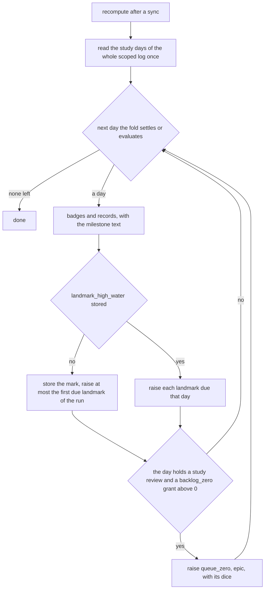
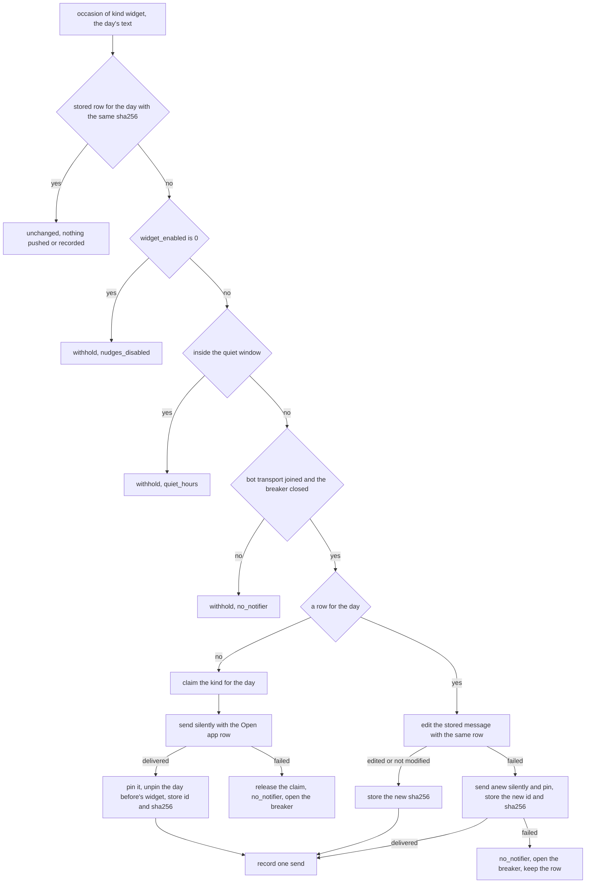
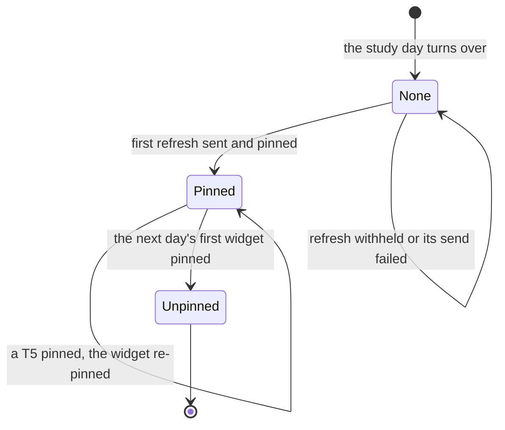

# Schematic: the landmarks, the milestone pings and the pinned widget

Kind: data flow and state machine. Read at DeckStreak `dev` af0693f and at the predecessor's
`27ee2bc` (`landmarks.py:run_landmarks`, `pipeline.py:GamifyPipeline._notify_milestones` and
`_run_sync_cycle_impl`, `pipeline_layers/showcase.py:ShowcaseLayer._update_widget` and
`_repin_widget`, `telegram.py:render_milestone`, `render_widget` and `widget_mood`). Added by the W5
architect turn, under ADR-109 (the widget is one silent pinned message a study day, edited in place
through the router). SPEC-102 builds it.

It extends five accepted schematics without changing them: `docs/schematics/notification-router.md`
(the decision each message goes through), `docs/schematics/celebration-ladder-on-the-router.md` (the
tiers, the dice and the T5 pin), `docs/schematics/recompute-settles-each-study-day.md` (the fold
whose awards phase the two new steps join), `docs/schematics/sync-cycle-and-change-gate.md` (the
cycle whose last step refreshes the widget) and `docs/schematics/cron-fire-ledger-and-catch-up.md`
(the hourly job's fires).

## The awards phase: landmarks and queue zero

Both steps run in the seventh phase of the fold (ADR-071), after the badges, for each study day the
fold settles and then for the current one. Each raises its occasions through the router, whose
once-ever dedupe is the guard against a second raise.

- An anniversary carries the honest variant when the language streak's last study day, as of the day
  evaluated, is not that day.
- A celebration raised at the morning's recompute falls in quiet hours: the router holds it, and the
  flush at the window's end delivers it (#291).

## A widget refresh

The sync cycle's last step, and the hourly job at minute 44, route one occasion of the kind
`widget`; its arm in `route` decides.

## The widget message across a study day

- The day before's widget is unpinned only when the next day's widget is sent; it is never edited
  again.
- A T5 in `route` or in the flush unpins and pins the day's widget after its own pin, so the widget
  stays the newest pin.
