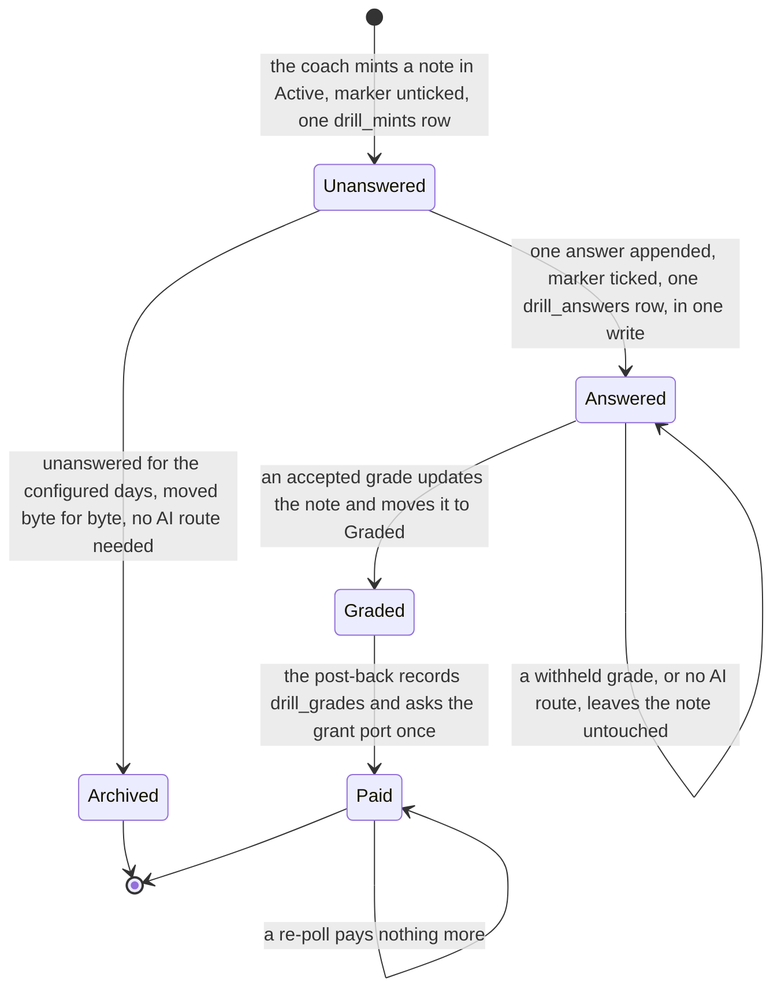
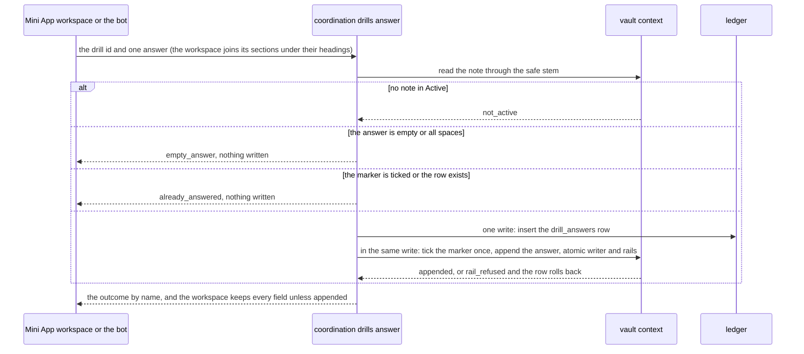
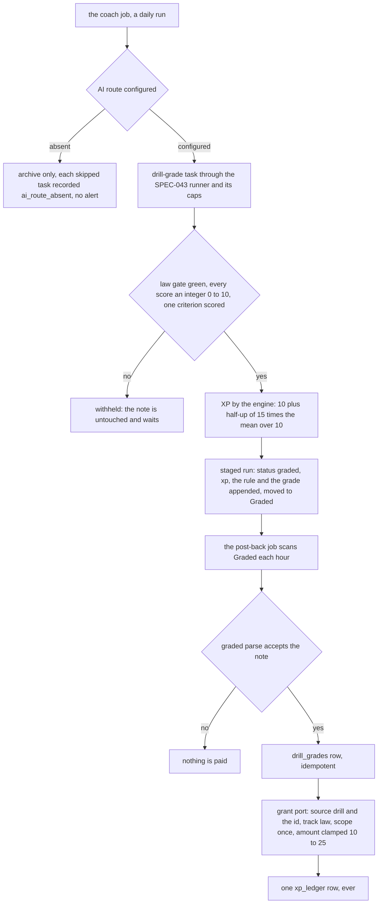

# Schematic: a law drill, from its mint to its answer, its grade and its pay

Kind: state machine and sequence. Read at DeckStreak `dev` 5216bcf (ADR-042, ADR-054,
`docs/schematics/vault-write-paths.md`, `docs/schematics/xp-grant-port.md`,
`docs/schematics/agent-duty-run.md`), and at the predecessor's `27ee2bc` for the behaviour it ports
(`vault_bridge.py:append_drill_answer`, `_parse_graded_drill`, `_active_drill_rollup`,
`nudges.py:NudgesLayer.submit_drill_answer`). Added by SPEC-110 (ADR-110), with SPEC-111 (the
coach's mint, archive and grade, ADR-111) and SPEC-121 (the workspace and the progress screen). It
adds to the vault's write paths the drill note's life, and to the grant port one source, `drill:`;
it rewrites neither.

## A drill note's states

Nothing is deleted in any state. The owner may also answer or grade a note in the vault by hand:
the post-back reads the note's frontmatter, not the path that wrote it.

## One answer, from either surface

## The grade and the pay

A model's score is advisory: only the engine's integer check and its formula set the XP, and only
the grant port writes it (SPEC-040). The progress screen (SPEC-121) counts the paid rows by their
`drill:` source and the backlog from the rollup; it reads the ledger, never a vault dashboard.
