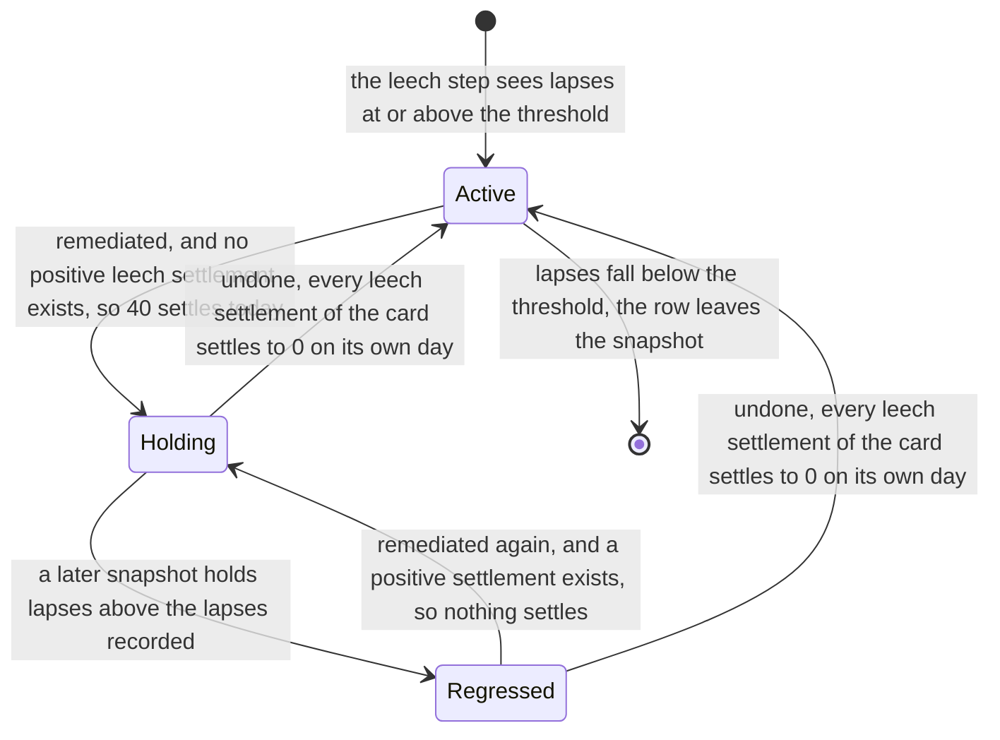
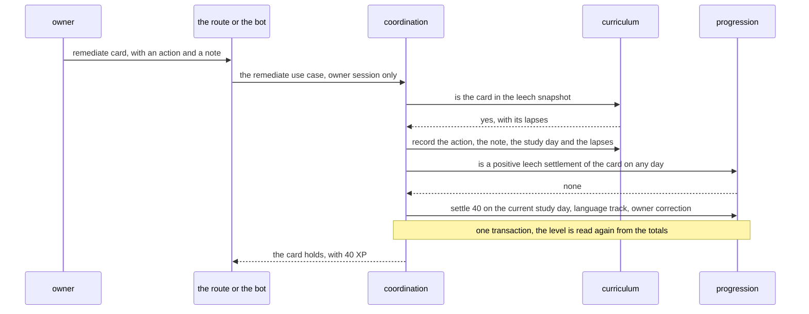
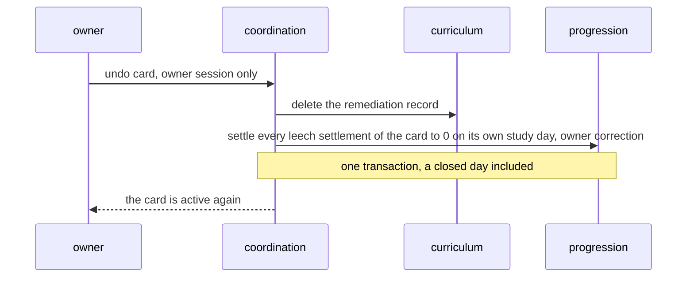

# Schematic: a leech's remediation settles once, and an undo settles it to zero

Kind: state machine and sequence. Read at DeckStreak `dev` dd98601 (`crates/curriculum/src/`
holds only `lib.rs`) and at the predecessor's `27ee2bc` (`leeches.py:cards_to_leech_rows`,
`build_board`; `pipeline.py:GamifyPipeline._persist_leeches`, `remediate_leech`,
`unremediate_leech`; `database.py:GamifyStore.grant_leech_xp_once`, `delete_xp_source`,
`day_base_xp`). Decided by ADR-072 (derived XP is settled, and the owner's correction replaces an
amount) and ADR-093 (a remediation settles `leech:<card id>` once, and an undo corrects it to zero).
Added by SPEC-093.

It sits beside `docs/schematics/leeches-state-machine.md` and does not change it. That schematic's
undo edge says the XP grant is removed; in DeckStreak the 40 XP is a settlement of the derived
source `leech:<card id>` (`docs/schematics/xp-grants-and-settlement.md`), and an undo is the owner's
correction of that settlement to 0 on its own study day. Nothing is deleted from the XP ledger.

## One card's status and its pay

The status is derived at each snapshot: `active` without a remediation record, `regressed` when the
lapses exceed those recorded, else `holding`. A remediation record outlives its card's leaving the
snapshot. After an undo, a remediation finds no positive settlement and pays 40 again, on the study
day it is made.

## The owner remediates a card

A card not in the snapshot is refused and nothing is written. The day base leaves every `leech:`
source out (SPEC-072 R17), so a remediation never feeds the consistency bonus or the coin mint.

## The owner undoes it

