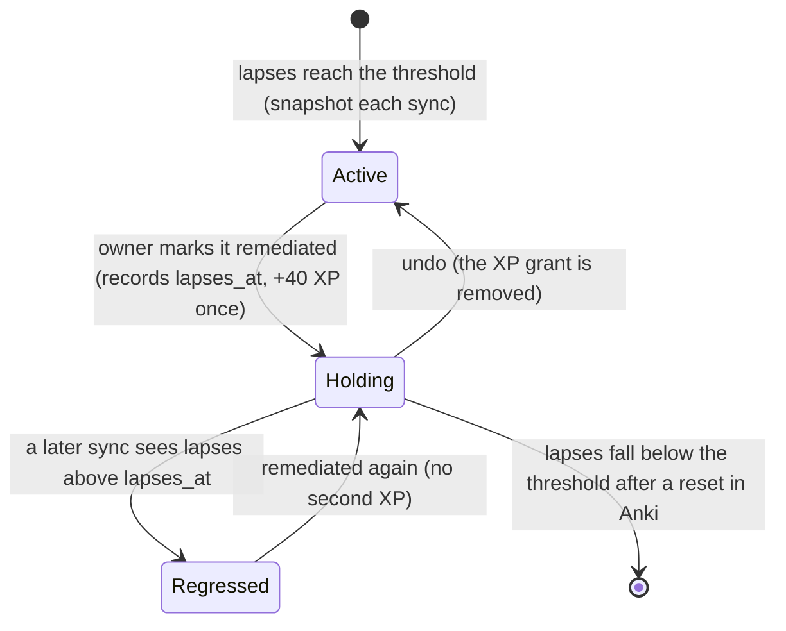

# Schematic: a leech's remediation

Kind: state machine. Read at the predecessor's `27ee2bc` (`leeches.py`, the remediation protocol)
and at DeckStreak `main` 769ee62 (`curriculum` context). A leech is a card with at least the leech
threshold of lapses (8 by default). DeckStreak never edits the card: the owner fixes it in Anki.

The board shows the worst 15, regressed first, then active, then holding. The protocol for the
top card is difficulty-aware: difficulty 8.0 or more, or 12 or more lapses, suggests Split and a
single-answer reformulation; otherwise Reformulate, then Mnemonic, Context, a cross-link within
the strand, or Delete. In W6 the leech doctor prepares an explanation, a mnemonic and a contrast
for the card before its next review.
