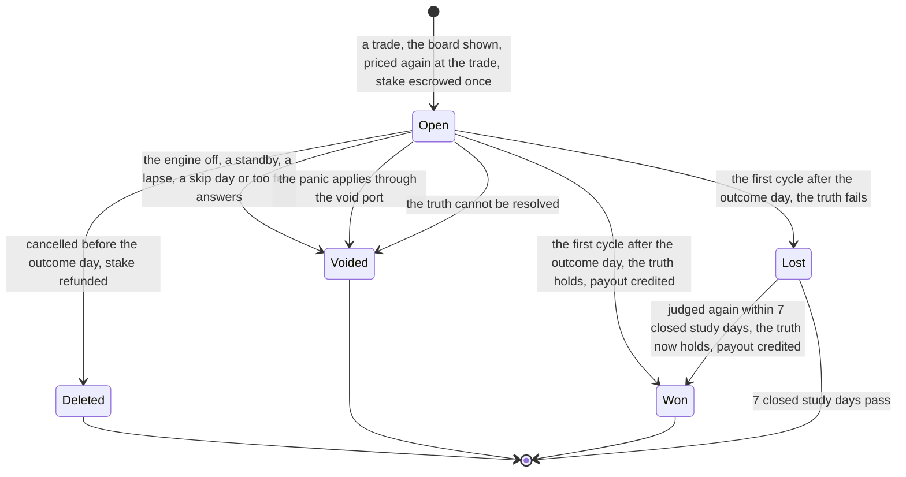
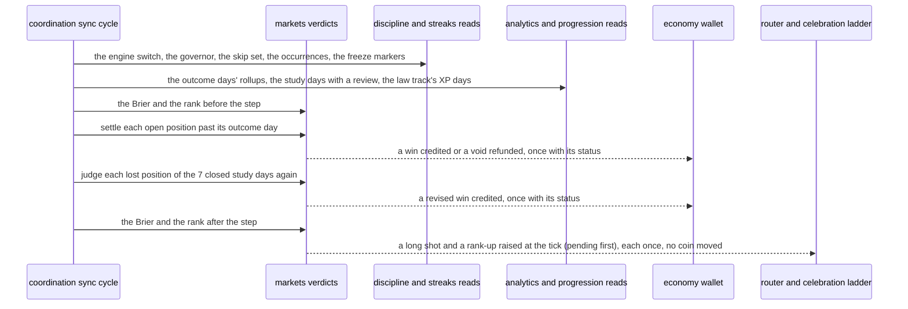
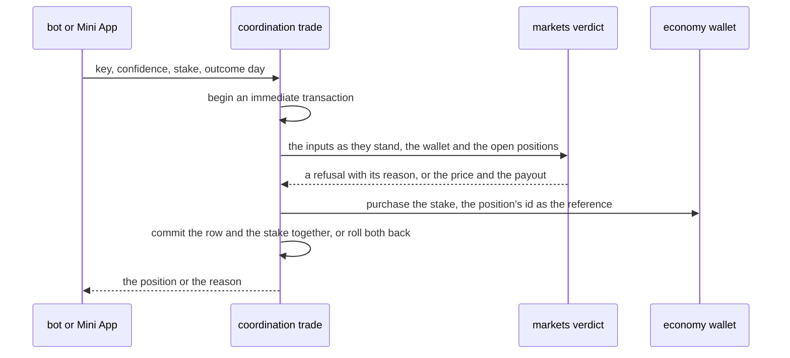
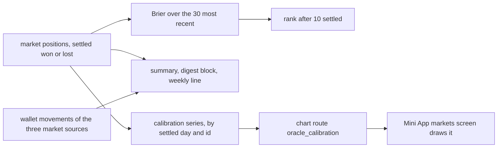

# Schematic: a market position's life, the markets step and the Oracle's reads

Kind: state machine and sequence. Read at DeckStreak `dev` 26263de and at the predecessor's
`27ee2bc` (`pipeline_layers/markets.py:MarketsLayer`'s `market_board`, `place_position`,
`cancel_position`, `_settle_markets`, `_market_truth`, `_day_survived`, `_void_position`,
`_apply_panic` and `_brier_rank`, and `charts.py:calibration_chart`). Added by the W5 architect
turn, under ADR-107 (a lost position is judged again for 7 closed study days), ADR-104 (a verdict
is provisional until its evidence settles) and ADR-085 (charts are drawn on the client). SPEC-107
builds it.

It extends four accepted schematics without changing them:
`docs/schematics/sync-cycle-and-change-gate.md` (the cycle whose markets step this is),
`docs/schematics/streaks-and-governor-state-machine.md` (the governor that hides the board, and the
freeze markers a `streak_sun` position reads), `docs/schematics/celebration-ladder-on-the-router.md`
(a long shot and a rank-up celebrate) and `docs/schematics/skip-day-record-and-effects.md` (a skip
day voids a position). The panic that calls the void port is
`docs/schematics/wager-and-contract-lifecycle.md`.

## A position's life

- Every arrow that moves coins moves them in the same transaction as the status, and each status
  changes once: a settlement and a void only from open, a revision only from lost to won. So a
  stake is escrowed, refunded or paid out at most once.
- A cancel deletes the row, as the predecessor does, and the table's ids are never reused, so a
  refund's reference never names a later position.
- The mercy is judged at the settlement only: a lost position is judged again on its truth alone.

## The markets step of a sync cycle

The step runs after discipline's steps, so a panic applied this cycle has already voided the open
positions through the void port.

- While the engine is off, the step voids every open position and refunds each stake, and settles
  nothing.
- The step records each raise pending; an owner's sync raises it through its router at once,
  a scheduled sync leaves it for `discipline_tick`. The digest's Oracle block reports what settled.

## A trade

- The price is made again inside the transaction and never read from the caller, so a stale board
  can only be refused.
- Two trades from two connections serialise on the write lock, so the cap of 3 open positions holds
  across processes.

## The Oracle's reads

- The calibration is a JSON series; the chart is drawn on the client and the bot's button opens the
  screen.
- No rank, rise or chart moves a coin.
