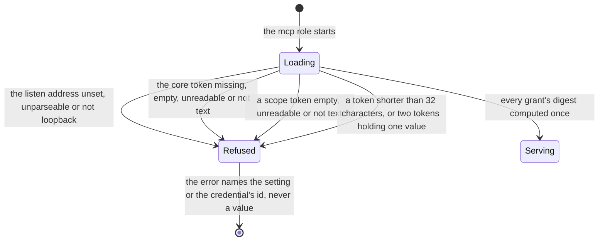
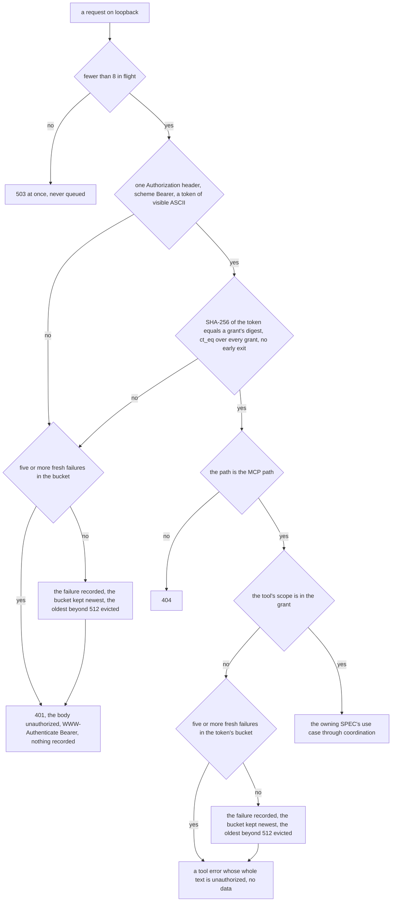

# Schematic: the MCP server's guard, and each refusal it answers

Kind: decision flow and state machine. Read at DeckStreak `dev` 5216bcf (ADR-002, ADR-025,
ADR-054, `docs/schematics/data-flow.md`, `docs/schematics/startup-settings-and-secrets.md`), and at
the predecessor's `27ee2bc` for the behaviour it ports (`mcp_auth.py:DrillAuth.require`,
`_bucket_id`, `_is_rate_limited`, `_record_failure`, `server.py:create_server`). Added by SPEC-119
(ADR-119, ADR-121). It adds one adapter to `data-flow.md`: the MCP server, which reads through
coordination's use cases like the API and the bot, and holds none of their rules.

## Start

Every token comes through the credential loader (SPEC-066); a missing scope token grants nothing
and is not an error.

## One request

The absent, empty, malformed, wrong and rate-limited refusals are one response, byte for byte:
nothing tells a caller which of them it met. Each refusal writes one warning naming the outcome, the
bucket and the scope, never the token or the header's value. A granted token is allowed before the
limiter reads anything, so it can never lock itself out. The limiter keeps no row: its buckets die
with the process.

## What the verifier plants

SPEC-119 §9 lists each plant (a guard that admits no header, a scope check skipped, a token compared
with `==`, the limiter consulted before the match, and the rest) with the criterion it must redden
and its mutation row.

## Change note

2026-10-03 (SPEC-119 T14, #158): a scope refusal passes through the limiter with the token's
bucket before the tool error, as R13 and A20 say; the flowchart had sent it straight to the tool
error. Nothing else changed.
