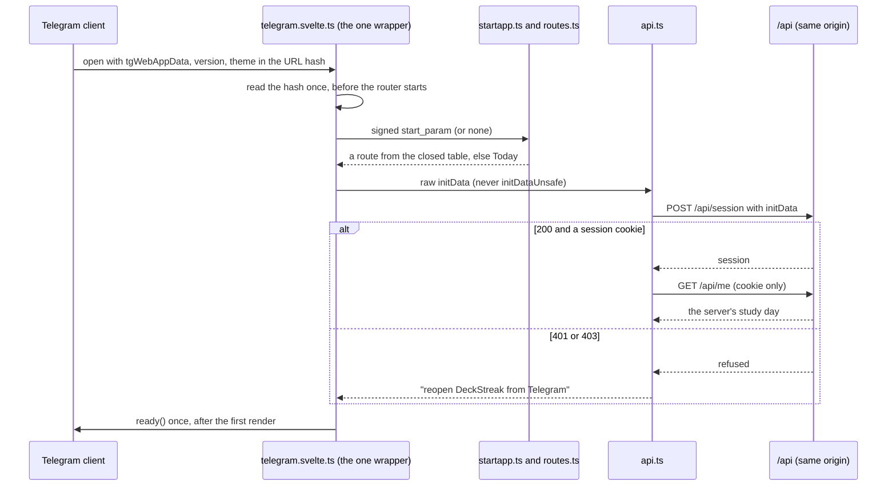
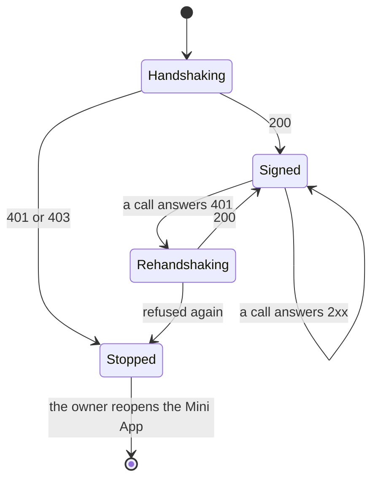

# Schematic: the Mini App launches, routes its startapp token and signs in once

Kind: sequence and state machine. Read at DeckStreak `main` e05dfa5 (ADR-005, ADR-006, ADR-007,
`docs/schematics/initdata-auth-sequence.md`, the telegram-platform pack). Decided by ADR-028. The
server side of the handshake is `docs/schematics/initdata-auth-sequence.md`; this drawing is the
client's.

| token | route |
|---|---|
| `today`, empty, unknown or malformed | `/` |
| `about` | `/about` |
