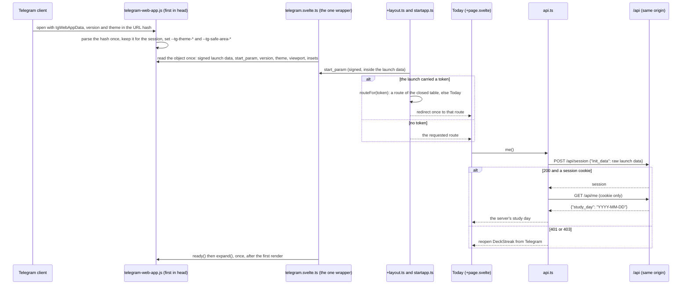
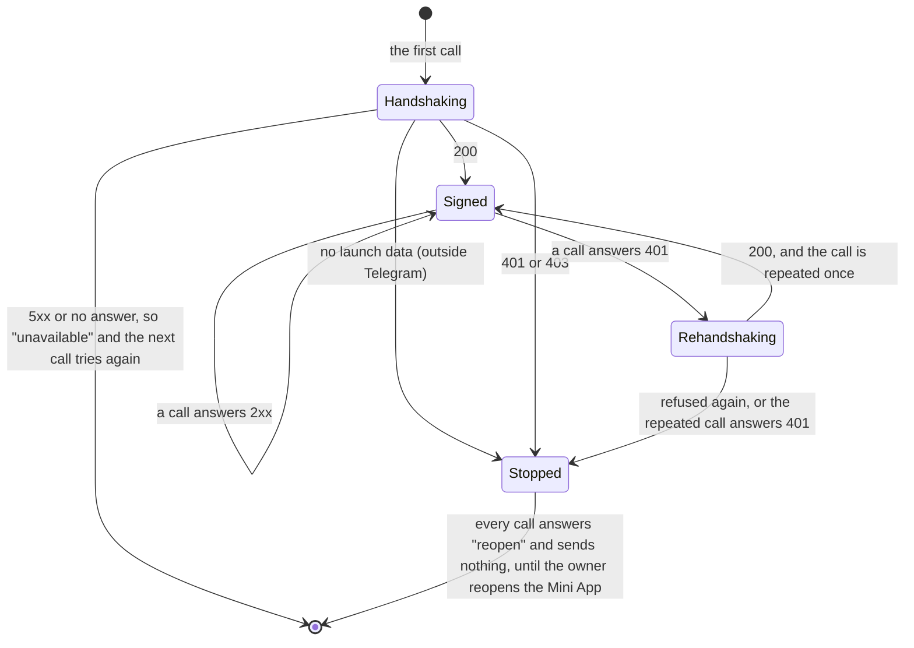
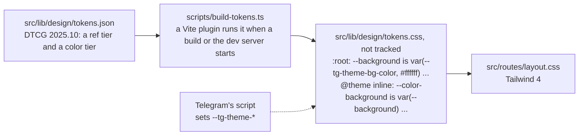
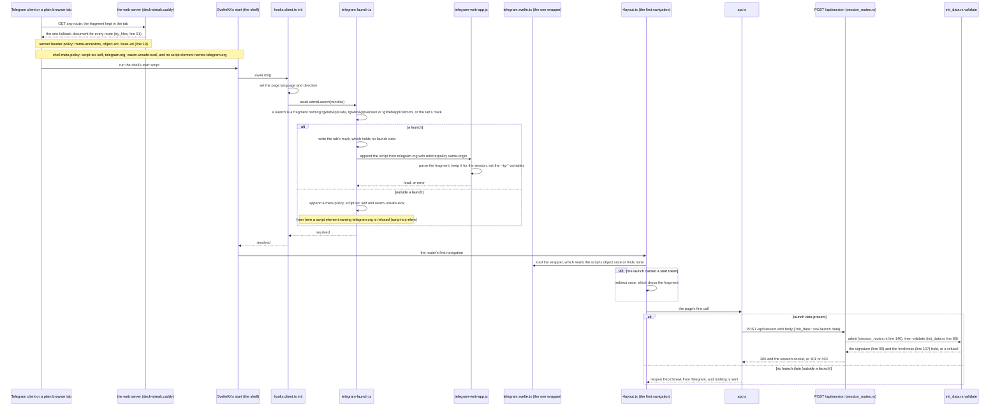

# Schematic: the Mini App launches, routes its startapp token and signs in once

Kind: sequence, state machine and data flow. Read at DeckStreak `main` e05dfa5 and `dev` 5257a97
(ADR-005, ADR-006, ADR-007, `docs/schematics/initdata-auth-sequence.md`, the telegram-platform
pack, and Telegram's own `telegram-web-app.js`). Decided by ADR-028; built by SPEC-028. The server
side of the handshake is `docs/schematics/initdata-auth-sequence.md` and
`docs/schematics/owner-session.md`; this drawing is the client's.

## The launch

Telegram's script is the first script in `<head>` and runs before any app code. It parses the
launch parameters out of the URL hash, keeps them in the tab's session storage (so a reload after a
navigation still has them), and sets the `--tg-*` CSS variables. The wrapper reads the script's
object once, when its module loads, which is before the router's first navigation: no navigation
can lose the launch.

> **Amended by SPEC-400 (ADR-414).** Telegram's script is no longer in the shell. The app's start
> hook adds it only on a launch, and awaits it before the router's first navigation. The drawing
> below still holds for a launch, except that the hook adds the script's participant rather than
> the shell's `<head>`. "The launch, gated", at the end of this file, draws the start inside and
> outside a launch.

## The session, as the client holds it

## The wire contract SPEC-024 serves

| call | request | answer the client reads |
|---|---|---|
| open a session | `POST /api/session`, `Content-Type: application/json`, body `{"init_data": "<the raw launch data>"}`, `credentials: same-origin` | 2xx and the `__Host-` session cookie; 401 or 403 refuses |
| the owner's day | `GET /api/me`, the session cookie only | `{"study_day": "YYYY-MM-DD"}` (the lexicon's `study_day`); 401 when the session has ended |

The launch data travels only in that one request body: never in a URL, a header, the device's
storage or a log line. The client parses nothing out of it but `start_param`, and that only to
choose a screen from the closed table.

## The startapp tokens

| token | route |
|---|---|
| `today` | `/` |
| `about` | `/about` |
| empty, unknown, or not `[A-Za-z0-9_-]{1,64}` | `/` (Today) |

## The design tokens

A colour that names no Telegram theme parameter fails the compile. `tokens.test.ts` compiles the
same file and judges the result: every colour reads a `--tg-theme-*` variable with a fallback, and
every text colour meets WCAG 2.2 AA on each background it declares, in both of Telegram's default
palettes (`web/app/tests/telegram-palettes.ts`) and in the fallbacks.

## The launch, gated (SPEC-400, ADR-414)

Kind: sequence. Read at dev `ce2bb195`.

The server answers every route with one fallback document (`deploy/caddy/deck-streak.caddy:91`).
The shell's policy admits Telegram's origin (`web/app/svelte.config.js:27`), and the shell holds no
script element that names that origin.

The app's client `init` hook (`web/app/src/hooks.client.ts`) runs once, before the router's first
navigation, and awaits `web/app/src/lib/telegram-launch.ts`. The URL fragment is still whole at
that point. A launch is either of:

- a fragment that names `tgWebAppData`, `tgWebAppVersion` or `tgWebAppPlatform` (presence only, no
  value read);
- the tab's own launch mark in session storage. A fragment launch writes the mark, and the mark
  holds no launch data.

On a launch, the hook adds Telegram's script and waits for it. Outside a launch, it adds a second
policy that refuses Telegram's origin for the page's life. Every policy a document holds applies.
Only then does the wrapper's module load and read the script's object, or find none.

The launch data still travels only in the one request body below, and the server validates it as
before.

| route | served by | policy in force after the start hook | Telegram's script |
|---|---|---|---|
| every path of `web/app/src/lib/routes.ts`, inside a launch | the fallback document | the shell's policy alone | loaded once by the hook, before the first navigation |
| every path of `web/app/src/lib/routes.ts`, outside a launch | the fallback document | the shell's policy and the hook's narrower one, together | never requested; an element naming it is refused |
| a reload after the launch's redirect | the fallback document | the shell's policy alone (the tab's mark) | loaded again; it reads the launch from its own session storage |
