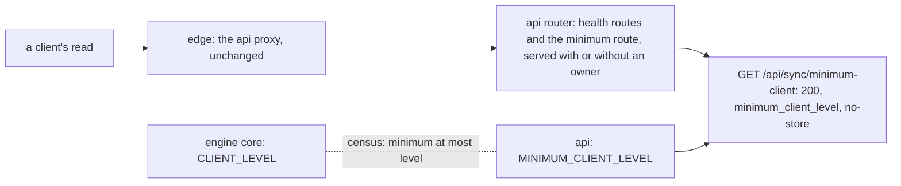
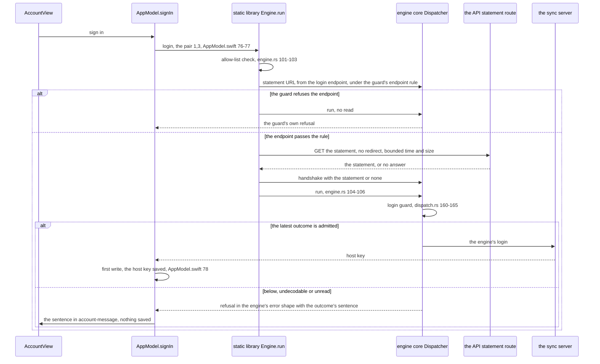
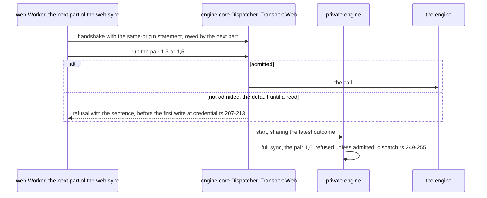
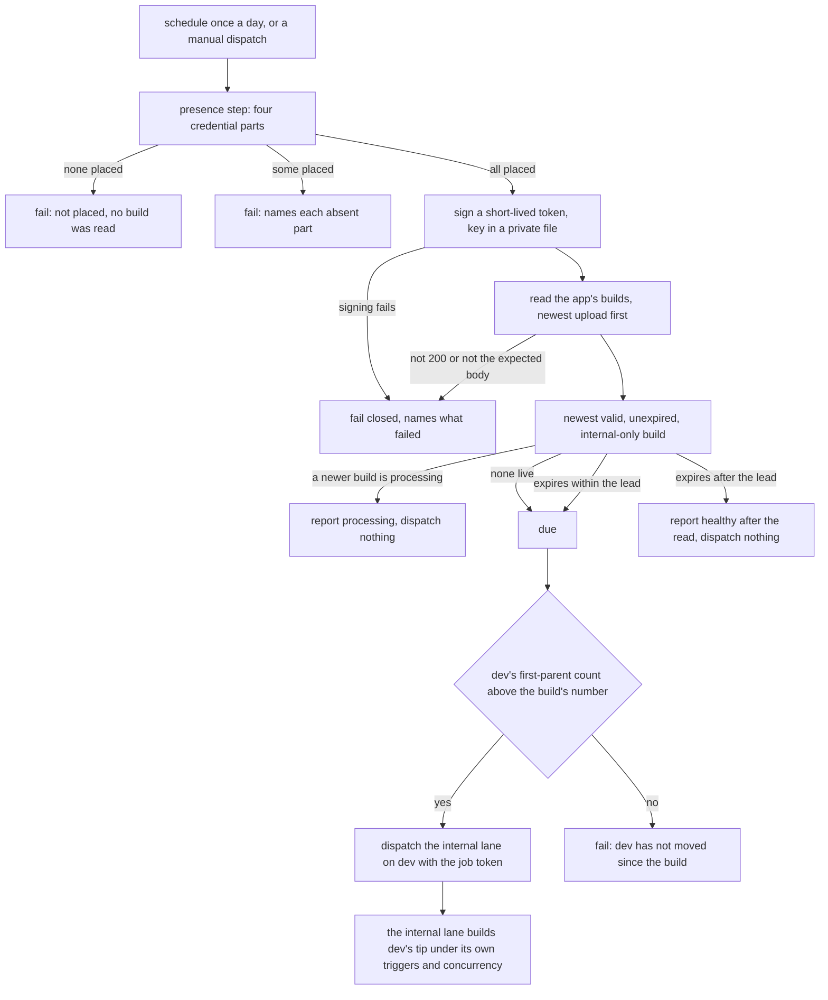

# The minimum-client handshake and the re-release check (SPEC-374, ADR-385)

Every `path:line` below was read at `6f9ef860`. Part one is the handshake (sections 1 to 3);
part two is the re-release check (section 4). Section 5 says where each test pins each flow.

## 1. The service's statement

The route is merged beside `health::routes()` (`crates/api/src/router.rs:216`), outside the owner's
routes (`:217-259`), and the edge already proxies `/api/*` to the API
(`deploy/caddy/deck-streak.caddy:46-52`).

## 2. iPhone and iPad: from the first sync contact to the stop or the sync

The stop sits in the core's `run` after the login guard and before the engine
(`crates/engine-core/src/dispatch.rs:160-169`), reached from `AppModel.swift:76-77`, so the first
write at `AppModel.swift:78` never runs on a refusal. No Swift file changes.

## 3. The web client and every engine on both transports

At this commit the web client's sync entry is `obtain()` (`web/app/src/lib/engine/credential.ts:193-216`):
the seal-key release at `:197`, the login at `:199`, the first write at `:207-213`. The login runs
through the core's `run`, so the core's refusal precedes the first write. The Worker's read is the
next part of the web sync's (SPEC-374 section 5).

## 4. The scheduled re-release check (part two)

The lane accepts a manual dispatch on `dev` (`.github/workflows/testflight-internal.yml:10-24`,
`scripts/ios_lane.py:99-135`) and numbers the build by `dev`'s first-parent count
(`scripts/ios_lane.py:134`). The check never tags, never names `main`, and never releases.

## 5. Where each test pins each flow

| flow step | pinned by |
|---|---|
| the statement's route, body and cache header, served with no owner | SPEC-374 A6, `crates/api/tests/minimum_client_route.rs` |
| the minimum never above the level | A7, `scripts/tests/test_client_level.py` |
| the core's refusal before the engine, both transports, every sync pair | A1, A2, `crates/engine-core/tests/handshake.rs` |
| the latest statement decides; a private engine obeys its parent | A3, `crates/engine-core/tests/handshake.rs` |
| the native read before the login, nothing under the sync path below the minimum, the sentence | A4, `crates/ffi/tests/handshake.rs` |
| the read's order, the unanswered read's network sentence, no redirect, no read for a refused endpoint | A5, `crates/ffi/tests/handshake.rs` |
| the stop before the first Swift write | `AppModel.swift:76-78` order, unchanged; SPEC-347's UI test of a refused login, unchanged |
| the read followed by the sync, with a raise in between | `formal/tla/MinimumClientHandshake/` |
| the schedule, the token's permissions, the admitted credential reads | A8, `scripts/tests/test_ci_workflows.py` |
| a build due before the next run reported and dispatched on dev | A9, `scripts/tests/test_testflight_age.py` |
| healthy only after a read | A10, `scripts/tests/test_testflight_age.py` |
| absent or half-placed credential, unreadable answer | A11, A12, `scripts/tests/test_testflight_age.py` |
| unmoved dev | A13, `scripts/tests/test_testflight_age.py` |
| no credential part in argv, environment or log | A14, `scripts/tests/test_testflight_age.py` |
| the lead covers the schedule | A15, `scripts/tests/test_ci_workflows.py` |
