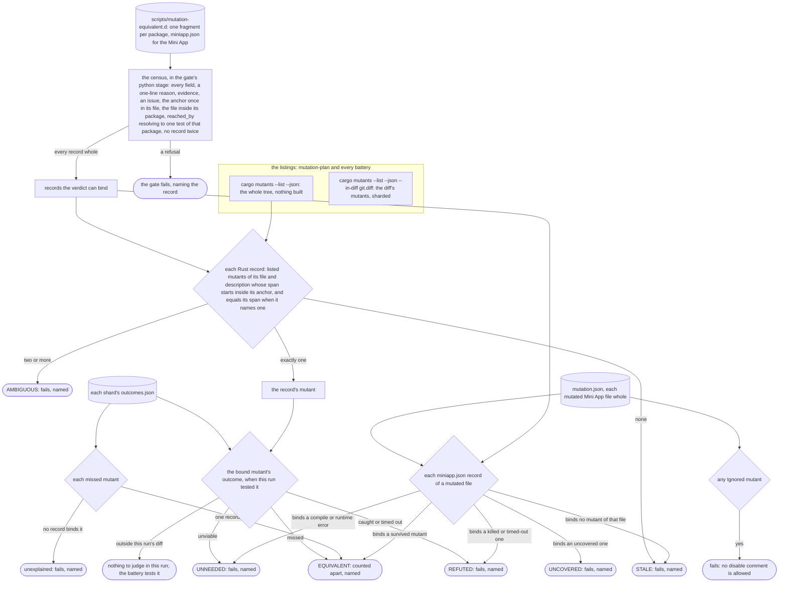
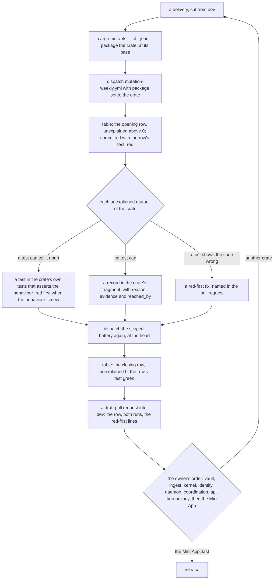
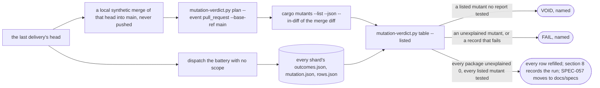

# Schematic: the equivalence record, from a claim to the verdict, and the campaign that fills it

Kind: data flow (a record from its fragment to the verdict), a state machine (one record across
runs) and a delivery flow (the campaign, crate by crate, then the release rehearsal). Read at
DeckStreak `dev` 16ed8e2 (`scripts/mutation-verdict.py`, `.github/workflows/ci.yml`,
`.github/workflows/mutation-weekly.yml`), with cargo-mutants 27.1.0 and StrykerJS 10.0.0. Decided by
ADR-070 (proposed); planned by SPEC-057, whose vault delivery builds it. The pull request's own
mutation jobs, which this record joins, are drawn in `docs/schematics/mutation-testing.md`.

## 1. A record, from its fragment to the verdict

The mutant a record excuses is never taken out of the listing: cargo-mutants and StrykerJS list,
shard, run and report it like any other, so each run that reaches it tests the claim again. Every
failing state names the record and fails its job; the census and the verdict print `examined N`.

## 2. What a record binds, and who checks it

| field | holds | checked by |
|---|---|---|
| `file` | the mutated file, from the repository's root | the census: inside its fragment's package |
| `mutant` | the tool's own description without its location: cargo-mutants' name after `<file>:<line>:<column>: `, or StrykerJS's `<mutatorName>: <replacement>` | the verdict, against the listing and the reports |
| `anchor` | a text that occurs exactly once in `file`, inside whose occurrence the mutant's span starts | the census (once in its file); the verdict (binds one mutant) |
| `span` | the mutated text, only when two mutants of that description start at one position | the verdict |
| `reason` | one line: why no test can tell the mutant apart | the census (one line); the reviewer |
| `evidence` | the code fact that makes it so, where a reviewer checks it | the census (present, not the reason again); the reviewer |
| `reached_by` | Rust only: a test of the mutant's own package that runs the mutated code, `<target>::<test path>` | the census (resolves to exactly one test); the reviewer (it runs the code) |
| `issue` | `#N`, the issue its delivery closes | the census |

An anchor is a whole line where the line holds one mutant of that description, and a narrower
window around the span's start where it holds two. Lines and columns are 1-based in both tools'
reports.

## 3. One record across runs

```mermaid
stateDiagram-v2
  [*] --> Written: a delivery records a mutant its sweep reported missed or survived
  Written --> Refused: the census refuses a field, the anchor, the file or a duplicate
  Refused --> Written: the delivery repairs the record
  Written --> Bound: exactly one listed mutant binds
  Bound --> Equivalent: the run tests it and it is missed or survived again
  Equivalent --> Bound: the next run that reaches it
  Bound --> Refuted: a test caught it, or it timed out
  Bound --> Stale: its anchored code changed, or its mutant left the listing
  Bound --> Ambiguous: a second mutant of its description starts inside the anchor
  Bound --> Unneeded: the mutant stopped building
  Refuted --> [*]: the record is removed; a test now kills the mutant
  Stale --> Written: the claim is examined again and bound anew
  Stale --> [*]: the mutant is gone, and the record with it
  Ambiguous --> Written: the anchor is narrowed, or span is added
  Unneeded --> [*]: the record is removed
```

A record never ends silently: each transition out of Bound fails the run that finds it, so the
record changes in a pull request that a reviewer reads. Lines that move above an anchor change
nothing: the anchor still occurs once and the mutant still starts inside it.

## 4. The campaign, crate by crate

The first delivery, the vault's, builds sections 1 to 3 of this schematic before its first kill,
with the scoped dispatch and `table`, and carries the squash-subject match and the canonical-lock
guard (SPEC-057 R17, R18).

## 5. The release rehearsal

The first release's merge diff holds every mutant of the tree (2,207 at `dev` 16ed8e2, the whole
tree's listing), so a scoped sweep of one crate at a head runs exactly the mutants the release
would run for that crate's files, with the same flags; the rehearsal ties every crate's row to one
head.
