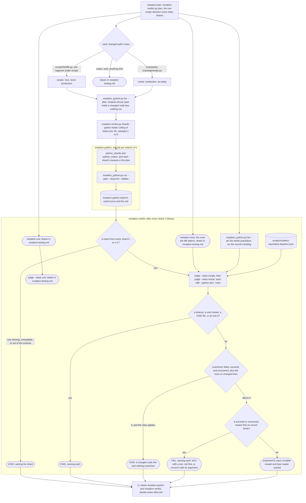
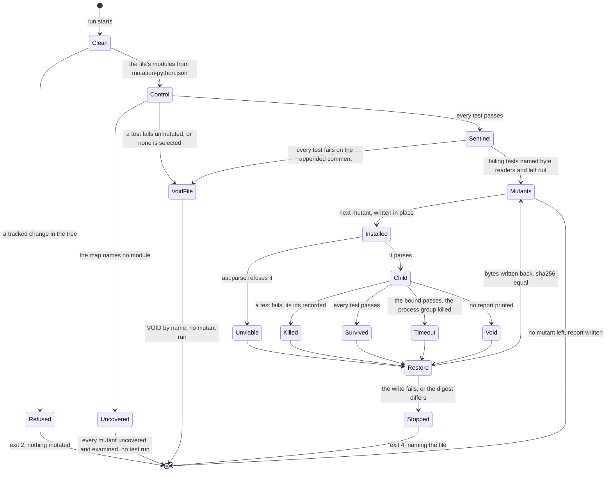
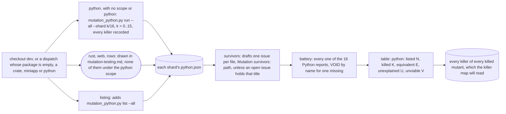

# Schematic: generated mutants for the repository's Python, on a pull request and weekly

Kind: data flow (the pull request's mutation jobs with the Python job added, and the weekly
battery's Python shards) and a state machine (one file's run inside a shard). Read at DeckStreak
`dev` 26263de (`.github/workflows/ci.yml`, `.github/workflows/mutation-weekly.yml`,
`scripts/mutation-verdict.py`, `scripts/mutation_rows.py`). Decided by ADR-073; built by SPEC-087.

This ADDS to `docs/schematics/mutation-testing.md` and redraws none of it: the Rust shards, the
rows, the web job and the verdict's Rust class are drawn there, and the equivalence record's path
from a fragment to a verdict in `docs/schematics/mutation-equivalence-record.md`. Here each of
those appears as one node, and only the Python run is drawn whole.

## 1. A pull request's diff: where the Python job sits

A class whose changed lines are all blank or comments reads `not-applicable` before any of this,
as SPEC-039 R4 reads every class; the `mutation-python` job still runs one shard, prints its case
and writes a report, because `ci` reads a skipped need as failed.

## 2. One file's run inside a shard

The sentinel's run restores the file the same way before the first mutant. Every child runs with
`PYTHONDONTWRITEBYTECODE=1` and `PYTHONPYCACHEPREFIX` in a temporary directory, and loads each test
module as `unittest discover` does, so an import that fails is a failed test named for its module.
The child runs from a copy of the runner and of the `scripts/` modules it imports, taken outside the
tree before the first mutant, so no mutant of the runner runs as its own child, and drops the
copy's modules from `sys.modules` before it loads a test module, so a test that imports
`mutation_rows` by name reads the tree's file, the mutant installed.

## 3. The weekly battery: the Python shards added

## 4. What crosses each step

| from | to | what | shape |
|---|---|---|---|
| `mutation-plan` | `mutation-python` | the plan, the matrix, each shard's mutants | `plan.json`, `python_shards`, `python_matrix` |
| `mutation-plan` | `mutation-verdict` | the whole population's listing | the `list --all` output |
| `mutation-python` | `mutation-verdict` | one report per shard | `python.json`, schema `deckstreak.mutation-python.v1` |
| `mutation-rows` | `mutation-verdict` | the rows' outcomes, counted into each class's examined | `rows.json` |
| the tree | `mutation-verdict` | the Python records | `scripts/mutation-equivalent.d/python.json` |
| the weekly `python` job | `survivors`, `battery`, `table` | sixteen reports with every killer | `python.json` each |
