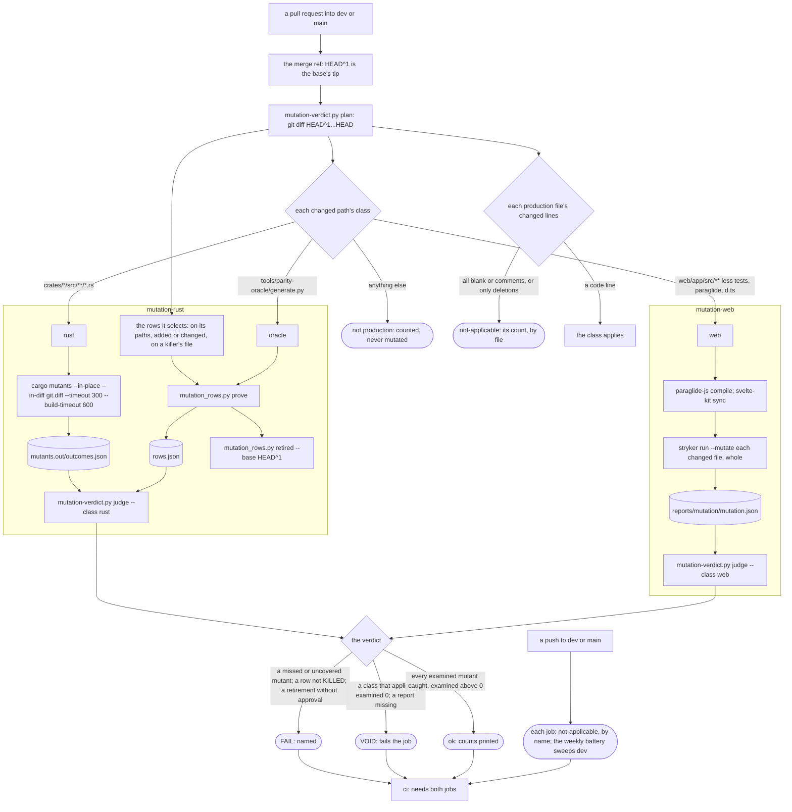
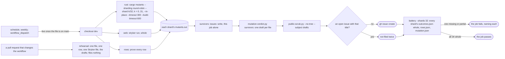

# Schematic: mutation testing, from a pull request's diff to a verdict, and the weekly battery

Kind: data flow (the pull request's two jobs, the weekly battery) and a state machine (one row's
proof). Read at DeckStreak `dev` 3f5470e (`.github/workflows/ci.yml`, `scripts/check.sh`, the
mutation-rows pack's row shape), with cargo-mutants 27.1.0 and StrykerJS 10.0.0 as SPEC-039 §1
measured them. Decided by ADR-057; built by SPEC-039.

## 1. A pull request's diff, through the two jobs

Each job uploads its report under `if: always()`, restores the Rust cache or the pnpm store, and
saves nothing. `cargo mutants --in-place` and the runner both rewrite a tracked file and restore
it, so they run one after the other in one job, never beside another reader of the tree.

## 2. What crosses each step

| step | what crosses | guard |
|---|---|---|
| plan | the diff, `git diff HEAD^1...HEAD`, written to `git.diff` | the new side of the diff is the checked-out tree, so cargo-mutants never exits 5 on a mismatch |
| classes | each changed path | R2's globs, exactly; a test, a script or a document is never production |
| lines | each production file's new-side changed lines | blank and comment lines are counted apart; a file whose hunks only delete reads not-applicable with its count |
| cargo-mutants | the diff, the tree | `--in-place` on the checkout, `--timeout 300` on each mutant's tests and `--build-timeout 600` on its build, the job's `timeout-minutes`; its exit is recorded, never trusted alone |
| Stryker | every changed web production file, whole | the whole file, so a survivor already there is the pull request's (rule 5); `thresholds.break` 100 |
| rows | the selected rows | the runner's own refusals (section 3); the report lists every row with its verdict |
| retired | the rows at `HEAD^1` against the rows at `HEAD` | a row gone while its target stays needs an entry in `scripts/mutation-rows.retired.json` |
| judge | `outcomes.json`, `mutation.json`, `rows.json` | examined is caught, missed and timed out; unviable is never a kill; zero examined on an applying class is VOID; a missing report is VOID, and so is a partial one (an exit other than 0, 2 or 3, or counts short of `total_mutants`) |

## 3. One row's proof

```mermaid
stateDiagram-v2
  [*] --> Clean: a tree with no tracked change
  [*] --> Refused: a tracked change (exit 2)
  Clean --> Anchored: the find occurs exactly once; sha256 recorded
  Clean --> Void: the find occurs 0 or 2+ times
  Anchored --> Control: run the killer, no mutant
  Control --> Void: red, or not exactly one test selected
  Control --> Installed: green, one test selected
  Installed --> Built: cargo test --no-run passes, or the Python parses
  Installed --> Void: does not build or parse (never a kill)
  Built --> Killed: the killer fails, one test selected
  Built --> Survived: the killer passes
  Built --> Void: not exactly one test selected, or it timed out
  Killed --> Restored
  Survived --> Restored
  Void --> Restored
  Restored --> [*]: the saved bytes written back and the sha256 equal again
```

The restore runs whatever happened after the install, and the next row starts only when the
target's sha256 is the one recorded. A Python killer runs with its own `PYTHONPYCACHEPREFIX` and
no bytecode written, so no run reads another's compiled mutant.

## 4. The weekly battery

Every shard and job uploads its report under `if: always()`, so a shard that fails on its
survivors still hands them to the `survivors` job, which runs `if: always()` and never on a pull
request. A shard whose runner was shut down uploads nothing, and one stopped early leaves a partial
report: the job's last step counts every report the battery promises, and fails naming each one
missing or partial, so neither reads as a shard with no survivor.

## 5. The rows file

| file | holds |
|---|---|
| `scripts/mutation-rows.json` | the header alone: `_` (the rules, and one `target spelling:` line per table), `arities`, and empty `tables` |
| `scripts/mutation-rows.d/S<NNN>00-S<NNN>99.json` | SPEC-NNN's rows, `{"tables": {...}}` and nothing else |
| `scripts/mutation-rows.retired.json` | each row retired while its target stayed: its id, the reason and the maintainer's approval |
| `scripts/mutation_rows.py` | the one reader (`load_tree`, `PopulationRefused`) and a row's target by its table's declared spelling, the census, `prove` and `retired` |

| table | 1 | 2 | 3 | 4 | 5 | 6 |
|---|---|---|---|---|---|---|
| `MUTATIONS` | crate directory | file in the crate | find | replace | killer `<target>::<test path>` | description |
| `CARGO_KILLED_SCRIPT_MUTATIONS` | path from the root | find | replace | killer's crate | killer `<target>::<test path>` | description |
| `SCRIPT_MUTATIONS` | path from the root | find | replace | description | killer `<module>.<Class>.<method>` | |
