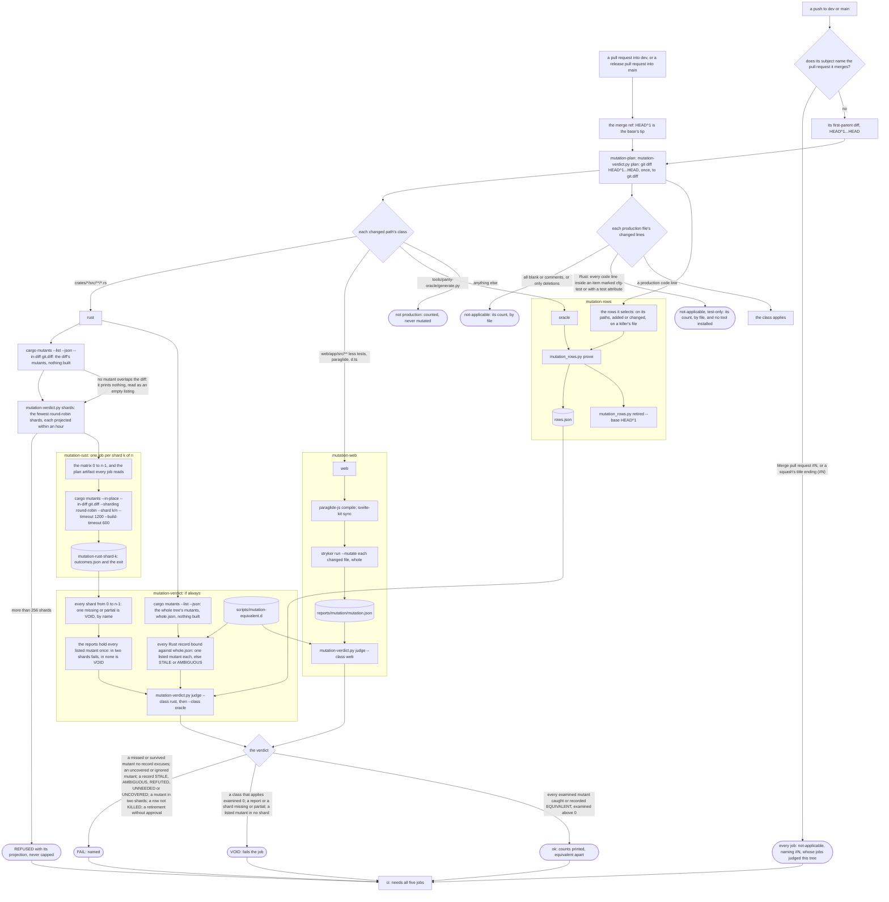
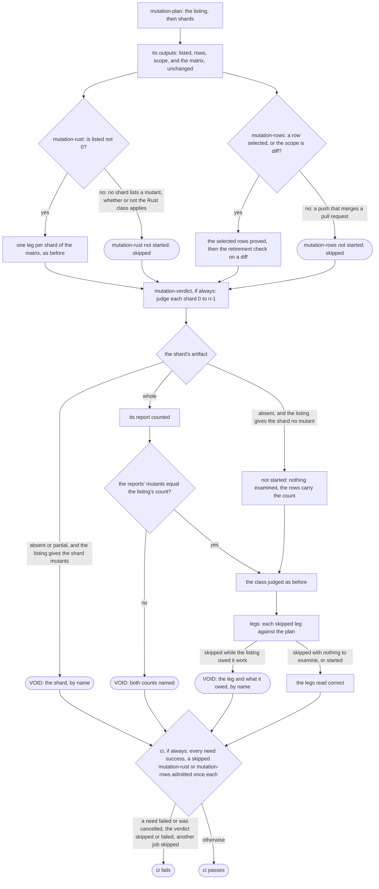
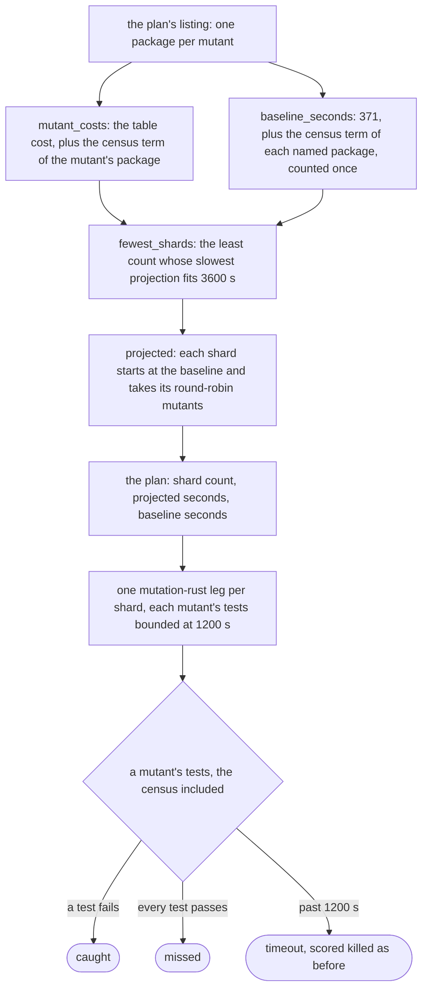
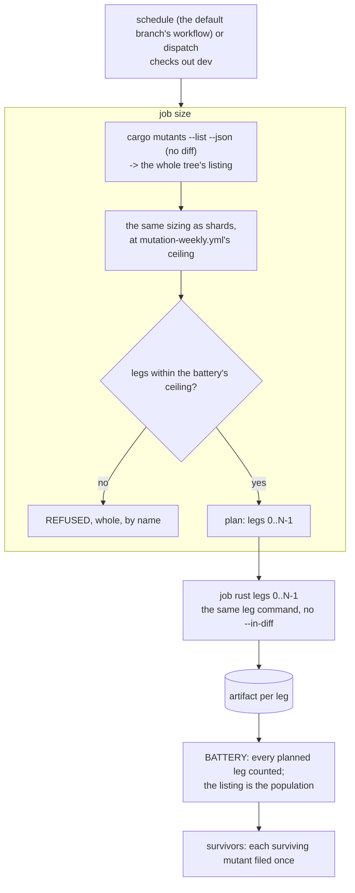
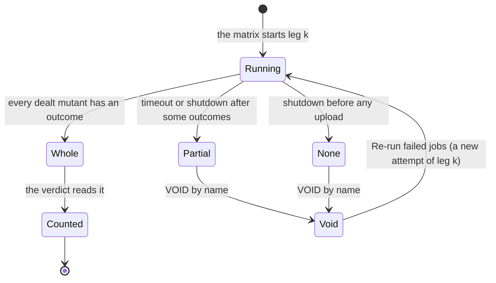
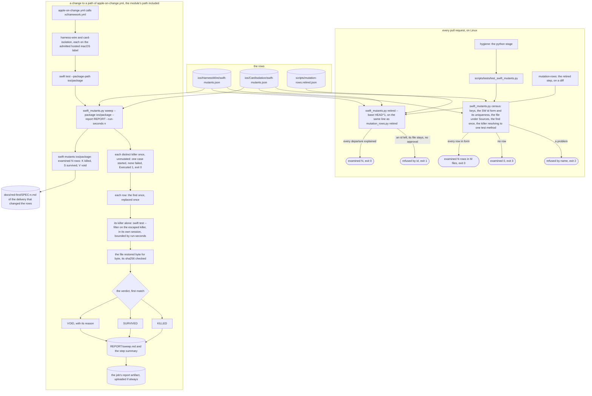

# Schematic: mutation testing, from a pull request's diff to a verdict, and the weekly battery

Kind: data flow (the pull request's mutation jobs, the weekly battery) and a state machine (one
row's proof). Read at DeckStreak `dev` 32bf1e1 (`.github/workflows/ci.yml`, `scripts/check.sh`,
the mutation-rows pack's row shape), with cargo-mutants 27.1.0 and StrykerJS 10.0.0 as SPEC-039 §1
measured them, and its shards as R18 sizes them. Decided by ADR-057; built by SPEC-039. The
equivalence record (ADR-070, SPEC-057) joins the verdict's step and the battery; its own path, from
a fragment to a verdict, is drawn in `docs/schematics/mutation-equivalence-record.md`.

## 1. A pull request's diff, through the mutation jobs

Each job that writes a report uploads it under `if: always()`, restores the Rust cache or the pnpm
store, and saves nothing. `cargo mutants --in-place` and the runner both rewrite a tracked file and
restore it, so each runs in a job of its own checkout, never beside another reader of the tree.
Every job reads the plan's one `git.diff`, and the verdict counts the shards the plan promised, not
the ones that happened to report.

## 2. What crosses each step

| step | what crosses | guard |
|---|---|---|
| plan | the diff, `git diff HEAD^1...HEAD`, written to `git.diff` | the new side of the diff is the checked-out tree, so cargo-mutants never exits 5 on a mismatch |
| classes | each changed path | R2's globs, exactly; a test, a script or a document is never production |
| lines | each production file's new-side changed lines | blank and comment lines are counted apart; a file whose hunks only delete reads not-applicable with its count; in Rust, a line whose every token lies inside an item cargo-mutants never mutates for a test attribute (`#[cfg(test)]`, `#[test]`, `#[tokio::test]`) is test-only, counted apart and never a code line (SPEC-057 R22) |
| shards | cargo-mutants' own listing of the diff's mutants, `--list --json` | each shard's projected time, the baseline's 346 s and each of its mutants' package cost, plus the settle census's 788 s for each mutant of a package that holds it and once in the baseline (SPEC-327), within an hour; the fewest shards that fit; more than 256 refused, never capped |
| cargo-mutants | the diff, the tree, the shard `k/n` | `--in-place` on the checkout, round-robin as the plan projected, `--timeout 1200` on each mutant's tests and the baseline's (SPEC-327) and `--build-timeout 600` on its build, the shard job's `timeout-minutes` of 120; its exit is recorded, never trusted alone |
| Stryker | every changed web production file, whole | the whole file, so a survivor already there is the pull request's (rule 5); `thresholds.break` 100 |
| rows | the selected rows | the runner's own refusals (section 3); the report lists every row with its verdict |
| retired | the rows at `HEAD^1` against the rows at `HEAD` | a row gone while its target stays needs an entry in `scripts/mutation-rows.retired.json` |
| judge | every shard's `outcomes.json`, `mutation.json`, `rows.json` | examined is caught, missed and timed out; unviable is never a kill; zero examined on an applying class is VOID; a missing report or shard is VOID, by name, and so is a partial one (an exit other than 0, 2 or 3, or counts short of `total_mutants`); the shards' reports hold each listed mutant once |

## 3. One row's proof

```mermaid
stateDiagram-v2
  [*] --> Clean: a tree with no tracked change
  [*] --> Refused: a tracked change (exit 2)
  Clean --> Anchored: the find occurs exactly once; sha256 recorded
  Clean --> Void: the find occurs 0 or 2+ times
  Anchored --> Control: run the killer, no mutant
  Control --> Void: red, or not exactly one test selected
  Control --> Installed: green, one test selected
  Installed --> Built: cargo test --no-run passes, or the Python parses
  Installed --> Void: does not build or parse (never a kill)
  Built --> Killed: the killer fails, one test selected
  Built --> Survived: the killer passes
  Built --> Void: not exactly one test selected, or it timed out
  Killed --> Restored
  Survived --> Restored
  Void --> Restored
  Restored --> [*]: the saved bytes written back and the sha256 equal again
```

The restore runs whatever happened after the install, and the next row starts only when the
target's sha256 is the one recorded. A Python killer runs with its own `PYTHONPYCACHEPREFIX` and
no bytecode written, so no run reads another's compiled mutant.

## 4. The weekly battery

```mermaid
flowchart LR
  sched[schedule, weekly: live once the file is on main] --> checkout[checkout dev]
  dispatch[workflow_dispatch at any ref that holds the file: package empty, a crate, or miniapp] --> checkout
  prtrig[a pull request that changes the workflow] --> rehearsal[rehearsal: one file, one row, one Stryker file, the drafts; files nothing]
  checkout --> shards[rust, unless the scope is miniapp: cargo mutants --package the scope's crate, if any, --sharding round-robin --shard k/32, k = 0..31, --in-place --timeout 1200 --build-timeout 600]
  checkout --> webfull[web, with no scope or miniapp: stryker run, whole]
  checkout --> rowsall[rows, with no scope: prove every row]
  checkout --> listing[listing: cargo mutants --list --json, the whole tree, nothing built]
  listing --> reports
  shards --> reports[(each shard's mutants.out)]
  webfull --> reports
  rowsall --> reports
  reports --> survivors[survivors: issues: write, this job alone]
  survivors --> drafts[mutation-verdict.py survivors: one draft per file, none for a mutant one record excuses]
  drafts --> scrub[public-scrub.py --no-tree --subject drafts]
  scrub --> dedupe{an open issue with that title?}
  dedupe -->|yes| skip([not filed twice])
  dedupe -->|no| file([gh issue create])
  file --> count[battery --shards 32 --listed whole.json: every report the scope promises, whole]
  skip --> count
  count --> table[mutation-verdict.py table --listed whole.json: one line per package in the scope, every record bound]
  count -->|one missing or partial| red([the job fails, naming each])
  table -->|a listed mutant no report tested| red
  table -->|an unexplained mutant, or a record that fails| red
  table -->|every promised report whole, unexplained 0| green([the job passes, its last line the table])
```

Every shard and job uploads its report under `if: always()`, so a shard that fails on its
survivors still hands them to the `survivors` job, which runs `if: always()` and never on a pull
request. A shard whose runner was shut down uploads nothing, and one stopped early leaves a partial
report: the job's last step counts every report the battery promises, and fails naming each one
missing or partial, so neither reads as a shard with no survivor.

A dispatch scoped to one crate (SPEC-057 R14) promises the shards its scope gave a mutant, which
`battery` counts from the listing: cargo-mutants deals the scope's mutants round-robin, so shard
`k` holds one when the scope lists more than `k`, and a shard of none exits 0 and writes no
report. The scope promises no rows, and `miniapp` promises the Stryker sweep alone. The step then
runs `table` over the same scope, whose line is the step's last.

## 5. The rows file

| file | holds |
|---|---|
| `scripts/mutation-rows.json` | the header alone: `_` (the rules, and one `target spelling:` line per table), `arities`, and empty `tables` |
| `scripts/mutation-rows.d/S<NNN>00-S<NNN>99.json` | SPEC-NNN's rows, `{"tables": {...}}` and nothing else |
| `scripts/mutation-rows.retired.json` | each row retired while its target stayed: its id, the reason and the maintainer's approval |
| `scripts/mutation_rows.py` | the one reader (`load_tree`, `PopulationRefused`) and a row's target by its table's declared spelling, the census, `prove` and `retired` |

| table | 1 | 2 | 3 | 4 | 5 | 6 |
|---|---|---|---|---|---|---|
| `MUTATIONS` | crate directory | file in the crate | find | replace | killer `<target>::<test path>` | description |
| `CARGO_KILLED_SCRIPT_MUTATIONS` | path from the root | find | replace | killer's crate | killer `<target>::<test path>` | description |
| `SCRIPT_MUTATIONS` | path from the root | find | replace | description | killer `<module>.<Class>.<method>` | |

## 6. A leg with nothing to examine is not started (SPEC-290, ADR-290)

Section 1 draws every leg as started. SPEC-290 lets two of them not start, and the decision is the
plan's listing, read in each leg's job-level condition before its matrix is expanded; a leg's
absence decides nothing. The verdict and `ci` keep every refusal: a shard the listing promises and
that reported nothing is VOID by name, and a skipped leg reads as correct only where the listing
says it had nothing to examine.

| step | what crosses | guard |
|---|---|---|
| `shards` | the listing, into the plan and the step outputs | `listed` is the count of mutants the shards hold, `0` when the Rust class does not apply; the shard count and the matrix are unchanged |
| a leg's `if:` | the plan's outputs alone | `listed != '0'` for the rust leg; `rows == 'true' \|\| scope == 'diff'` for the rows leg, so the retirement check runs on every diff |
| the verdict | each shard's artifact, the plan's listing | a shard with no artifact reads `not started` only when the listing gives it no mutant; the reports' mutants must equal the listing's count |
| `legs` | each leg's result, the plan | a skip the listing owed is VOID by name; a result that is not a job's is VOID |
| `ci` | every need's result | `skipped` admitted from the two legs alone, once each; `mutation-verdict` must succeed |

## 7. The sizer charges the settle census (SPEC-327, ADR-328)

Read at DeckStreak `dev` bb1fab8. One `--timeout` bounds the unmutated baseline's whole test run
and each mutant's, so it must cover the settle census's two tests in `deck-streak-progression`,
measured at 788 s with their start offset (SPEC-327 section 1). The bound is `--timeout 1200` on
every command, and the sizer charges the census where it is paid: once per mutant of the package,
and once in the baseline of every shard whose plan lists that package. A package the census table
does not name is sized exactly as before.

| step | what crosses | guard |
|---|---|---|
| `CENSUS_SECONDS` | `deck-streak-progression` to 788 s, a table apart from `SECONDS_PER_MUTANT` | a package it does not name pays 0, so no unnamed package is charged the table's highest twice |
| `mutant_costs` | each listed package | table cost plus census term; rows S32700 and S32701 |
| `baseline_seconds` | the listing's packages, as a set | 371 plus each named package's term once; rows S32702 and S32703 |
| `shards` and `size` | the computed baseline, into `fewest_shards` and `projected` | the pull request's plan and the package dispatch both pay it; row S32704 |
| every `cargo mutants` command | `--timeout 1200 --build-timeout 600` | `BOUNDS` and the byte pins hold each command to it; rows S12904 to S12909 and S32705 |

## 8. A release's mutants in one run of legs (SPEC-362, ADR-373)

Schematic for SPEC-362 and ADR-373 (rows band S36200-S36299). It draws the data flow of a pull
request's Rust mutants, the release pull request's included, and of the scheduled battery, as the
build leaves them. Names are the jobs, artifacts and files the workflows write; section 8.4 cites
each step by `path:line`. Where sections 1, 2, 4 and 7 name the bound of an hour, the 120-minute
leg, the 32 whole-tree legs, `--timeout 1200` or a census of 788 s, this section supersedes them.

### 8.1 A pull request's run, the release's included

```mermaid
flowchart TD
    EV["pull_request into dev or main<br/>(the merge ref; a release's head is dev)"] --> PLAN

    subgraph PLAN["job mutation-plan"]
        D["git diff HEAD^1...HEAD<br/>-> git.diff"] --> L["cargo mutants --list --json --in-diff git.diff<br/>-> listed.json (the population)"]
        L --> S["mutation-verdict.py shards<br/>fewest round-robin legs whose slowest is projected<br/>within SHARD_BOUND_SECONDS (half the leg's timeout)"]
        S --> C{"legs N within<br/>LEG_CEILING for ci.yml?"}
        C -- "no" --> R["REFUSED, whole: count, ceiling, projection<br/>(never capped)"]
        C -- "yes" --> P["plan.json: legs 0..N-1, each its mutants<br/>prints: legs N of ceiling C"]
    end

    P --> ART1[("artifact mutation-plan<br/>git.diff, listed.json, plan.json")]
    R --> ART1

    ART1 --> M

    subgraph M["job mutation-rust, matrix leg = 0..N-1 (one run)"]
        LEG["leg k: cargo mutants --in-place --in-diff git.diff<br/>--sharding round-robin --shard k/N<br/>--timeout from the census; nextest profile mutants"]
        LEG --> B["baseline: the leg's tests, unmutated<br/>(log: its slowest test)"]
        B --> MU["each mutant: build, then tests until the first failure<br/>caught / missed / timeout / unviable"]
        MU --> O["mutants.out: outcomes.json, logs"]
    end

    O --> ART2[("artifact mutation-rust-shard-k<br/>one per leg, latest attempt")]

    ART1 --> V
    ART2 --> V

    subgraph V["job mutation-verdict (if: always())"]
        V1["the population is listed.json:<br/>plan's legs hold each listed mutant once, else VOID"]
        V2["every planned leg 0..N-1:<br/>no report or a partial one is VOID by name"]
        V3["each leg: 1.5 x its slowest baseline test<br/>within the per-mutant timeout, else VOID"]
        V4["reports hold each listed mutant once:<br/>in two legs FAIL, in none VOID"]
        V5["judge: a missed mutant FAILS; caught, timeout<br/>and unviable are examined"]
        V1 --> V2 --> V3 --> V4 --> V5
    end

    V5 --> CI{"job ci (if: always())<br/>needs every job, the verdict included"}
    CI -- "every need success" --> OK["required check ci: success"]
    CI -- "any other result" --> NO["required check ci: failure"]

    NO -. "a leg VOID from a runner shutdown:<br/>Re-run failed jobs" .-> M
```

Reading it:

- One run holds every leg. `LEG_CEILING` is 256 less the most jobs the run's other jobs can
  generate, so the plan never asks for a matrix the run cannot start.
- The plan's legs come from the tool's listing, and the verdict checks them against that listing,
  so a sizing defect cannot shrink the population the verdict judges.
- A leg that never reports is VOID because the verdict walks the plan's legs, never the artifacts
  that arrived.
- A push to `dev` while a release pull request's run is in flight starts a new run on the new head
  and cancels this one (the workflow's concurrency group): the cancelled run decides nothing.

### 8.2 The scheduled battery

The battery's legs were a fixed 32. They are sized from the listing like any diff's, so the
battery judges the whole tree at the bound every leg can hold, and refuses by name when the tree
outgrows the ceiling.

### 8.3 A leg's report, as the verdict reads it

An artifact's name is unique in its run, and the leg's upload sets no `overwrite`, whose default
refuses a name the run already holds; the verdict downloads `mutation-rust-shard-*` with
`merge-multiple: true`. So a re-run attempt's upload does not replace what an earlier attempt of
leg k stored, and the verdict reads whichever report the store holds for each leg. The TLA+ entry
`formal/tla/EveryLegCounted` lets the verdict read any stored attempt, so its two properties hold
under either reading of a re-run's upload.

### 8.4 Where each step lives

Read at this delivery's `039b003c`; the documents committed after it change none of the files
cited. A line moves with any edit above it, so search by the item named beside it after that.

| step | `path:line` |
|---|---|
| the run's concurrency group: a push to `dev` cancels a release pull request's run in flight | `.github/workflows/ci.yml:25-27` |
| job `mutation-plan` | `.github/workflows/ci.yml:374` |
| the diff's listing, `listed.json`, the population | `.github/workflows/ci.yml:417` |
| the whole tree's listing, `whole.json` | `.github/workflows/ci.yml:423` |
| `mutation-verdict.py shards` | `.github/workflows/ci.yml:432` |
| artifact `mutation-plan` | `.github/workflows/ci.yml:437` |
| `SECONDS_PER_MUTANT`, `BASELINE_SECONDS`, `CENSUS_SECONDS` | `scripts/mutation-verdict.py:849`, `:866`, `:872` |
| `SHARD_BOUND_SECONDS`, `LEG_CEILING` | `scripts/mutation-verdict.py:876`, `:879` |
| `MUTANT_TIMEOUT_SECONDS`, `TIMEOUT_MARGIN` | `scripts/mutation-verdict.py:882`, `:883` |
| `fewest_shards`: the fewest legs within the bound, up to the ceiling | `scripts/mutation-verdict.py:911` |
| `shards`: sized at the `ci` ceiling, its refusal, its headroom line | `scripts/mutation-verdict.py:1008`, `:1044`, `:1045`, `:1077-1081` |
| job `mutation-rust`, its `timeout-minutes: 360`, its matrix of legs | `.github/workflows/ci.yml:445`, `:449`, `:453` |
| leg k's `cargo mutants` command | `.github/workflows/ci.yml:514` |
| nextest's `mutants` profile, which stops at the first failure | `.config/nextest.toml:8-9` |
| cargo-mutants runs nextest under that profile | `.cargo/mutants.toml:17`, `:23` |
| artifact `mutation-rust-shard-k`, no `overwrite` | `.github/workflows/ci.yml:521` |
| job `mutation-verdict`, `if: always()` | `.github/workflows/ci.yml:644-646` |
| the legs' download, `merge-multiple` | `.github/workflows/ci.yml:672-673` |
| `judge --class rust` | `.github/workflows/ci.yml:687` |
| `judge_rust` | `scripts/mutation-verdict.py:1389` |
| `whole_reports`, walking the plan's legs 0..N-1 | `scripts/mutation-verdict.py:1218`, `:1234` |
| R7: `baseline_void`, read for each whole leg | `scripts/mutation-verdict.py:1315`, `:1419-1422` |
| R8: `population_gaps`, the listing as the population | `scripts/mutation-verdict.py:1368`, `:1423` |
| `partition`: each listed mutant tested once | `scripts/mutation-verdict.py:1264`, `:1465` |
| `examined_sum` | `scripts/mutation-verdict.py:1293`, `:1468` |
| job `ci`, `if: always()`, needing every job | `.github/workflows/ci.yml:873-876` |
| the battery's job `size`, and its `mutation-verdict.py size` | `.github/workflows/mutation-weekly.yml:61`, `:99` |
| `size`: the battery's ceiling, its refusal, its headroom line | `scripts/mutation-verdict.py:925`, `:930`, `:943`, `:956` |
| the battery's job `rust`, its `timeout-minutes: 360`, its matrix, its two leg commands | `.github/workflows/mutation-weekly.yml:108`, `:112`, `:116`, `:172`, `:174` |
| the battery's verdict | `.github/workflows/mutation-weekly.yml:395`; `scripts/mutation-verdict.py:2109` |
| the model of the legs and the verdict | `formal/tla/EveryLegCounted/EveryLegCounted.tla` |
| the rows that pin each new constant and check | `scripts/mutation-rows.d/S36200-S36299.json` |

## 9. Swift mutant rows, from a package's row file to the verdict (SPEC-397, ADR-411)

Kind: data flow. Read at DeckStreak `dev` `164ac206` (`.github/workflows/xcframework.yml`,
`.github/workflows/apple-on-change.yml`, `.github/workflows/ci.yml`, `scripts/mutation_rows.py`
and the two `ios/*/swift-mutants.json`), and drawn as SPEC-397 builds it. A Swift row is no band
row: it has its own reader, `scripts/swift_mutants.py`, its own jobs and its own verdict line, and
joins neither the `mutation-verdict` job nor the weekly battery. Two paths read it: the Linux
checks on every pull request, and the package's macOS job when the change caller's paths match.

| step | where |
|---|---|
| the two row files, `{population, mutants}`, each row `id`, `file`, `find`, `replace`, `killer`, `why` | `ios/HarnessWire/swift-mutants.json`, `ios/CardIsolation/swift-mutants.json` |
| the reader and its verbs `census`, `retired`, `sweep` | `scripts/swift_mutants.py` (added by SPEC-397) |
| the census on every pull request, and its planted refusals | `scripts/tests/test_swift_mutants.py` (added by SPEC-397) |
| the approvals record, keyed by id, read by both retired checks | `scripts/mutation-rows.retired.json`; its reader `scripts/mutation_rows.py:1236-1240` |
| the retired step, one `run:` line, on a diff | `.github/workflows/ci.yml:630-632` |
| the change caller's paths | `.github/workflows/apple-on-change.yml:11-19`, joined by `scripts/swift_mutants.py` |
| the jobs that sweep, their test steps and their report uploads under `always()` | `.github/workflows/xcframework.yml`, jobs `harness-wire` and `card-isolation` |
| the admitted macOS label | `scripts/tests/test_ci_workflows.py:44` |
| the bound: each job's `timeout-minutes` and each sweep's `--run-seconds`, from the measured constants | the A8 test in `scripts/tests/test_ci_workflows.py` |
| the verdict line, read by name, and where a delivery records it | the job's log; `docs/red-first/SPEC-<n>.md` |

The `ci.yml`, `apple-on-change.yml`, `mutation_rows.py` and `test_ci_workflows.py:44` lines are
`164ac206`'s. SPEC-397 rewrites the sweep steps of `xcframework.yml`, which moves its later lines,
so that file and the new module are cited by job and by name.
