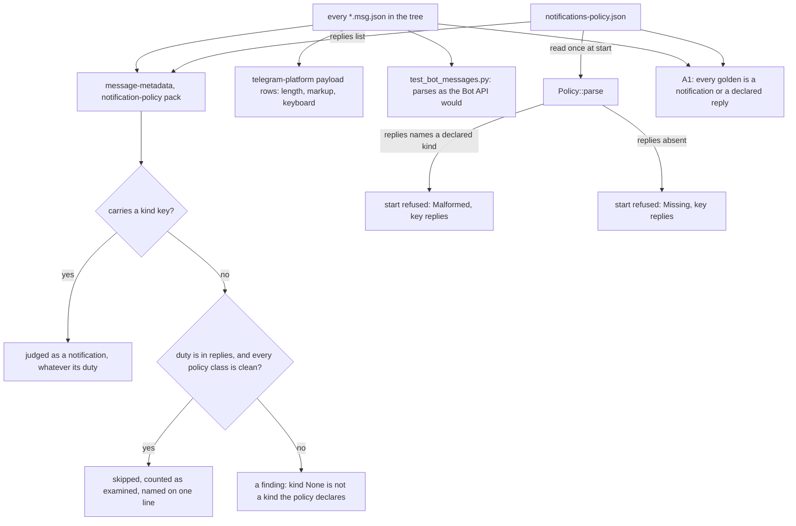

# Schematic: which committed messages the notification-policy check judges

Kind: data flow. Read at DeckStreak dev `02758d40b`. Decided by ADR-323; built by SPEC-323.

The payload rows and `test_bot_messages.py` read all 26 command replies whether or not the metadata
row skips them. At this head the metadata row judges 0 notification envelopes.
