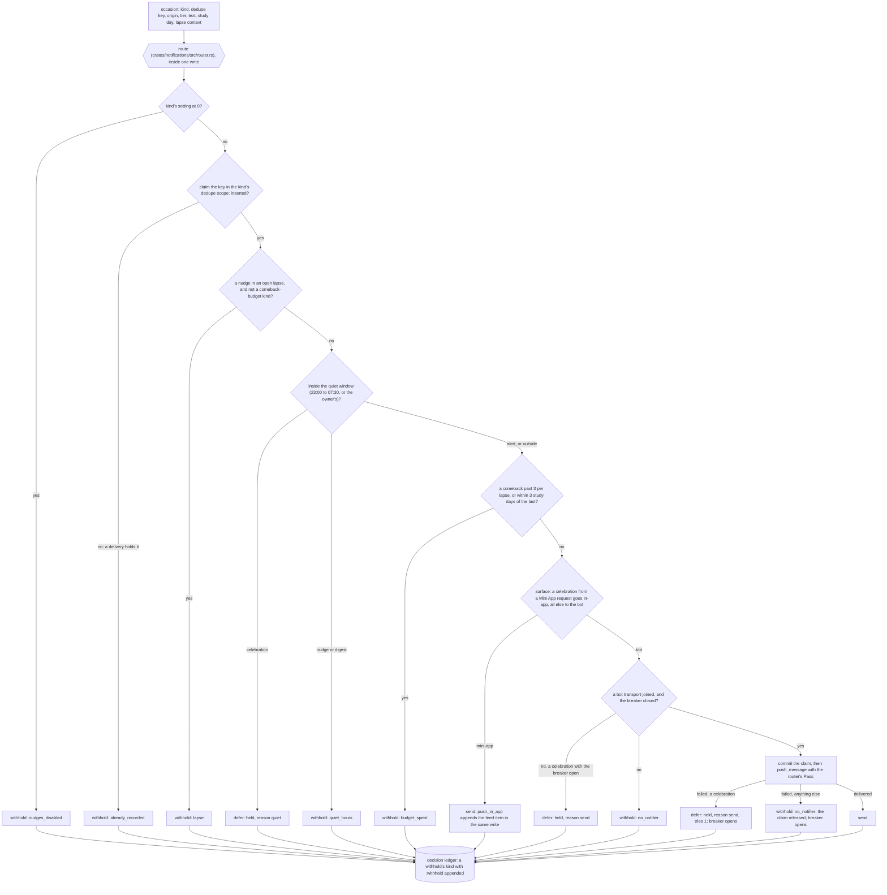
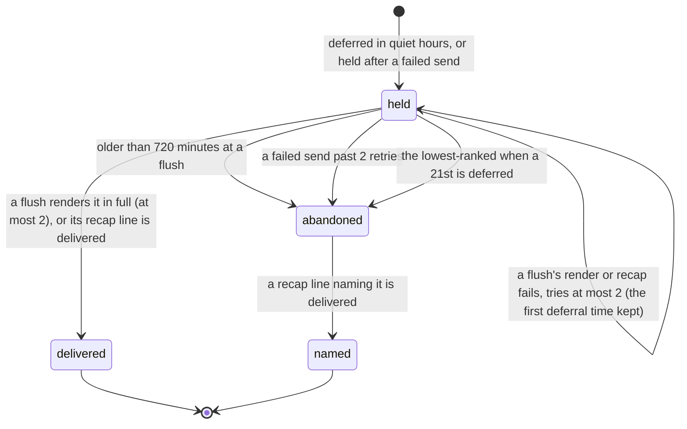
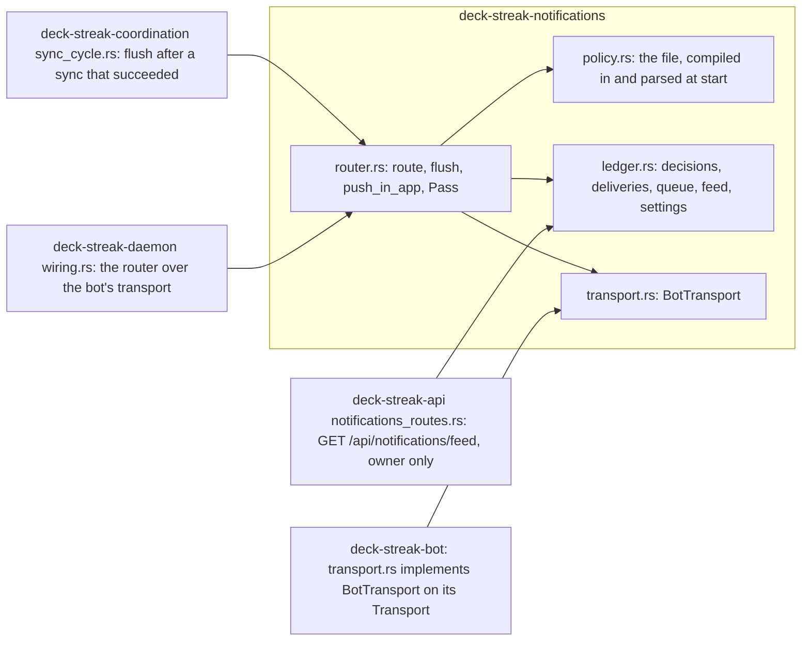

# Schematic: the notification router's decision

Kind: data flow and decision order, a held celebration's state machine, and the joins. Read at
DeckStreak `main` ce3683d (`notifications-policy.json`, ADR-011,
docs/schematics/streaks-and-governor-state-machine.md), at the predecessor's `27ee2bc`
(`quiet_hours.py:in_quiet_hours`, `pipeline_layers/celebrations.py:CelebrationsLayer.celebrate` and
`flush_deferred_celebrations`), and at the packs vendored from `19bb0f3` (notifications-policy: the
decision ledger, the withhold reasons, `one-router`). Added by SPEC-041, and brought to the design it
delivered at `dev` f5322b2 (SPEC-041 §7; ADR-041's decisions at delivery).

## The decision

A withhold after rule 2 deletes the claim inside the same write, so a key is claimed exactly when
it was sent or held. Three guards hold every delivery to the router, each on its own path:

- **The port's call, by the compiler (SPEC-041 A2).** Only the router module can make a `Pass`, and
  each bot transport call takes one, so a call of the port outside the module does not compile: the
  pass has a private field, no `Default` and no `Clone`. `push_in_app` is private to the module.
- **A delivery around the port, by a census (A15).** A source that never calls the port could still
  reach the owner through the bot's own `send_html` or a raw request to the Bot API. A census of
  every shipped source refuses both: outside `crates/bot/` nothing names the Bot API's host or a
  send method, SPEC-031's alert path aside, and the bot's sends are called only at named call
  sites: by `OwnerChat`, by the command replies and inside the transport's own requests.
- **A call the policy names, by the box run (§3a B1).** The `one-router` row refuses a call of
  `push_message`, `push_dice`, `push_reaction`, `push_pin` or `push_in_app` outside `router.rs`.

## A held celebration

A flush does nothing without a bot transport, inside the quiet window, or while the breaker is
open; its first failed render ends it. Each render, re-hold and abandonment is a decision in the
ledger; an abandonment is withheld with `quiet_hours` or `no_notifier`, by what held it.

## The joins

The lapse context comes from the governor, through the caller (ADR-041). The bot role's owner
`/sync` flushes through the router over its transport; the job role's scheduled cycle has no bot
transport, so its flush does nothing until a job that sends joins one.
