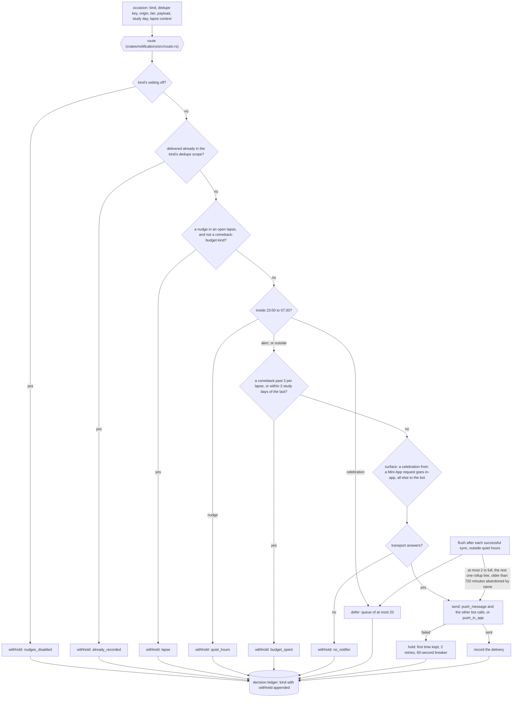

# Schematic: the notification router's decision

Kind: data flow and decision order. Read at DeckStreak `main` ce3683d (`notifications-policy.json`,
ADR-011, docs/schematics/streaks-and-governor-state-machine.md), at the predecessor's `27ee2bc`
(`quiet_hours.py:in_quiet_hours`, `pipeline_layers/celebrations.py:CelebrationsLayer.celebrate` and
`flush_deferred_celebrations`), and at the packs vendored from `19bb0f3` (notifications-policy: the
decision ledger, the withhold reasons, `one-router`). Added by SPEC-041.

The five delivery calls the policy's `router.transport` names are called only inside the router
module; the bot implements its four in `crates/bot/src/transport.rs`, and `push_in_app` appends to the
in-app feed that `GET /api/notifications/feed` serves to the owner. The lapse context comes from the
governor, through the caller (ADR-041).
