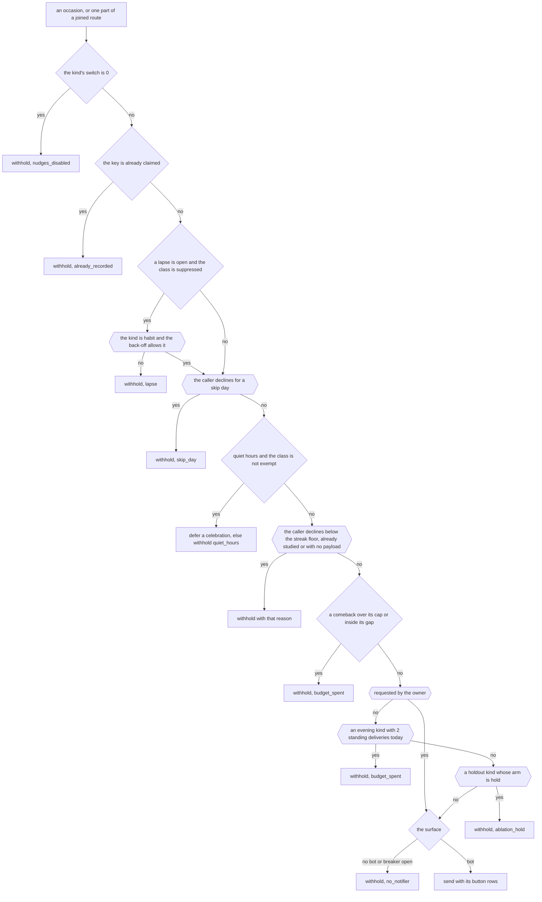
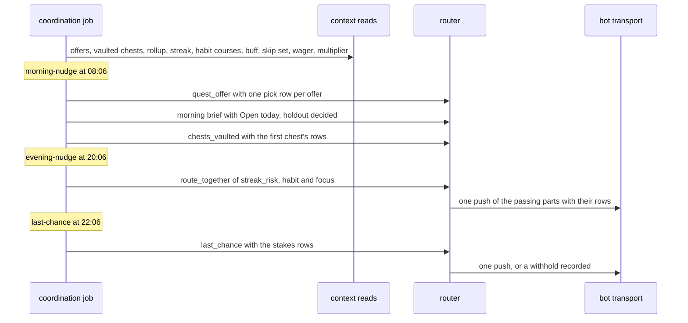
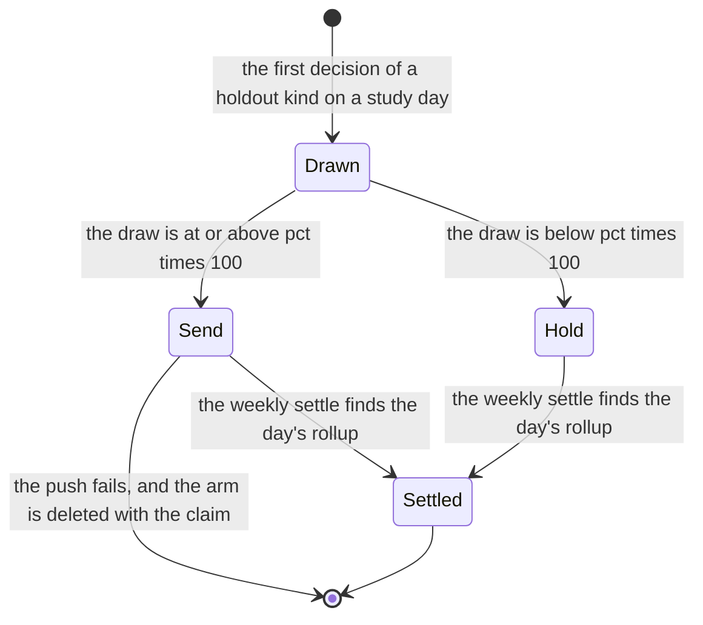
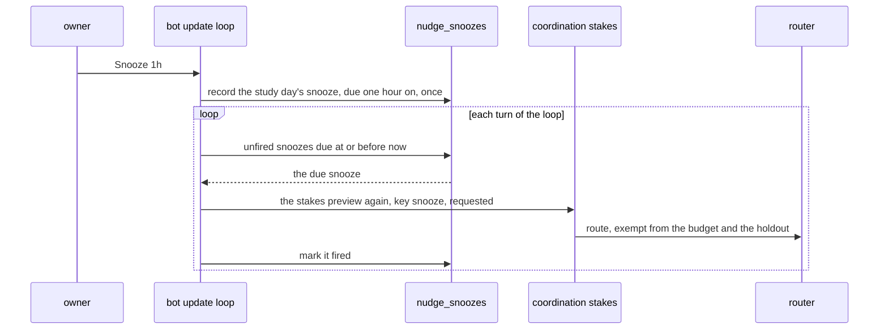

# Schematic: the nudge coordinator, the joined route and the holdout

Kind: flowchart, state machine and sequence. Read at DeckStreak `dev` 5216bcf and at the
predecessor's `27ee2bc` (`pipeline_layers/nudges.py:NudgesLayer`'s `run_morning_brief`,
`_send_quest_offer`, `_streak_risk_payload`, `_evening_ping_budget_left` and
`run_last_chance_nudge`, `pipeline_layers/focus.py:FocusLayer.run_evening_nudges`,
`pipeline_layers/habits.py:HabitsLayer._habit_nudge_decayed`, and `database.py:GamifyStore`'s
`decide_nudge_arm`, `settle_nudge_ablation` and `nudge_ablation_readout`). Added by the W5 architect
turn, under ADR-100 (the evening check-in is one routed message whose parts keep their own kinds),
ADR-101 (the comeback is the owner's one-reading sequence under the predecessor's cadence) and
ADR-102 (a hold withholds the whole nudge, and what the owner holds travels as its own message).
SPEC-100 builds it.

It extends seven accepted schematics without changing them: `docs/schematics/notification-router.md`
(the decision this adds rules to), `docs/schematics/cron-fire-ledger-and-catch-up.md` (the jobs'
fires), `docs/schematics/bot-update-loop.md` (the loop whose turn fires a snooze),
`docs/schematics/streaks-and-governor-state-machine.md` (the lapse and the streak the nudges read),
`docs/schematics/skip-day-record-and-effects.md` (the skip day a nudge declines on),
`docs/schematics/quests-and-chests-lifecycle.md` (the offer and the vaulted chests the morning
carries) and `docs/schematics/celebration-ladder-on-the-router.md` (the celebrations the same router
decides).

## The decision, with the nudge rules

The router's order after this SPEC. The rules drawn with a double border are new.

- Every withhold releases the claim and records `<kind>:withheld` with its reason, in the decision's
  write.
- A requested occasion (the snooze) skips the budget and the holdout, so it spends nothing and draws
  no arm.
- The habit back-off allows the check-in in a lapse while fewer than 5 days have passed since the
  language track's last study day, and after that only when the kind's most recent delivery is at
  least 3 study days old, read from the ledger alone.

## The morning, the evening and the last chance

- The offer and the chests are digests: neither a lapse nor a hold withholds them, so a held or
  lapsed morning still carries what the owner must act on.
- A joined route records each passing part once under its own kind; a failed push releases every
  claim and records each `no_notifier`.
- The comeback stays the morning readings job's (SPEC-049), under the same router.

## A holdout arm's life

- An arm is drawn once for its kind and study day and reused unchanged, even when the percent
  changes.
- A day with no rollup row is never settled, so no outcome is fabricated.
- The settle takes at most 400 arms of the trailing 90 days, and the readout shows only kinds with
  both arms.

## A snooze

- The snooze is a row, so a restart keeps it, and the router's claim on the key keeps a fire from
  sending twice.
- A snooze whose study day has passed is marked fired and raises nothing.
