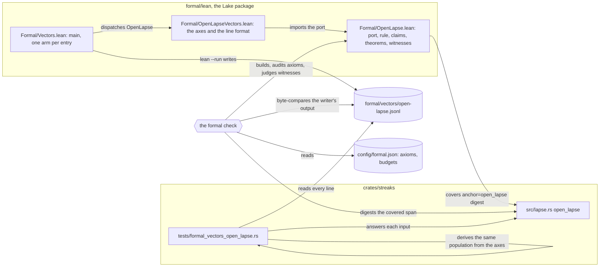
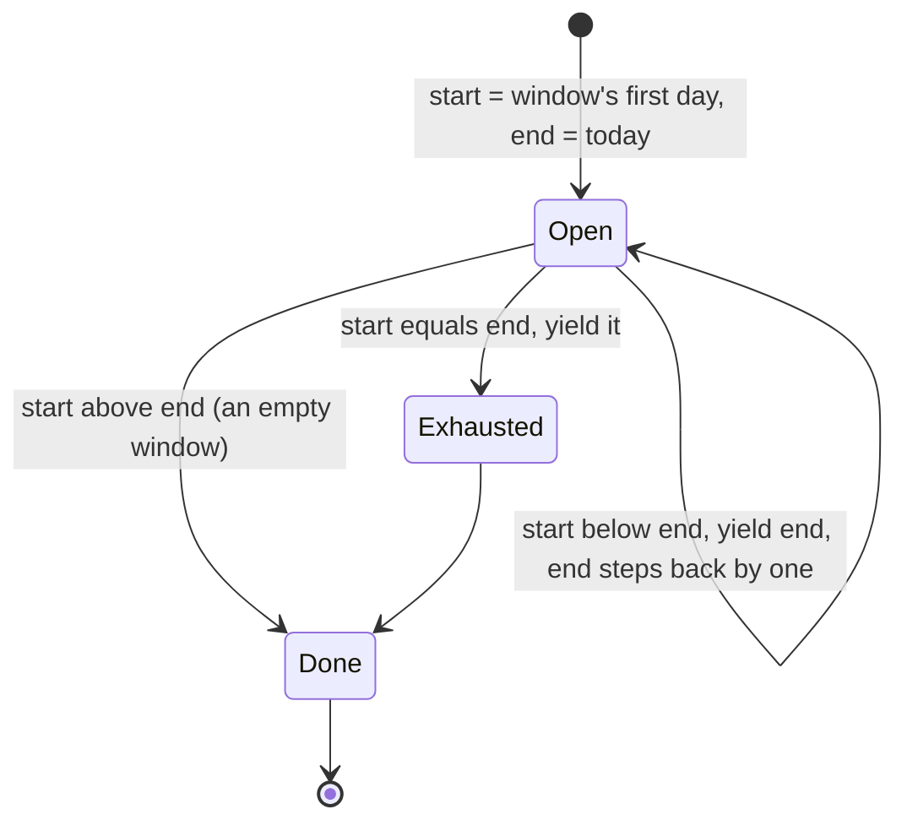

# Schematic: the open lapse walk's proof and its vectors

Kind: data flow and component. Read at DeckStreak `dev` 530a3d6 (`crates/streaks/src/lapse.rs`
`open_lapse`, `crates/kernel/src/study_day.rs` `StudyDay`, `config/formal.json`). Decided by
ADR-305; the property is #472's.

The first Lean entry adds one component, the Lake package under `formal/lean`, and one data flow:
the port's answers reach the Rust test through a committed vectors file, never through a shared
library. The checker reads every input at the head commit.

## What crosses each boundary

| from | to | what | caught when |
|---|---|---|---|
| `lapse.rs` | the entry | the span of `open_lapse`, by sha256 | the span moves: every theorem reads `STALE` until the port is re-read and the digest moves |
| the entry | the checker | three theorems, three witnesses, `#print axioms` of each | a hole (`sorry`, a new axiom, an axiom outside the allow-list), or a witness that does not build |
| the writer | the vectors file | a header naming the covered item and its digest, then one line per input | the committed file differs from the writer's output by one byte: a `DERIVED_DRIFT` finding names the first line that differs, and each theorem reads unclean |
| the vectors file | the test | each input and the port's answer | an input the test's own axes do not derive, a count that differs, or an answer the Rust function does not give |

## The port's states (`RangeInclusive::next_back`)

The walk's own exits, at each yielded day: a study review ends it with the threshold's answer; at
the smallest day the type admits it answers none; a `Done` answers by the threshold.
