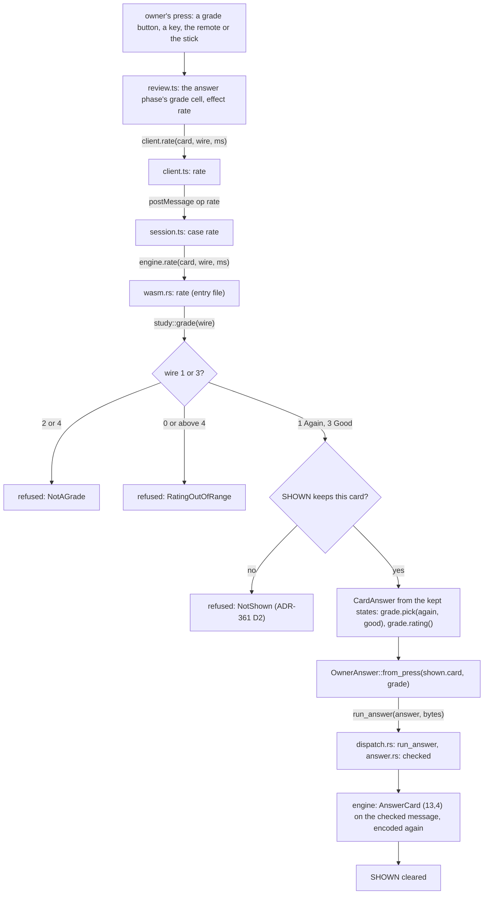
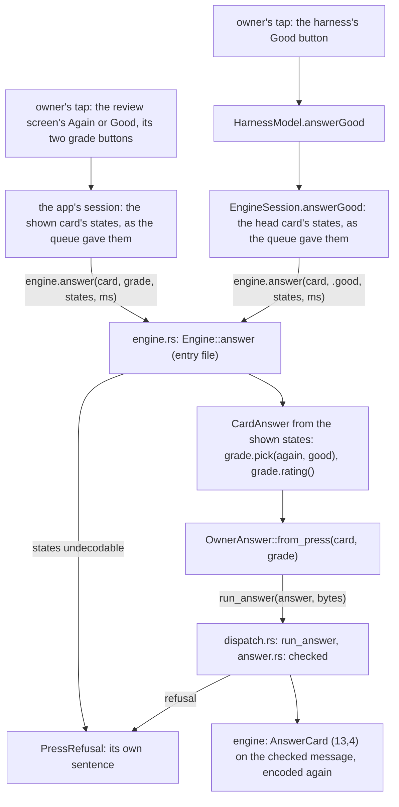
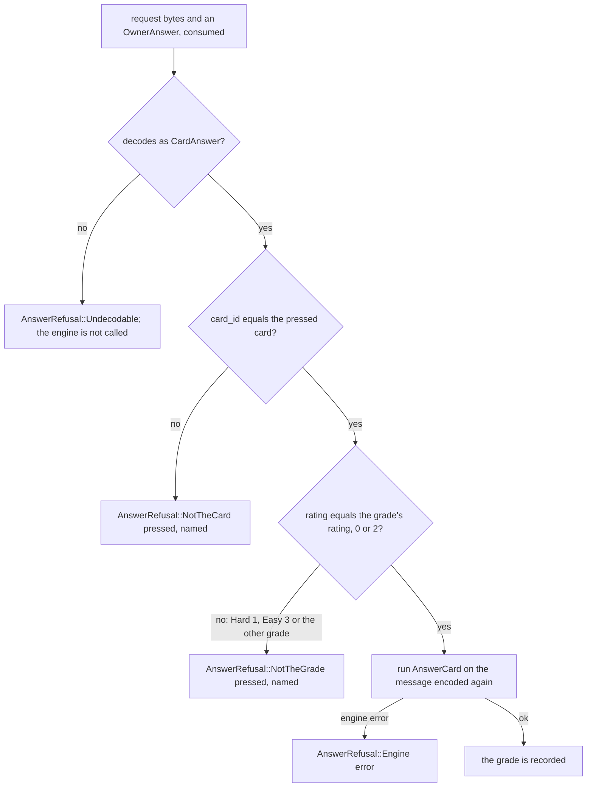

# Schematic: from the owner's press to the recorded grade (SPEC-365)

Kind: **data flow**, with one **component** view of the doors before and after. Every `path:line`
was read at DeckStreak `dev` `dee337bc`. Names after this delivery are those SPEC-365 R1 to R13
give.

## 1. The web client

## 2. The native client

## 3. The check, shared by both clients

## 4. Who can reach AnswerCard

| door | at `dev` `dee337bc` | after SPEC-365 |
|---|---|---|
| the core's `run` (`dispatch.rs:112-130`) | admits (13,4) on both transports (`table.rs:184-190`) | refuses `NeedsAnswer { 13, 4 }` |
| the native `run` (`engine.rs:94-103`) | admits it (`allow_list.rs:54-58`) | refuses `NotAllowed` at the allow-list |
| the web `run_method` (`wasm.rs:656-659`) | admits it (`study.rs:88`) | refuses: not a study call, and the core refuses it too |
| the web `answer` (`wasm.rs:251-270`) | answers the head card, any of four ratings | removed |
| the web `rate` (`wasm.rs:485-502`) | answers the kept card, any of four ratings | answers the kept card with Again or Good, through `run_answer` |
| the native `Engine::answer` | absent | answers the pressed card with Again or Good, from the states it was shown with, through `run_answer` |
| `Dispatcher::run_answer` | absent | the one door, which needs an `OwnerAnswer` |

The token's constructor is named outside the core only in the two entry files. The census
(`crates/engine-core/tests/containment.rs`) holds this, and it holds the engine's `answer_card`
outside the core to four fixture lines in `crates/ingest/tests`.

## 5. What carries state

- `SHOWN` (`wasm.rs:70`): the web's kept card and its states. It is written when a card is shown,
  read and cleared by `rate`, and only on the Worker's one thread. It is unchanged by this delivery.
- The collection: written only by the engine, behind its own lock, which also refuses a stale
  current state. It is unchanged.
- `OwnerAnswer`: made in an entry file and consumed by `run_answer` in the same call. It is never
  stored.
- The states a native press passes: written by the codec from the queue's reply, held by the app
  while the card shows, and consumed by `Engine::answer` in one call. The adapter never stores them.
