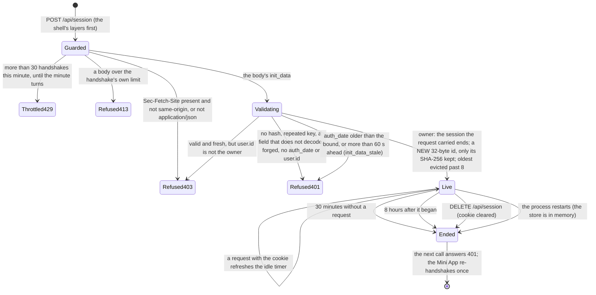
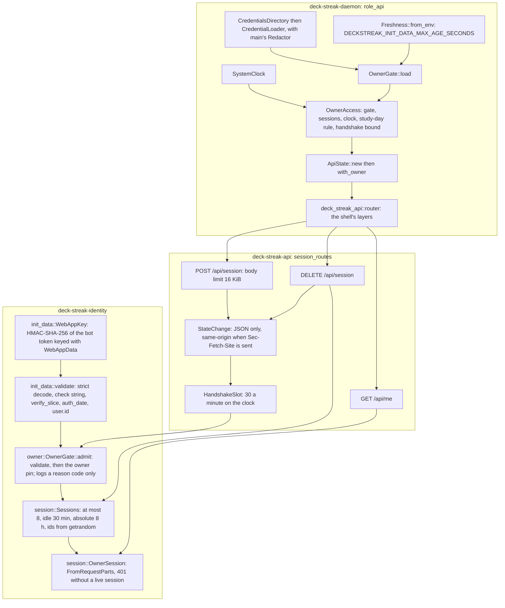
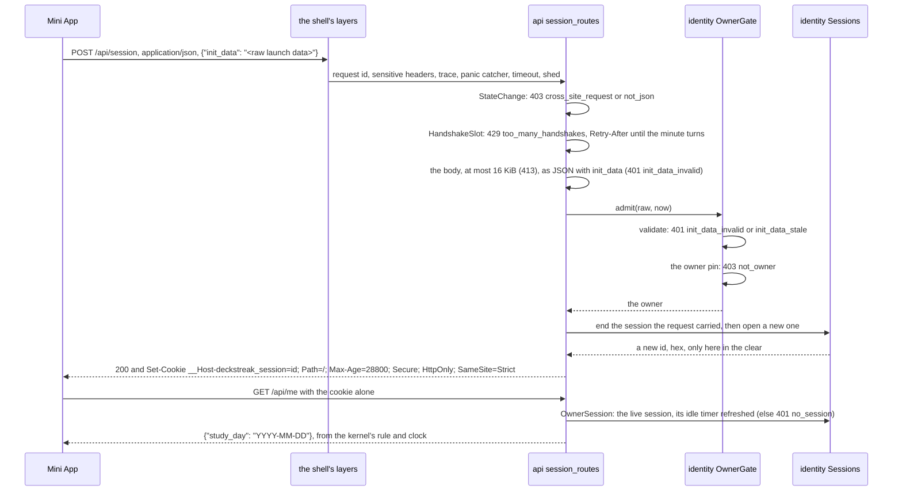

# Schematic: an owner session, from the handshake to its end

Kind: state machine, component diagram and sequence. Read at DeckStreak `main` e05dfa5 and `dev`
1534f5d (ADR-006, ADR-024, ADR-025, `docs/schematics/initdata-auth-sequence.md`,
`docs/schematics/mini-app-launch.md`, the auth pack's session practice). Decided by ADR-024; built
by SPEC-024. The validation steps before a session exists are the auth-sequence schematic's; the
wire contract is the Mini App's (`mini-app-launch.md`).

## The session's states

## Who holds what

The daemon's `api` role reads the two credentials at start, through the kernel's loader, which
registers each value with the redactor the log writer reads. `identity` keeps no personal data on
disk: the owner's id and a key derived from the bot token live in memory, and the store holds each
session as the SHA-256 of its id. `api` holds the routes, the cross-site bound and the handshake
bound; every route is served under the shell's layers (SPEC-025).

## A handshake, in order

Each step can refuse; nothing after a refusal runs, and a refusal is logged by its reason code
alone.

| guard | where | row |
|---|---|---|
| WebAppData HMAC over the sorted check string | `identity::init_data::validate` | `ws.tg-init-data-verified` (by hand) |
| constant-time hash compare | `identity::init_data` (`verify_slice` only; A6's census) | `ws.tg-init-data-constant-time` (by hand) |
| freshness | `identity::init_data` against the kernel's clock | `ws.tg-init-data-fresh` (by hand) |
| owner pin | `identity::owner::OwnerGate::admit` | CHARTER 14 |
| rotation | a new id at every handshake; the carried one ends | `auth.session-rotated-on-login` |
| idle and absolute end | `identity::session::Sessions` on the kernel's clock | `cp.session-idle-timeout` |
| logout | `DELETE /api/session` ends the session in the store | `auth.logout-server-side` |
| cookie | `__Host-deckstreak_session`; `Path=/`, `Max-Age`, `Secure`, `HttpOnly`, `SameSite=Strict`, no `Domain` | `ws.session-cookie-flags` (by hand), `ws.cookie-prefix`, `ws.session-samesite` |
| CSRF | JSON only; `Sec-Fetch-Site` must be `same-origin` when present | `ws.upload-csrf-cors` |
| handshake bound | 30 a minute, per process | `ws.rate-limit` |
| handshake body | 16 KiB, below the shell's 2 MiB | `ws.request-body-limit` (by hand) |
