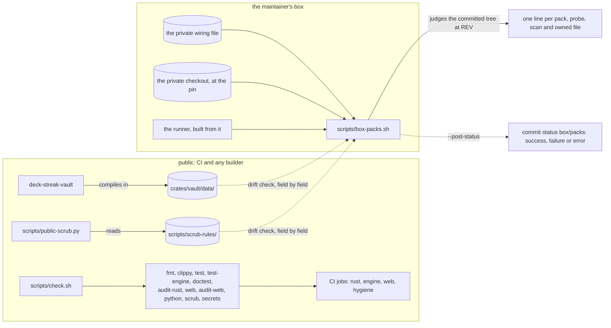
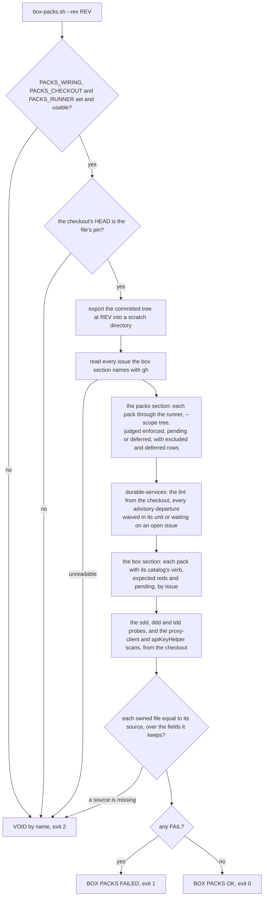

# Schematic: every pack judged on the box

Kind: component, then flow. Decided by ADR-069 and ADR-056; built by SPEC-056. The public gate runs
DeckStreak's own stages; the maintainer's box run judges every pack, the methodology probes, the
proxy-client and apiKeyHelper scans and the owned data's drift, and posts one verdict on the pull
request. The third table is how a criterion whose test the removal took away is retired, and the
fourth how the durable lint's advisory departures are judged.

| verdict | exit | `box/packs` state |
|---|---|---|
| BOX PACKS OK | 0 | `success` |
| BOX PACKS FAILED | 1 | `failure` |
| VOID, with its reason | 2 | `error` |

| the apiKeyHelper scan finds | the tree holds a settings file where the old gate step looked | its line |
|---|---|---|
| no settings file | no | `pending #N` with the private file's issue, or `FAIL` (VOID) without one |
| no settings file | yes | `FAIL` (VOID), naming the file |
| settings files, none carrying the shape | either | `ok`, or `FAIL` (stale) while an issue is still named |
| a finding, or a file it cannot read | either | `FAIL` |

| a retired criterion, insert-only (SPEC-056 R14) | where |
|---|---|
| its id struck, `~~A3~~` | the SPEC's criteria table |
| its command in a `retired` fence, splitting the `acceptance` fence where it stood (closed empty before a first line) | the SPEC's section 3 |
| its red, green or not-red lines in a `retired` fence | its red-first record |
| why its subject is gone, and what judges it now | the SPEC's dated amendment section, and SPEC-056 section 7 |

| an advisory departure the lint reports, by unit and reason (SPEC-056 R15) | the pack reads |
|---|---|
| waived in its unit, with a why of more than five words | counted as waived |
| waived with a why of five words or fewer | `FAIL`, a thin why |
| not waived, and waiting on an issue the private file names, which is open | counted as waiting |
| neither waived nor waiting | `FAIL`, naming the unit and the reason |
| a waiver or a waiting entry that matches no departure, or waits on a closed issue | `FAIL`, stale |
