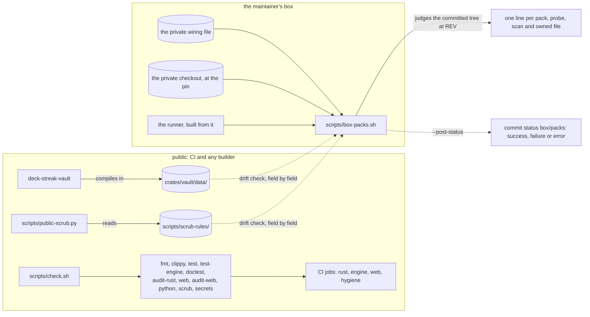
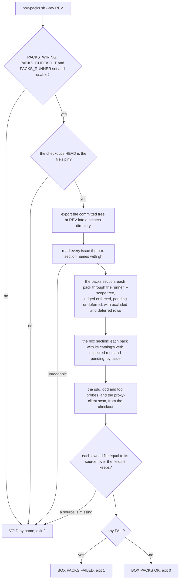

# Schematic: every pack judged on the box

Kind: component, then flow. Decided by ADR-069 and ADR-056; built by SPEC-056. The public gate runs
DeckStreak's own stages; the maintainer's box run judges every pack, the methodology probes, the
proxy-client scan and the owned data's drift, and posts one verdict on the pull request.

| verdict | exit | `box/packs` state |
|---|---|---|
| BOX PACKS OK | 0 | `success` |
| BOX PACKS FAILED | 1 | `failure` |
| VOID, with its reason | 2 | `error` |
