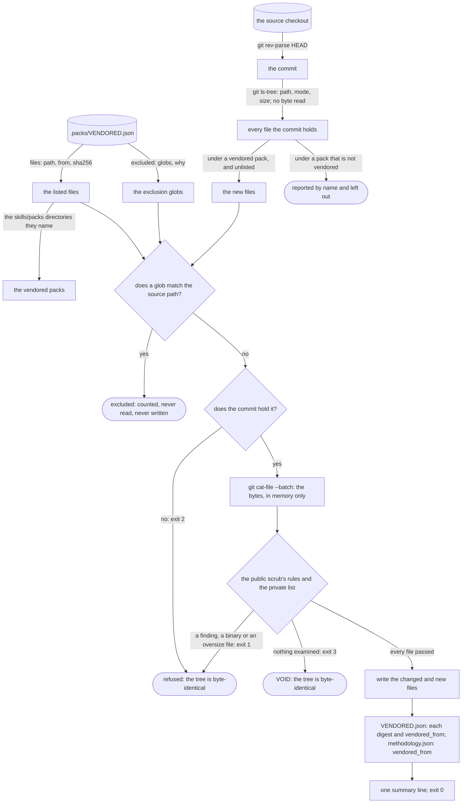

# Schematic: one vendoring run, from a phoenix-v2 commit to the vendored tree

Kind: data flow, with the refusals that leave the tree unchanged. Read at DeckStreak `dev` 8f91667
(`.packs/VENDORED.json`, `methodology.json`, `scripts/public-scrub.py`, ADR-004, ADR-033), and at
the vendored phoenix-v2 commit for the shape of what it ships. Decided by ADR-039; built by
SPEC-037.

Nothing is staged on disk. The candidates' bytes are read into memory, scanned there, and written
into the tree only when every one of them passed, so a refused run leaves no file behind, tracked or
untracked. The script sets `sys.dont_write_bytecode` before it loads the scrub, so a run writes no
`__pycache__` into either repository.

## What crosses each step

| step | what crosses | guard |
|---|---|---|
| manifest | the listed files and the exclusions | an exclusion without `globs` or `why`, or a path that leaves the root, stops the run with exit 2 |
| source | one commit, named by the checkout's `HEAD` | the files come from the commit, never the working tree, so `vendored_from` is what was read and an untracked file is never a candidate |
| candidates | the listed files, and every unlisted file of a pack already vendored | a pack that is not vendored is a wiring decision: it is named and left out, never vendored |
| exclusion | the source path only | `fnmatch` over the path, where `*` and `**` both cross `/`; a match is dropped before its bytes are read |
| a listed file an exclusion matches | its entry | the entry is dropped from the manifest and named on the output; the script deletes no file, so a person removes a copy the tree still holds, which the vendored-packs test names |
| scan | each file's bytes, in memory | `public-scrub.py`'s own `Scan`, binary rule, size limit and skipped rule files, over persona-core's and privacy-gdpr's shapes and the private list; a finding names the source path and the rule, never the value |
| write | the files whose bytes or executable bit differ | only after every candidate passed; a file already equal is not touched, so a run with nothing to change leaves the tree byte-identical |
| pin | the digests and the commit | `VENDORED.json` and `methodology.json` are written only when their content changes |

## The run's verdict

| what the run met | exit | the tree |
|---|---|---|
| every candidate read and clean | 0 | the changed and new files, the digests and the pins |
| a finding: an address, a private literal, a binary, an oversize file, a symlink | 1 | unchanged |
| a listed file the commit lacks, or a manifest, pin or private list it cannot read | 2 | unchanged |
| no candidate left to examine | 3 | unchanged |
