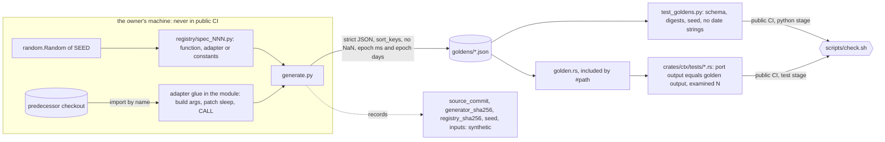

# Schematic: the parity oracle, from the predecessor's functions to a Rust assertion

Kind: data flow. Read at DeckStreak `main` e05dfa5 (ADR-012, `tools/parity-oracle/generate.py`,
`tools/parity-oracle/test_generate.py`), and at the predecessor's `27ee2bc` for the first function
it drives (`analytics.py:study_day`, `types.py:CollectionConfig`). Decided by ADR-029.

| step | what crosses | guard |
|---|---|---|
| registry to generator | a registration of one kind | a golden name registered twice exits 2 naming both modules |
| predecessor to golden | outputs of the predecessor's own code over seeded synthetic inputs | a registry module may not read a file, a database or the network (static read of its syntax tree) |
| generator to repository | the golden with its provenance | `generator_sha256` and `registry_sha256` stale only what changed |
| golden to Rust | typed cases | wrong schema, no case or a missing field is refused; zero examined panics |

The oracle never runs in public CI; public CI runs only what reads the committed goldens.
