# Passkey sign-in on the web: components and data flows (SPEC-359, ADR-370)

Kinds: component, data flow (as sequences), and the session proof's state machine. Every
`path:line` below was read at `3fe90969b3927cac1c3630c83a582f9d9c796d66`. Names are the ones the
SPEC and the code use: a session's proof is `telegram`, `link` or `linked`; a refusal is its
reason code.

## 1. Components

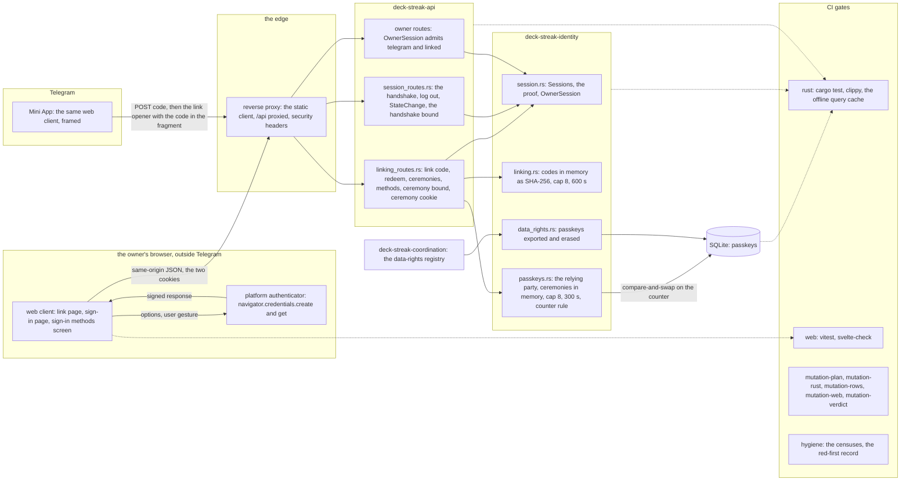

- The web client and the Mini App are one application on one origin
  (`web/app/svelte.config.js:24-33`, `deploy/caddy/deck-streak.caddy:46-52,89-93`), so the
  relying party ADR-132 names covers both. A ceremony runs only at top level outside Telegram:
  the edge declares no Permissions-Policy (`deploy/caddy/deck-streak.caddy:11-21`), so WebAuthn's
  default `self` allowlist holds there, and Telegram's frame is granted none.
- The page's `connect-src` is `'self'` (`web/app/svelte.config.js:30`). The ceremonies add no
  outbound request: the API verifies against its own configured origin and reaches no network.
- Identity depends on the kernel alone (`docs/CONTEXT-MAP.md:15`); `webauthn-rs`, `uuid` and
  `sqlx` are external crates, so no context edge is added.

## 2. A session's proof

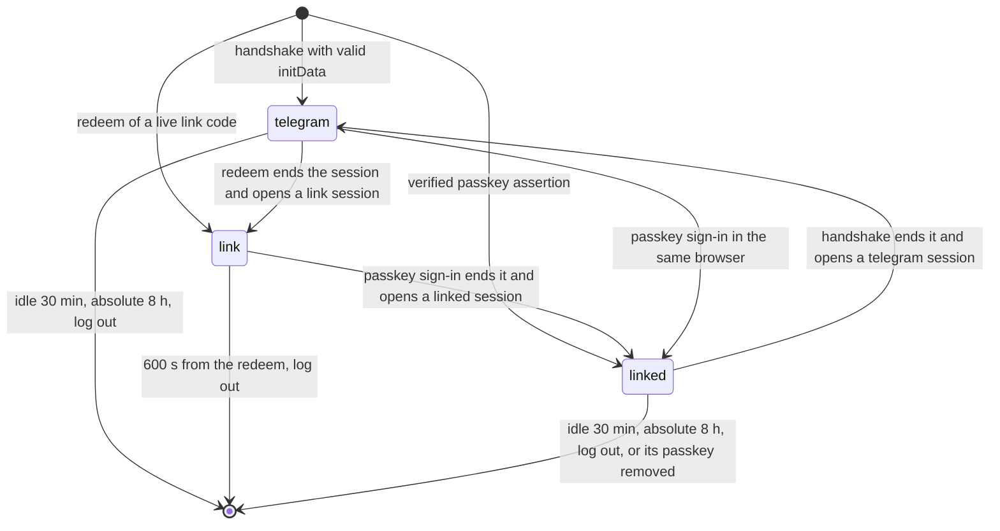

| proof | admitted by | mints a link code | removes a method | registers a passkey |
|---|---|---|---|---|
| `telegram` | `OwnerSession`, the methods routes | yes, at most 300 s after its handshake | yes, at most 300 s after its handshake | no |
| `link` | the linking routes alone | no | no | yes |
| `linked` | `OwnerSession`, the methods list | no (`reauth_required`) | no (`reauth_required`) | no |

Today a live session holds a digest, its owner and two instants (`crates/identity/src/session.rs:117-121`);
the proof is the field this delivery adds. Every transition that opens a session ends the one the
request arrived with first, as the handshake already does (`crates/api/src/session_routes.rs:128-155`).

## 3. Registration from a signed-in session

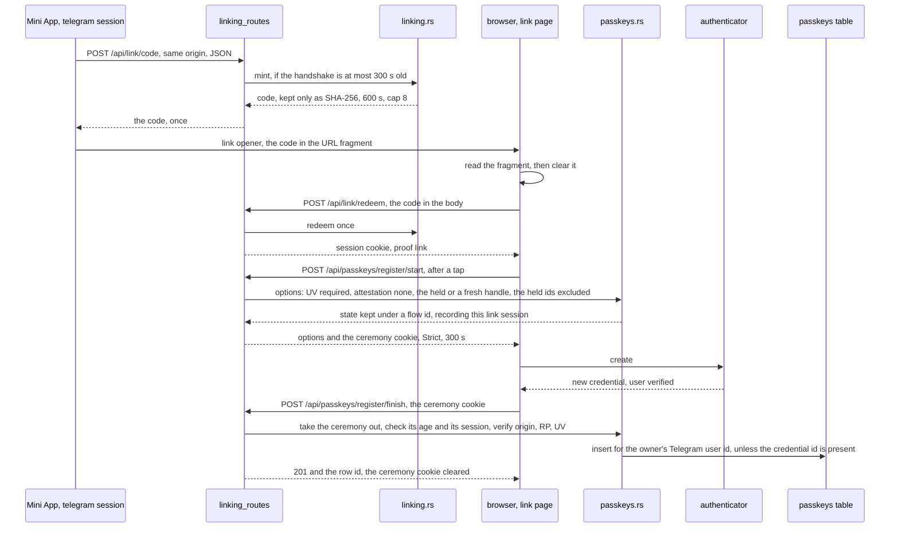

## 4. A passkey sign-in

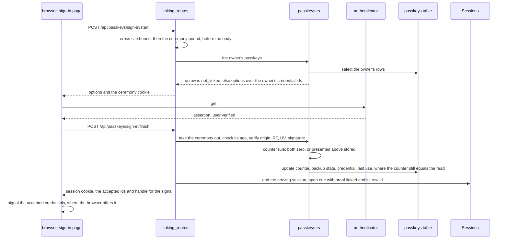

## 5. A refused doubtful assertion

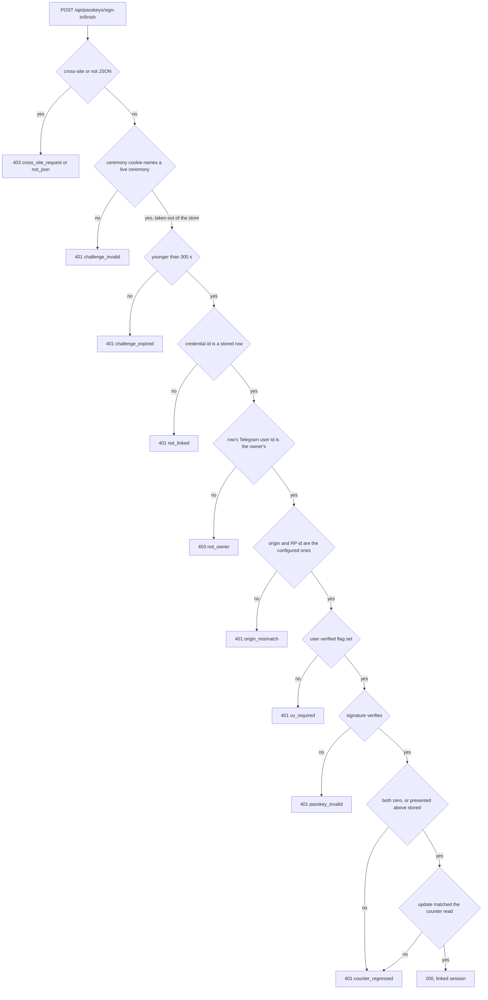

Every refusal writes nothing, opens no session and logs its reason code with no value of R13's
list. The ceremony is already out of the store, so the same response replayed meets
`challenge_invalid`.

## 6. A passkey removal

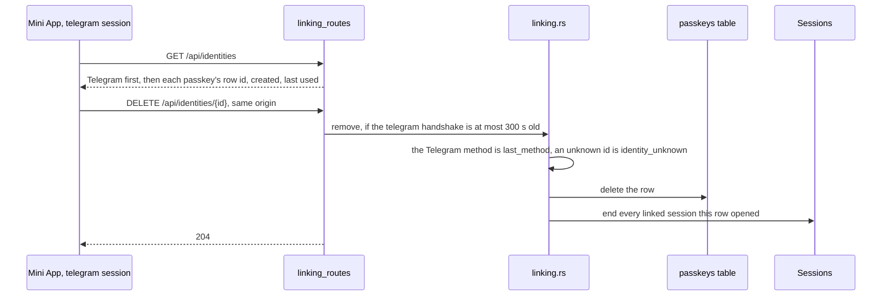

Recovery when every passkey is lost is this flow: the owner signs in through Telegram, the
primary identity (ADR-006), removes the lost passkeys, and registers a new one by §3.

## 7. The web client's half: components (SPEC-385, ADR-399)

Kinds for §7 to §11: component, sequence and state machine. Every `path:line` in them was read at
`e7ecf10d6b796eb1f86fe6544e04a96a0583c791`. The server's boxes are §1's, unchanged; the new boxes
are the web client's. The surface test is `telegram.launchData !== null`
(`web/app/src/lib/telegram.svelte.ts:95`), never `telegram.inside` (`telegram.svelte.ts:92`),
because `inside` names whether Telegram's script ran (on every page at `e7ecf10d`, only on a
launch since SPEC-400), never whether the page holds the launch data the handshake reads.

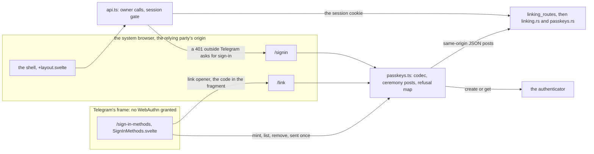

The client holds no challenge beyond one call, never reads the flow id or a session id (both
HttpOnly cookies, `crates/api/src/linking_routes.rs:60`, `crates/identity/src/session.rs:36`), and
writes nothing to browser storage.

## 8. Registration, from the owner's tap in the Mini App to a passkey on the owner's account

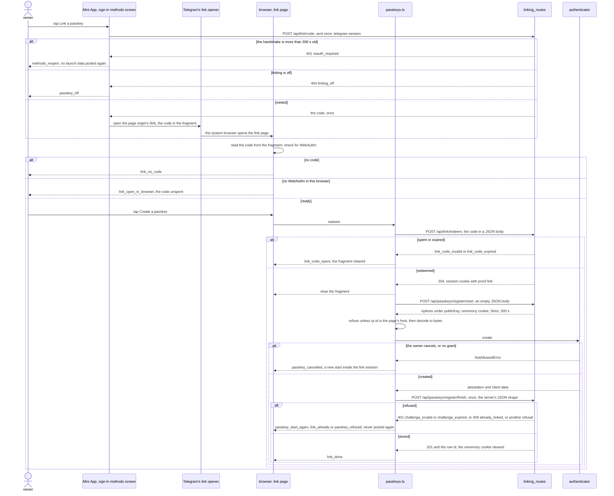

## 9. A passkey sign-in in the browser, to a `linked` session

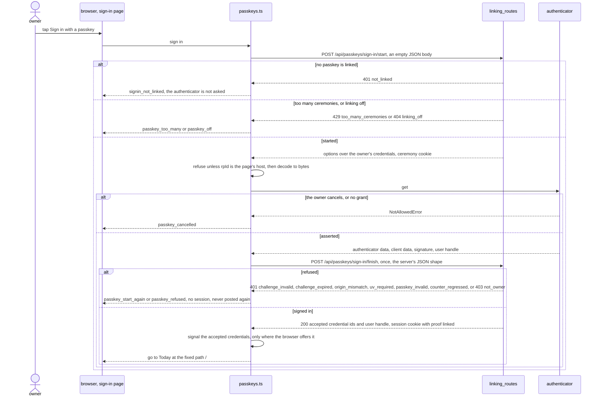

## 10. The session gate outside Telegram

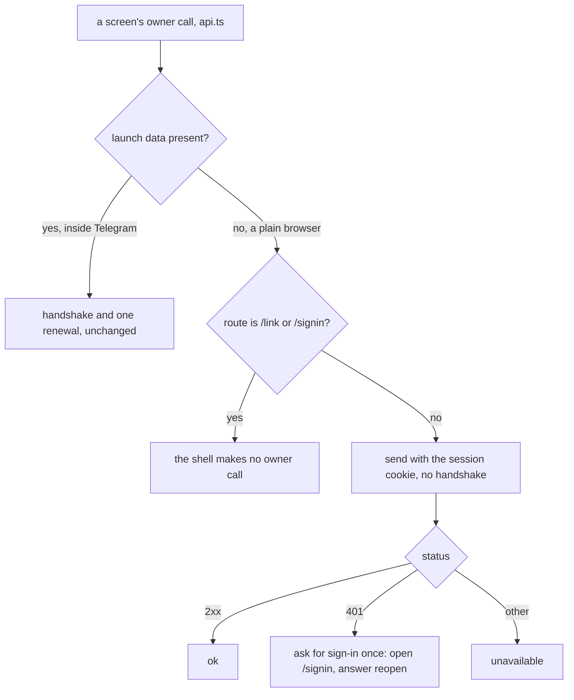

The server decides every session: `OwnerSession` admits `telegram` and `linked`
(`crates/identity/src/session.rs:125-132`), a `link` session only registers, and no command with
stakes is open to a `linked` session (SPEC-359 R14).

## 11. The link page and the sign-in page, as state machines with every refusal

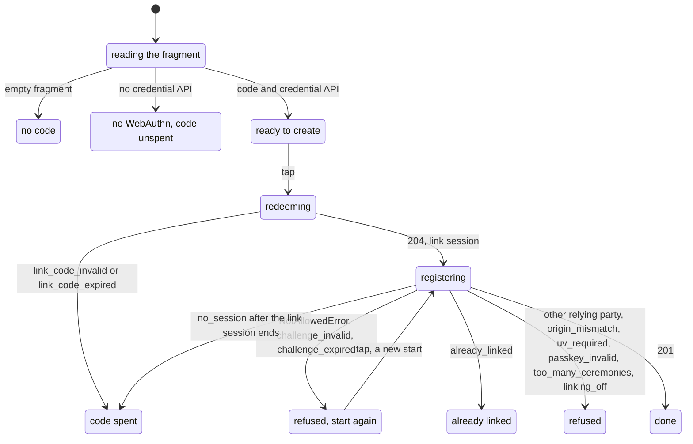

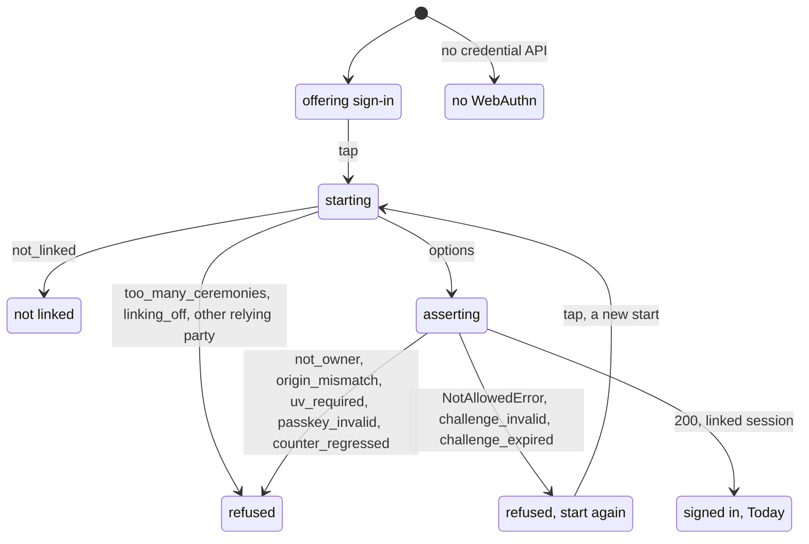

Every refused state leaves the page where it is: no navigation, no signal and no session. A finish
is posted once per start; a new attempt is a new start, and the server's ceremony store has already
taken the old one, so a replayed response meets `challenge_invalid` (§5 above). Two tabs that each
start a ceremony share one ceremony cookie, so the earlier tab's finish meets a refusal and offers a
new start; `formal/tla/PasskeyOnce/PasskeyOnce.tla` already holds that any request task may take any
id and that a take of an id no live entry has changes nothing.
