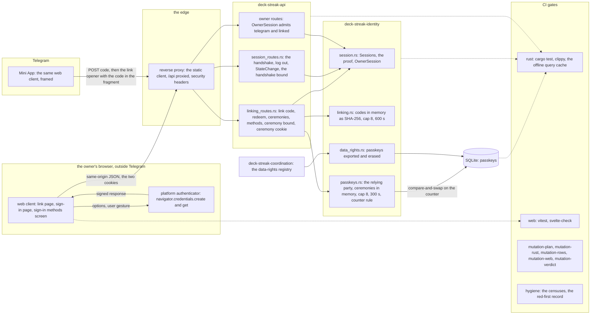
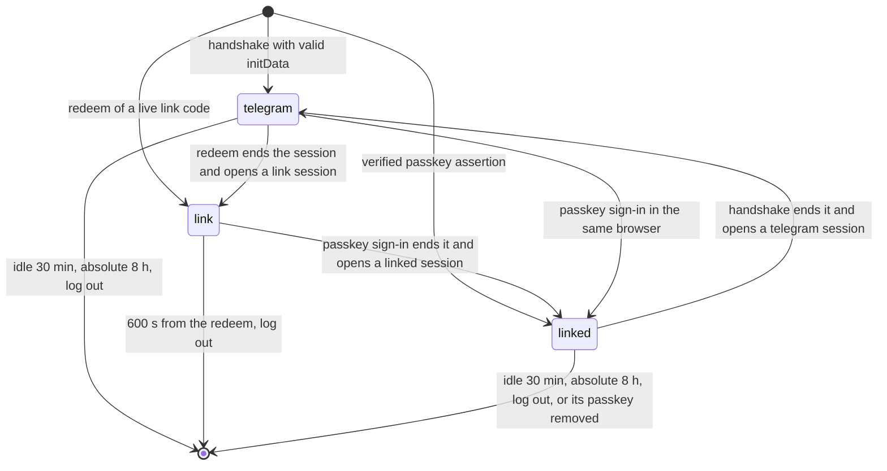
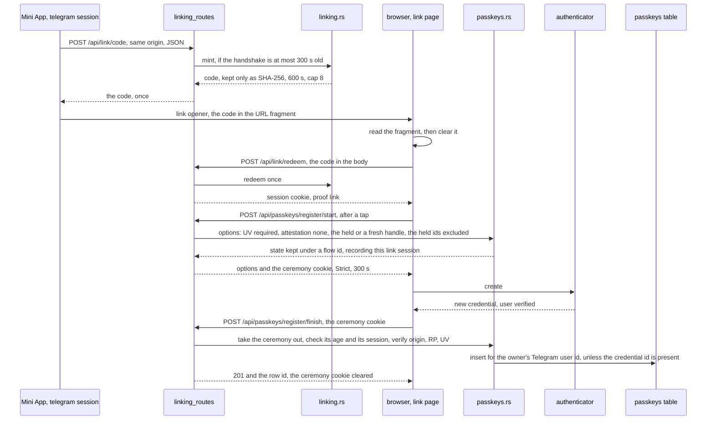
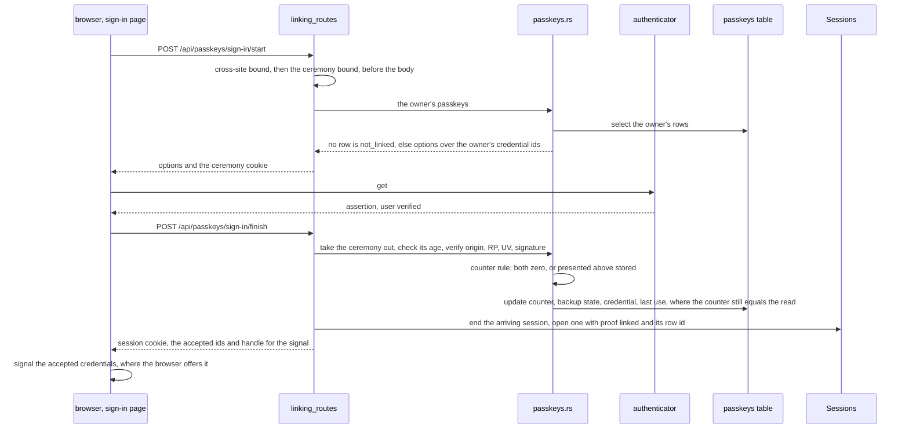
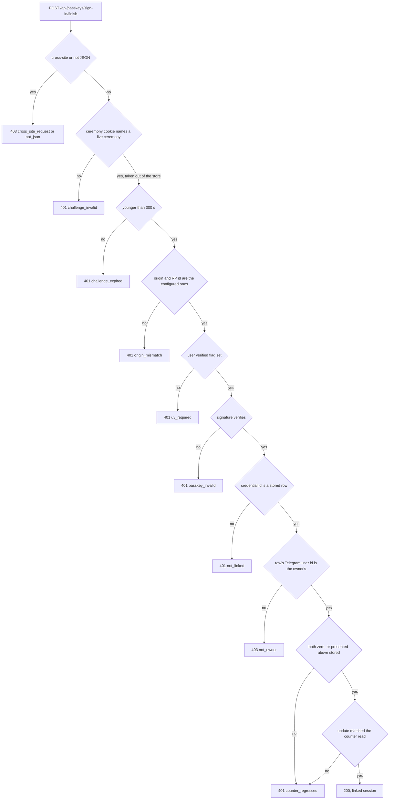
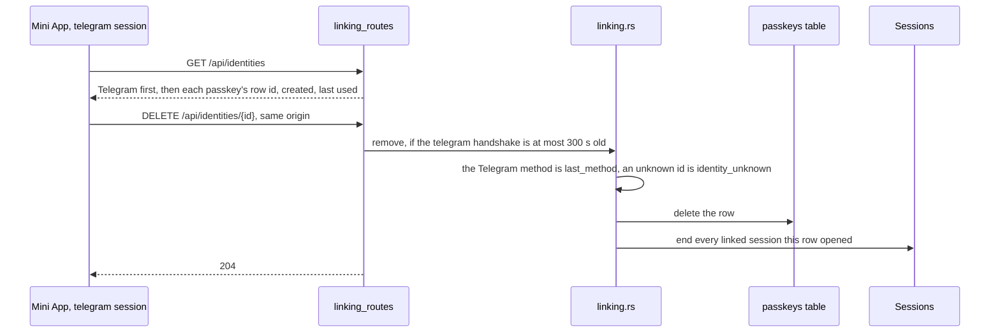

# Passkey sign-in on the web: components and data flows (SPEC-359, ADR-370)

Kinds: component, data flow (as sequences), and the session proof's state machine. Every
`path:line` below was read at `3fe90969b3927cac1c3630c83a582f9d9c796d66`. Names are the ones the
SPEC and the code use: a session's proof is `telegram`, `link` or `linked`; a refusal is its
reason code.

## 1. Components

- The web client and the Mini App are one application on one origin
  (`web/app/svelte.config.js:24-33`, `deploy/caddy/deck-streak.caddy:46-52,89-93`), so the
  relying party ADR-132 names covers both. A ceremony runs only at top level outside Telegram:
  the edge declares no Permissions-Policy (`deploy/caddy/deck-streak.caddy:11-21`), so WebAuthn's
  default `self` allowlist holds there, and Telegram's frame is granted none.
- The page's `connect-src` is `'self'` (`web/app/svelte.config.js:30`). The ceremonies add no
  outbound request: the API verifies against its own configured origin and reaches no network.
- Identity depends on the kernel alone (`docs/CONTEXT-MAP.md:15`); `webauthn-rs`, `uuid` and
  `sqlx` are external crates, so no context edge is added.

## 2. A session's proof

| proof | admitted by | mints a link code | removes a method | registers a passkey |
|---|---|---|---|---|
| `telegram` | `OwnerSession`, the methods routes | yes, at most 300 s after its handshake | yes, at most 300 s after its handshake | no |
| `link` | the linking routes alone | no | no | yes |
| `linked` | `OwnerSession`, the methods list | no (`reauth_required`) | no (`reauth_required`) | no |

Today a live session holds a digest, its owner and two instants (`crates/identity/src/session.rs:117-121`);
the proof is the field this delivery adds. Every transition that opens a session ends the one the
request arrived with first, as the handshake already does (`crates/api/src/session_routes.rs:128-155`).

## 3. Registration from a signed-in session

## 4. A passkey sign-in

## 5. A refused doubtful assertion

Every refusal writes nothing, opens no session and logs its reason code with no value of R13's
list. The ceremony is already out of the store, so the same response replayed meets
`challenge_invalid`.

## 6. A passkey removal

Recovery when every passkey is lost is this flow: the owner signs in through Telegram, the
primary identity (ADR-006), removes the lost passkeys, and registers a new one by §3.
