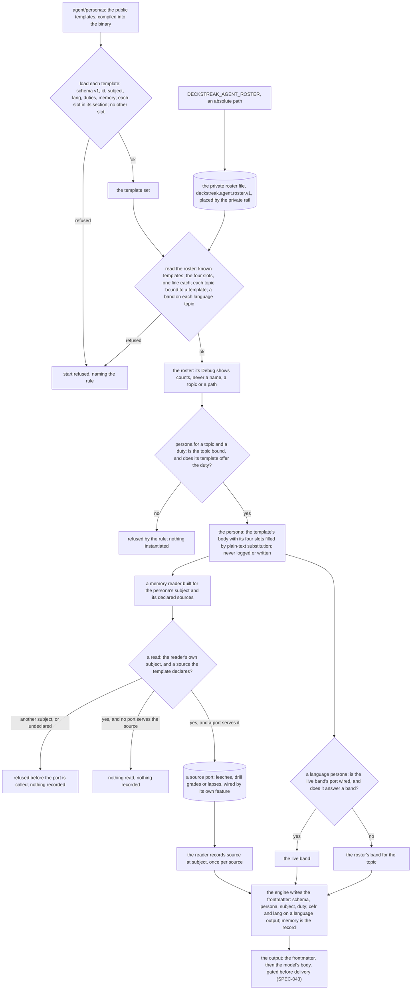

# Schematic: the persona engine

Kind: data flow. Drawn for SPEC-044 at DeckStreak `dev` 16ed8e2, from constraint 18, ADR-044 and
the persona packs' template schema v1 and output contract v1 (persona-core, law-professors,
language-mentors). The engine loads the public templates and the private roster at start, fills a
template's four slots for a topic and a duty, reads the subject's memory through a reader built for
that subject, and writes the output's frontmatter from what it did. SPEC-043 composes the prompt
and gates the output; SPEC-046 writes the reading's body and its seed-derived keys.

The journal has no path into this flow: no memory source can be named `journal` or `diary`, and a
template that declares one does not load.

| guard | where it holds | proved by |
|---|---|---|
| no filled slot | loading a template | A1, A3; B1 in the box run |
| the four slots filled, one line each, no unknown slot | reading the roster | A2, A7 |
| the duty offered | instantiation | A7 |
| another subject's memory refused before any input or output | the reader | A5; row S04401 |
| the journal is never a source | the source names, loading a template | A5; row S04402 |
| the declaration equals the reads | the frontmatter | A4, A6 |
| the band's source | the band's resolution | A8; row S04403 |
| nothing private logged | the roster's, the persona's and the path's `Debug`; every refusal | A2, A7 |
