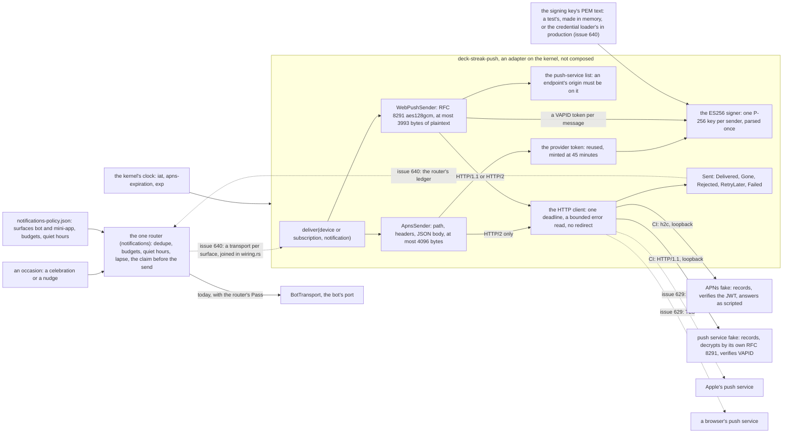
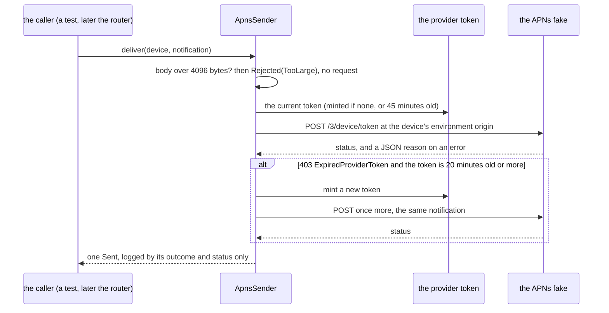
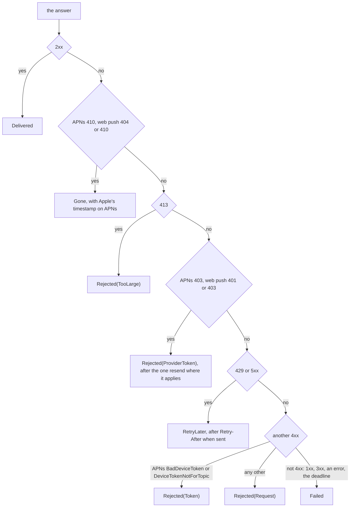
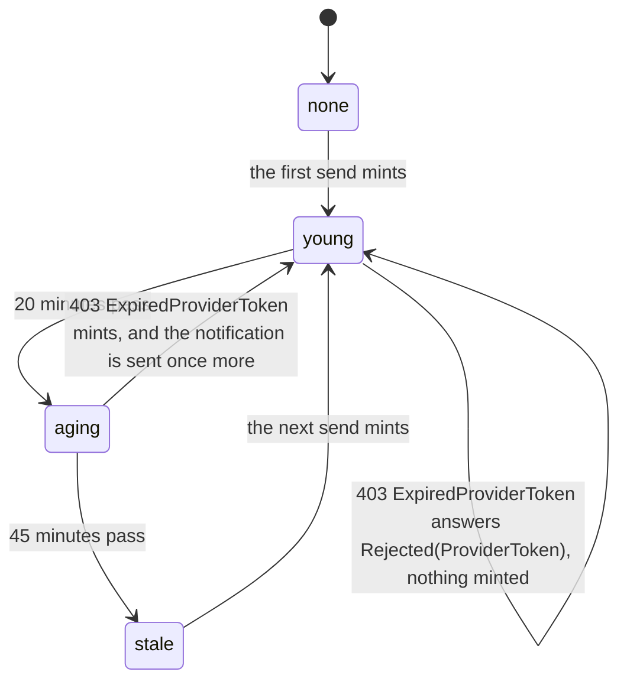
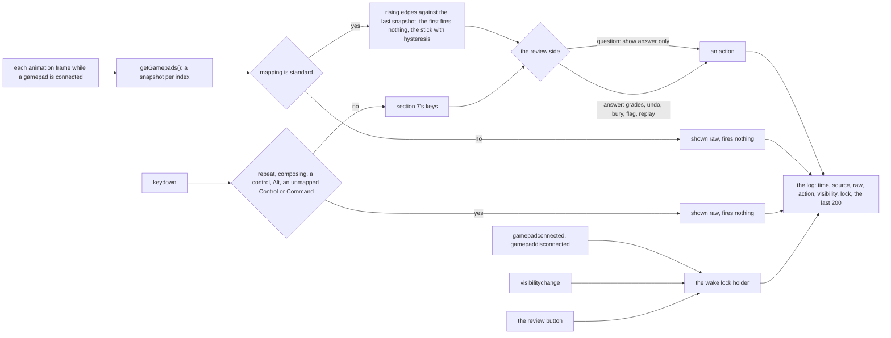
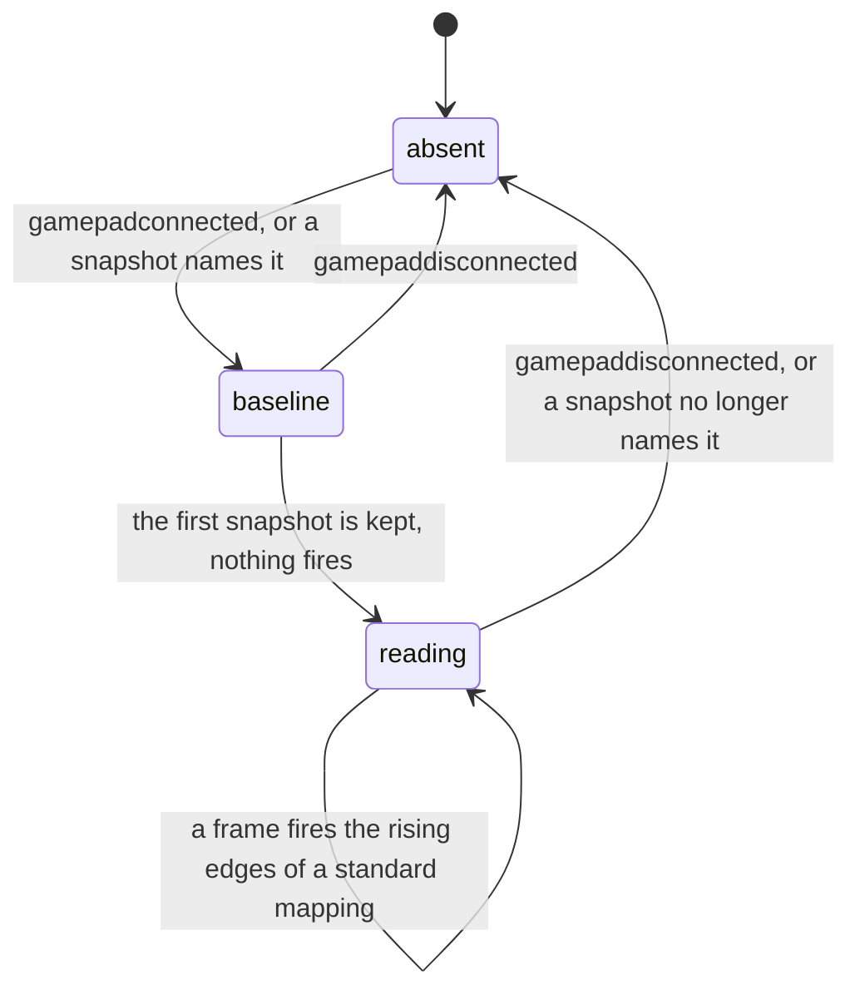
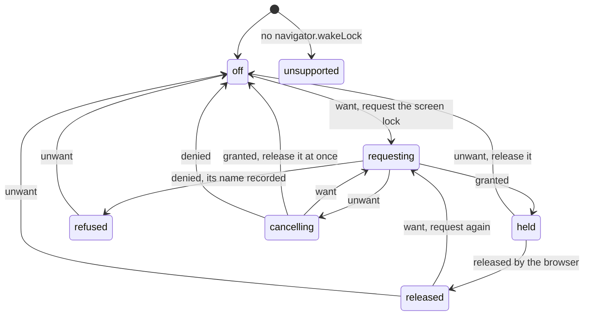
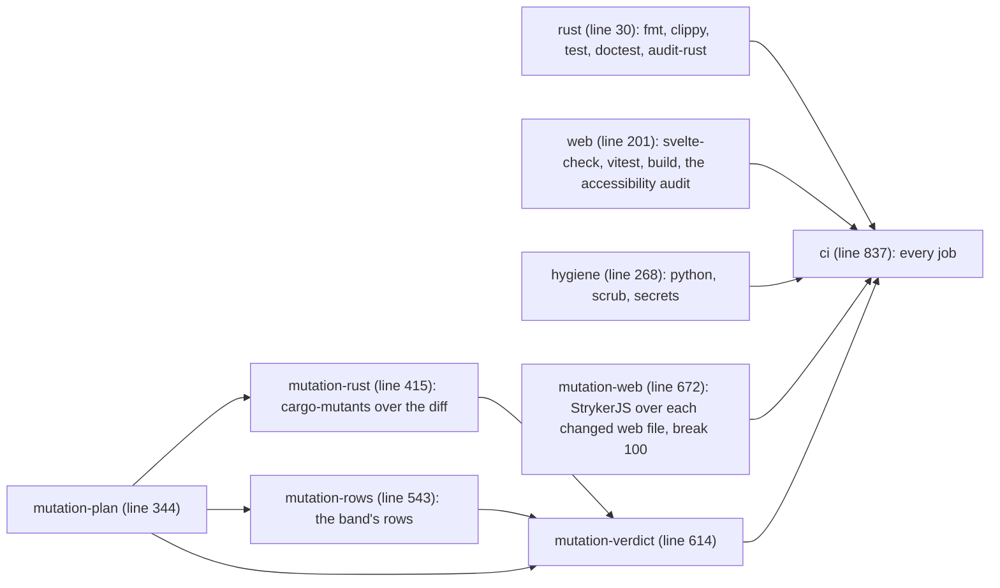

# Push senders against recording fakes, and the remote harness

SPEC-343, ADR-354. Every `path:line` here was read at DeckStreak `dev`
`1eec0870e67e801fc3aa279318219d6986116ec7`. Eight diagrams: the push data flow, one APNs call and
the outcome of an answer, the provider token's life, the remote harness's input flow with its two
state machines, and the CI jobs that judge the delivery.

## 1. The push data flow

What exists today is the router and the bot's port (`crates/notifications/src/router.rs:69` makes
the `Pass` only the router holds; `crates/notifications/src/transport.rs:84` is the bot's port).
This spike builds the `deck-streak-push` box and its fakes. The dashed edge is #640's: the
transport per surface, and its join in the composition root. The dotted platforms are the owner's
first device session (#629).

What each fake records and what the tests read from it:

| fake | records | verifies itself | the tests assert |
|---|---|---|---|
| APNs | method, path, every header, the body, the order of requests | the bearer token parses as a JWT and its ES256 signature verifies with the test's public key | `POST /3/device/<token>`; `apns-push-type`, `apns-priority`, `apns-topic`, `apns-expiration`, `apns-collapse-id`; the body's JSON value; the JWT's header and claims exactly; the request count per answer; which origin a device reached |
| push service | method, path, every header, the raw body | the body decrypts with the test subscription's private key and secret; the VAPID JWT verifies with `k` | `content-encoding: aes128gcm`; the plaintext's JSON value; `TTL`, `Urgency`, `Topic`; `vapid t=…, k=…` with `aud`, `exp`, `sub`; the request count per answer |

## 2. One APNs call

The outcome of an answer, for both senders (SPEC-343 R4):

## 3. The provider token's life

Apple accepts a token up to an hour old and refuses a new one more often than every 20 minutes on
one connection. The sender reuses one token and mints the next at 45 minutes.

The age check and the mint happen under one lock with no await inside it, and a refused token is
replaced only while it is still the current one, so calls refused together mint one token between
them and each resends with it (SPEC-343 R3).

## 4. The remote harness

### Input flow

### A gamepad's connection

A browser withholds `gamepadconnected` until a button or an axis on the gamepad is used, so the
snapshot also counts as a connection.

### The wake lock holder

The condition is: a review is open, a gamepad is connected, and the page is visible. `want` is its
rise, `unwant` its fall; `granted` and `denied` answer the one request in flight; `released` is the
browser's release of the lock the holder holds. Seven states, five events, thirty-five cells, each
examined by A32.

| state | want | unwant | granted | denied | released |
|---|---|---|---|---|---|
| off | requesting, request | off | off | off | off |
| requesting | requesting | cancelling | held | refused | requesting |
| cancelling | requesting | cancelling | off, release | off | cancelling |
| held | held | off, release | held | held | released |
| released | requesting, request | off | released | released | released |
| refused | refused | off | refused | refused | refused |
| unsupported | unsupported | unsupported | unsupported | unsupported | unsupported |

A `granted`, `denied` or `released` that reaches a state with no request in flight, or comes from
a lock the holder no longer holds, changes nothing. When the page is hidden the browser releases
the lock and the condition falls, in either order; both orders end in `off`, and the next `want`,
on visible, requests again (A30).

## 5. The CI jobs

No job is added. The rows below are the jobs of `.github/workflows/ci.yml` at the commit above
that judge this delivery.

| job | what it runs for this delivery |
|---|---|
| `rust` | the push crate's tests (A1 to A19), the censuses (A20 to A22), clippy with warnings denied, `cargo deny` over the new crates |
| `web` | the harness's tests (A23 to A34), and the accessibility audit, which visits `/remote` in both colour schemes |
| `hygiene` | the secrets scan, which finds no key in the tree |
| `mutation-rust` | cargo-mutants over the push crate's changed lines |
| `mutation-rows` | the band's rows, each installed, its killer run red, and the file restored |
| `mutation-web` | StrykerJS over every changed file under `web/app/src`, the screen included, with no survivor |
