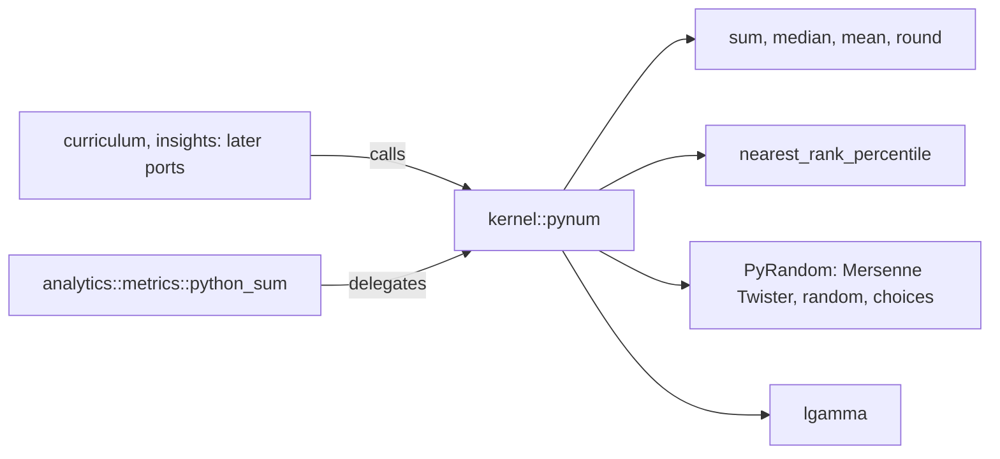
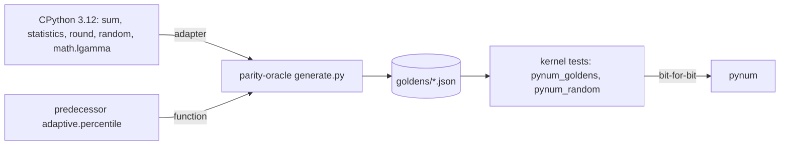

# Schematic: the kernel's CPython numbers and how a golden proves them

Kind: component and data flow. Decided by ADR-090; built by SPEC-302.

## 1. The components

The kernel depends on no internal crate (ADR-002), so every context reads one copy.

## 2. The proof

Floats compare by bit pattern, so a value one unit in the last place away fails its golden.
