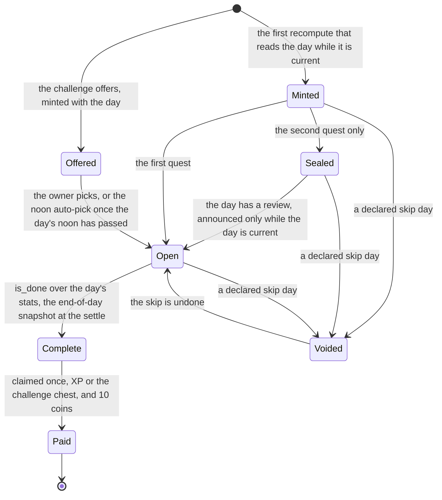
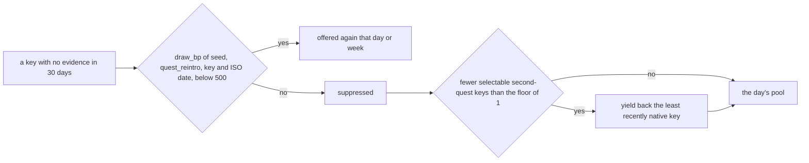
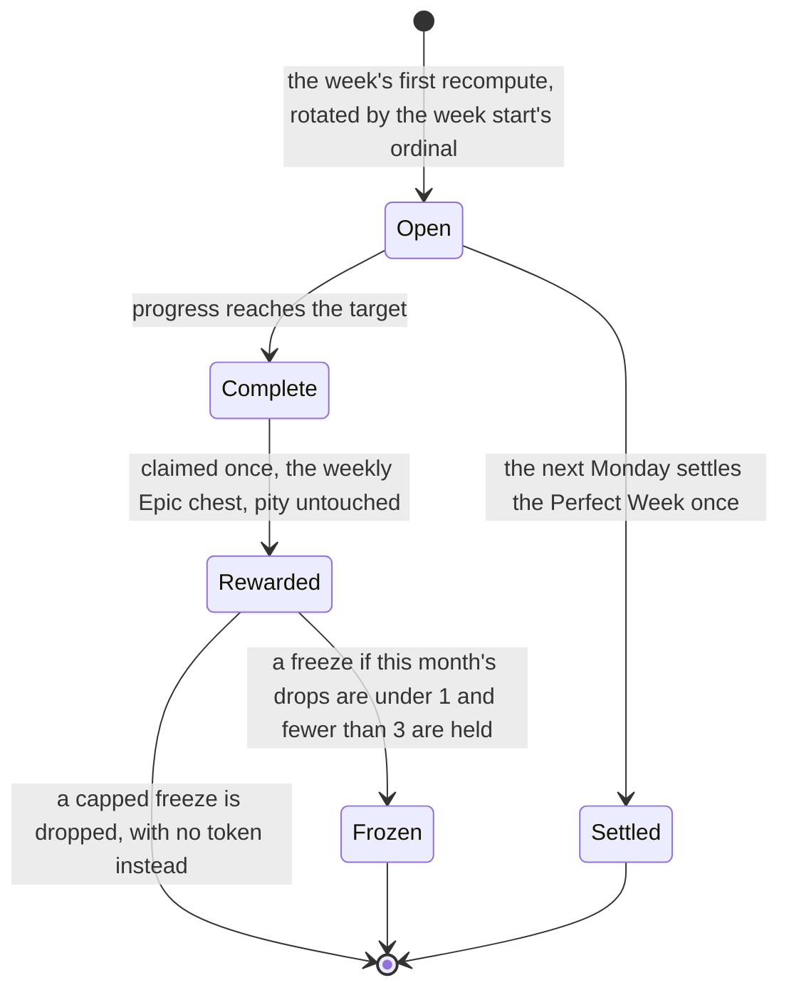
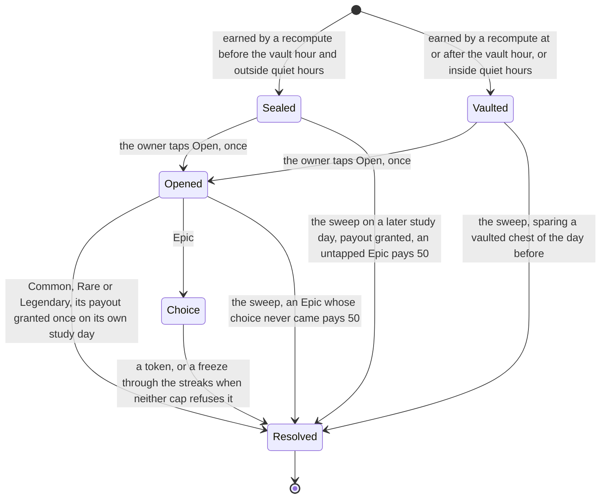
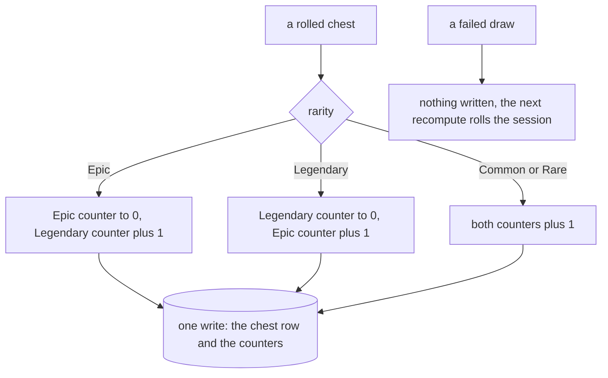
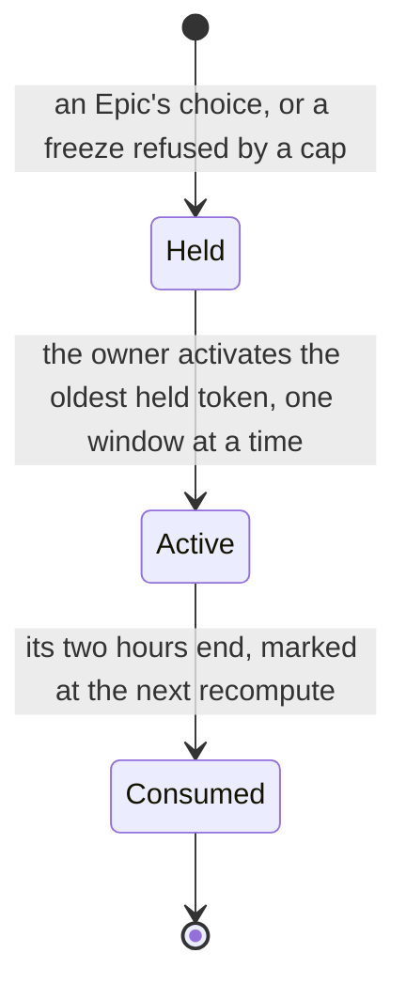
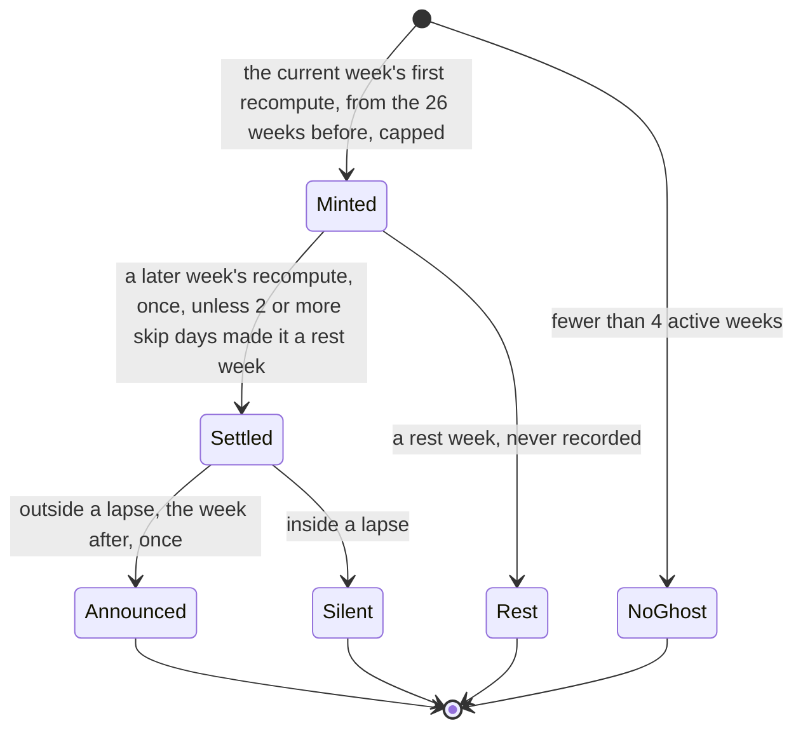

# Schematic: the daily quests, the weekly quest, chests, tokens and the ghost race

Kind: state machine. Read at DeckStreak `dev` c3d769b and at the predecessor's `27ee2bc`
(`gamification/quests.py`, `gamification/chests.py`, `gamification/ghost.py`,
`pipeline_layers/loot.py`, `pipeline_layers/ghost_race.py`, `database.py`'s draws). Added by
SPEC-080 and SPEC-081. Every step here runs inside the recompute's fold (ADR-071,
`docs/schematics/recompute-settles-each-study-day.md`): the quest, chest, sweep and race steps in its
phase 4, the token bonus in its phase 5. The first recompute's backfill of past days runs none of
the rules below that the predecessor applies only to the current study day: it mints no quest,
grants no chest and crowns no day.

## A daily quest slot

The first and second quests are minted at the first recompute that reads their day while it is
current; the challenge quest exists once an offer is picked. A declared skip day voids every slot of
its day (SPEC-080 R13), and undoing the skip returns them.

A study day whose three slots are paid is a crown day, recorded once and celebrated once. The
reintroduction draw that can return a suppressed key is the kernel's `draw_bp` (ADR-080).

## The weekly quest and the Perfect Week

A week is a Perfect Week when its crown days are at least its days that are not skip days and at
least 5; it adds one smoke bomb unless 2 are held, and it is recorded settled either way. A smoke
bomb has no use yet (#268), and nothing says it has one.

## A chest

A chest is rolled once, when it is earned: the rarity, the payout and the pity counters after it
are written in one write (ADR-081). Every later recompute reads the row.

The challenge chest is rolled with 10 Epic points and a 200 XP session base, moves the pity
counters, and is never vaulted; the weekly chest is an Epic without a roll and leaves them alone.

## A double-XP token

While a window is open, phase 5 of each settled or evaluated study day settles the token's bonus:
the day's review XP at the base rate inside the window, capped per day, outside the day's base.

## The ghost race

A win is a `ghost_win` celebration, or a quieter `record` after more than three wins in a row; a
loss is told only when the owner studied that week, and names a photo finish only when the gap is
at most 5 cards or 5 percent. A change of the week's leader is told at most once a study day.
