# Schematic: a reading's lifecycle, and each topic's end state for a study day

Kind: state machine. Read at DeckStreak `main` ce3683d (docs/CONTEXT-MAP.md, docs/LEXICON.md,
ADR-019, docs/schematics/streaks-and-governor-state-machine.md), at the predecessor's `27ee2bc`
(`pipeline_layers/preread.py:PreReadLayer.run_preread_generation`, `reading_notes.py:roll_forward`,
`preread_tracking.py:is_studied`, `undetermined_triage.py:classify_undetermined`), and at the packs
vendored from `19bb0f3` (nudge-duties' comeback template, study-duties' daily reading). Added by
SPEC-045; SPEC-046 to SPEC-053 act on it. The nightly run reads the study day's sync and never syncs
(ADR-037), and an absent AI route is a state of its own (ADR-054).

## 1. A topic's end state for one study day

Every topic of the taxonomy ends each study day in exactly one of six states (SPEC-045 R5). A
could-not-tell state (the predecessor's "undetermined") carries its class and a closed reason; a
failed state carries a closed reason.

```mermaid
stateDiagram-v2
  [*] --> Gates: the generation job fires, or the owner taps Regenerate
  Gates --> AiRouteAbsent: no AI route is configured (ADR-054), checked first
  Gates --> CouldNotTell: the nightly run finds the study day's sync did not succeed, or a tap finds the last sync failed (rail_broken, sync_failed)
  Gates --> Paused: nightly only, no qualifying review on the two study days before
  Gates --> Resolving: the sync succeeded, and the owner studied or tapped
  Resolving --> CouldNotTell: locked, open failed or resolve timeout (rail_broken); taxonomy missing or fetch saturated (config_fault)
  Resolving --> NoNewCards: the day set holds no new card for the topic
  Resolving --> Ready: the digest equals the last ready reading's, so that reading is carried
  Resolving --> Generating: a new day set, under the topic's lock
  Generating --> Ready: every gate green on the first attempt or on the one repair
  Generating --> Failed: the repair fails too (gate_failed), a configured route's agent is unavailable (agent_unavailable), or the seed or form is refused before any call
  Ready --> [*]
  NoNewCards --> [*]
  CouldNotTell --> [*]
  Paused --> [*]
  Failed --> [*]
  AiRouteAbsent --> [*]
```

| state | written | pages | the Mini App says |
|---|---|---|---|
| Ready | a reading row; the vault copy when the archive switch is on | never | the reading, its minutes, read and studied |
| NoNewCards | nothing | never | "No new cards today", never a placeholder |
| CouldNotTell, rail_broken | nothing | once per study day | the rail's words |
| CouldNotTell, config_fault | nothing | once per study day | the configuration's words |
| Paused | nothing | never | "Paused after two days without study" |
| Failed | an attempt row with its reason | through the health verdict | the closed reason |
| AiRouteAbsent | the state only, no attempt | never | "Readings are not enabled" |

## 2. A reading, from its first generation

A reading exists only once every gate passed (SPEC-046 R8). Its identity is its topic, its first
generated study day and its digest; its id is derived from that identity, so a regeneration of the
same day set keeps it. Three things change independently: where its vault note lives, whether the owner
read it, and its studied verdict.

```mermaid
stateDiagram-v2
  [*] --> Generated: every gate green, stored, vault copy written or recorded off
  state Generated {
    [*] --> Live
    Live --> Carried: the next study day keeps it (same digest, no new cards, could not tell or paused), rolls plus one
    Carried --> Carried: carried again, rolls plus one
    Live --> Archived: a newer reading for the topic, or a later study day that does not carry it
    Carried --> Archived: a newer reading for the topic, or a later study day that does not carry it
    Live --> Live: regenerated with the same digest (text version plus one, both box lines kept)
    Live --> Archived: regenerated with a new digest (superseded; its ticks kept)
    --
    [*] --> Unread
    Unread --> Read: the owner's tap (40 XP once, the vault's I read it line ticked)
    Read --> Read: a later tap changes nothing
    --
    [*] --> Open
    Open --> Studied: 80 percent of its new cards reviewed on study day d or d plus 1 (60 XP once, Studied stamped)
    Open --> Retired: the rollover that starts d plus 2 arrives below the threshold
    Retired --> Studied: late reviews made inside the window cross the threshold
  }
```

- **Carried nights** equal the vault note's `rolls`; the reader and the history show them (SPEC-049).
- **The comeback reading.** While the governor's lapse is open, the reading with the latest generation
  instant is chosen once for that lapse id, whatever its studied verdict, and offered until it is read,
  inside the router's three-message cap (SPEC-049). No reading is generated for it.
- **Pause and lapse.** The pause (two study days without study) is the readings'; the lapse (three
  zero-review study days, with an id) is the governor's, and in W1 comes from the lapse-episode
  slice SPEC-049 builds in `streaks`. A lapse always opens while the readings are paused, and closes
  on the next study day with a qualifying review; the pause ends at the first nightly generation
  after a study day.
- **No path unticks** `I read it`, and only the owner's tap ticks it (SPEC-047).
