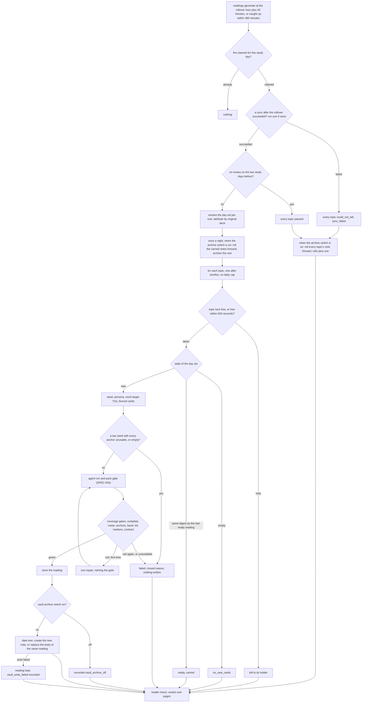

# Schematic: the nightly readings generation, topic by topic

Kind: data flow. Read at DeckStreak `main` ce3683d (ADR-010, ADR-011, ADR-019,
docs/schematics/data-flow.md), at the predecessor's `27ee2bc`
(`pipeline_layers/preread.py:PreReadLayer.run_preread_generation`, `preread.py:check_coverage`,
`reading_notes.py:roll_forward`, `scheduler.py:run_startup_catchup`), and at the packs vendored from
`19bb0f3` (study-duties, learning-science, law-professors, language-mentors). Added by SPEC-046;
SPEC-048 and SPEC-053 act on it.

Card text leaves the host only inside the fenced prompt, through the owner's subscription proxy, and
only for a topic that reached the agent run; paused and unsynced nights make no collection copy and no
call.
