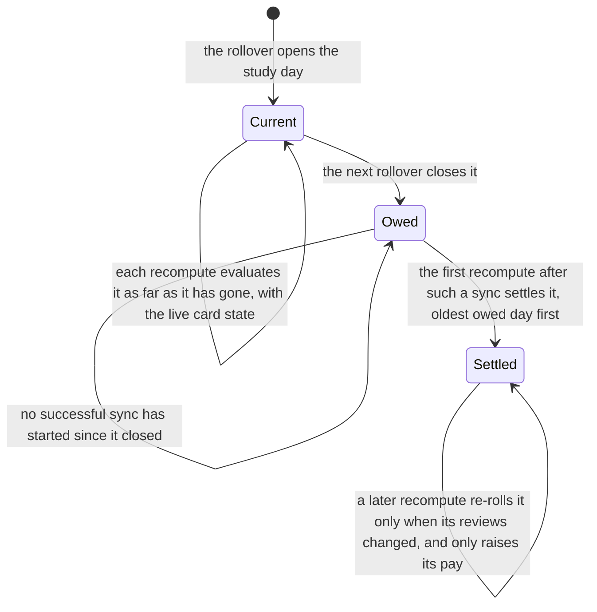
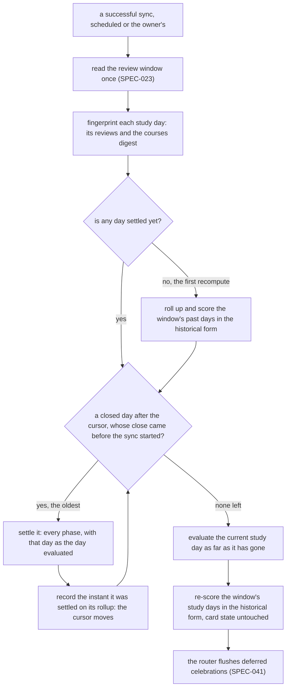
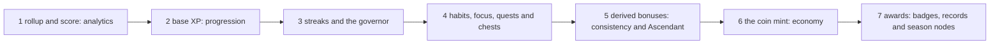

# Schematic: the recompute settles each study day once, in order

Kind: state machine and data flow. Read at DeckStreak `dev` c3d769b (ADR-037,
`crates/coordination/src/sync_cycle.rs`, whose recompute has no domain consumer before W3) and at
the predecessor's `27ee2bc` (`pipeline.py:GamifyPipeline._recompute_day`, `_days_to_recompute`,
`_advance_streak`, `_baseline`; `pipeline_layers/governor.py:GovernorLayer._on_pace_run`). Decided
by ADR-071 (the fold) and ADR-072 (settled XP). Added by SPEC-071. It extends, and does not
change, `docs/schematics/data-flow.md` (the recompute box after the read) and
`docs/schematics/sync-cycle-and-change-gate.md` (the recompute the gate lets through).

## One study day

A day settled right after it closed keeps the card state it had at its close, with its provenance.
A day settled after a gap has no card state, and keeps none. The very first recompute, which finds
no settled day, rolls up and scores every past day of the window in the predecessor's historical
form, with no today-only rule, and the fold settles from the most recently closed day on.

## One recompute

## The phases of one day

| phase | what it ports from the predecessor | registered by |
|---|---|---|
| 1 rollup and score | `analytics.py:compute_daily_metrics`, `compute_card_snapshot`, `cross_language.py:language_daily_metrics`, `scoring.py:compute_score` | SPEC-071 |
| 2 base XP | the review XP and the daily bonuses of `pipeline.py:GamifyPipeline._recompute_day`, and the day's Ascendant armed from the day before (`GovernorLayer._maybe_grant_ascendant`) | SPEC-072 |
| 3 streaks and the governor | `_advance_streak`, `DigestsLayer._update_law_streak` (evaluated every day, ADR-076), `GovernorLayer._update_governor`, `ShowcaseLayer._relight` | SPEC-076 |
| 4 the other contexts' day steps | Road to C2's progress and band-ups, the habit and focus XP, the daily and weekly quests, the ghost race, session chests and tokens | SPEC-077, SPEC-078, SPEC-079, SPEC-080, SPEC-081 |
| 5 derived bonuses | `GovernorLayer._apply_day_bonuses` (consistency and Ascendant), after every base source of the day | SPEC-072 |
| 6 the coin mint | the mint of `_recompute_day`, over the day's base XP | SPEC-082 |
| 7 awards | the badges of `_evaluate_and_award` (study, habit, focus and band badges through one award port), the records of `rewards.py:detect_records`, the season node track and the chapter ceremony (`ShowcaseLayer._evaluate_season_nodes`, `ShowcaseLayer._month_ceremony`) | SPEC-073, SPEC-074, SPEC-077, SPEC-078, SPEC-079 |

Every step is keyed by the day it evaluates, so running it again for a settled day changes nothing
unless that day's own reviews changed; and every XP amount a step writes for a closed day is only
ever raised (ADR-072).
