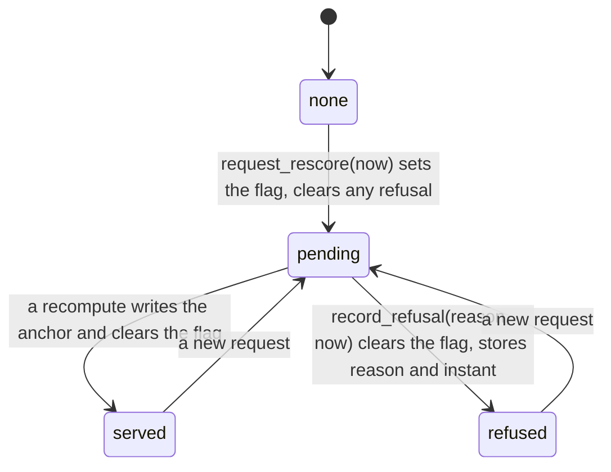

# Schematic: the states of one owner request, with a refusal

Kind: state machine. Decided by ADR-128; built by SPEC-128.

## 1. The states

## 2. What each reader sees

| state | `rescore_pending` | `refused_at` | the bot's answer to a request made at `since` |
|---|---|---|---|
| pending | 1 | NULL | wait; at the bound, "still running" |
| refused | 0 | at or after `since` | "No sync ran" with the reason code, no flush |
| refused before `since` | 0 | before `since` | ignored: the owner run, or "reused", answers |
| served | 0 | NULL | the owner's run: synced, failed or reused |

## 3. Who writes

Only the sync job writes a refusal: `serve_owner_request` in `role_job.rs`, in its recompute setup
arm and its cycle arm. The bot's port only reads it. The next job run reads the flag, finds it
clear and runs no owner cycle.
