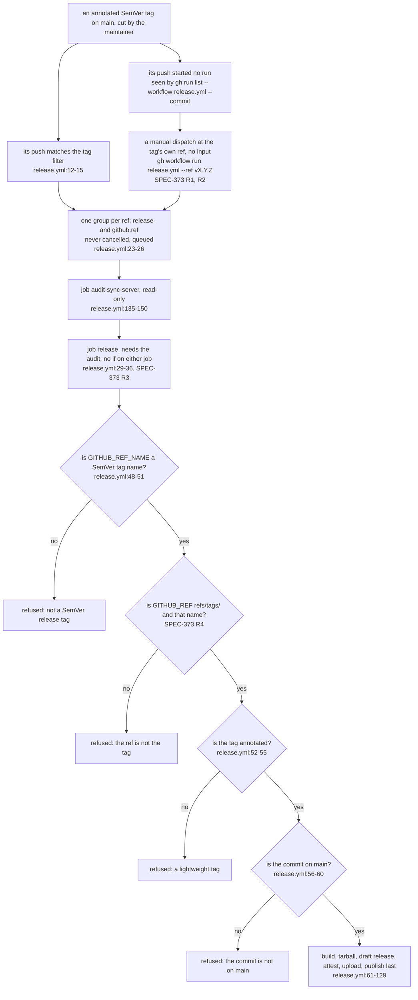

# Schematic: a release from a tag push or a dispatch at the tag's ref

Kind: data flow. It serves SPEC-373 and ADR-384. Every `path:line` citation was read at dev
`6f9ef860`, before SPEC-373's change; the nodes marked SPEC-373 are what the change adds.

## The two paths through the shared checks

Both paths enter one group and one guard step. The guard reads only the run's environment
(`GITHUB_REF_NAME`, `GITHUB_REF`, `GITHUB_SHA`) and the repository, so it cannot tell which event
started the run, and no `if:` lets either path step around it.

## Where each test pins each refusal

| refusal or property | where it is held | test (SPEC-373 unless named) | rows |
|---|---|---|---|
| the release has a second path, and only the two | `on:` | A1 | S37301 |
| the dispatch takes no input | `on.workflow_dispatch` | A1 | S37302, S19022 (re-anchored) |
| no path skips the guard or a job | the two jobs and the guard step, no `if:` | A1 | S37304, S37305, S37306 |
| a ref that is not the tag (a branch named like it, a missing ref, `dev`) | guard, the ref check | A2 | S37303 |
| a lightweight tag, on either path | guard, `release.yml:52-55` | A3; SPEC-062 A18 on the push | none new |
| a tag whose commit is not on `main`, on either path | guard, `release.yml:56-60` | A3; SPEC-062 A18 on the push | S06215, S37308 |
| a check that holds on one path only | guard | A3 | S37308 |
| a pushed and a dispatched run of one tag share one group | `concurrency.group` | A4; SPEC-190's tests for the tag's other events | S37307 |
| a recovery that pushes the tag again | `RELEASING.md` section 3 | A5 | S37309 |
| a dispatch at a tag whose commit lacks the trigger | GitHub refuses the dispatch | none: the live proof of SPEC-373 section 4 | none |

## What is drawn and what is not

- The jobs after the guard are drawn as one node; SPEC-373 changes none of them, and both paths
  run all of them in the order `release.yml` gives.
- The queue's behaviour with two runs of one tag in the group is SPEC-190's and ADR-292's, and its
  model is #467's; the diagram shows only that both paths enter the same group.
