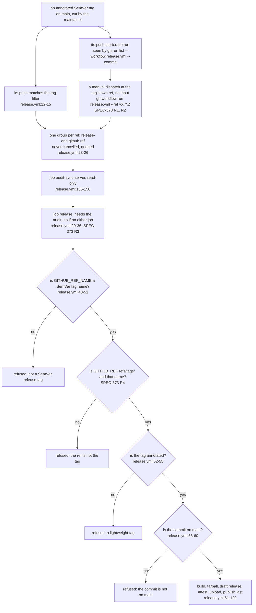
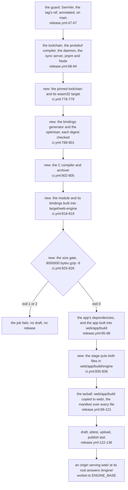
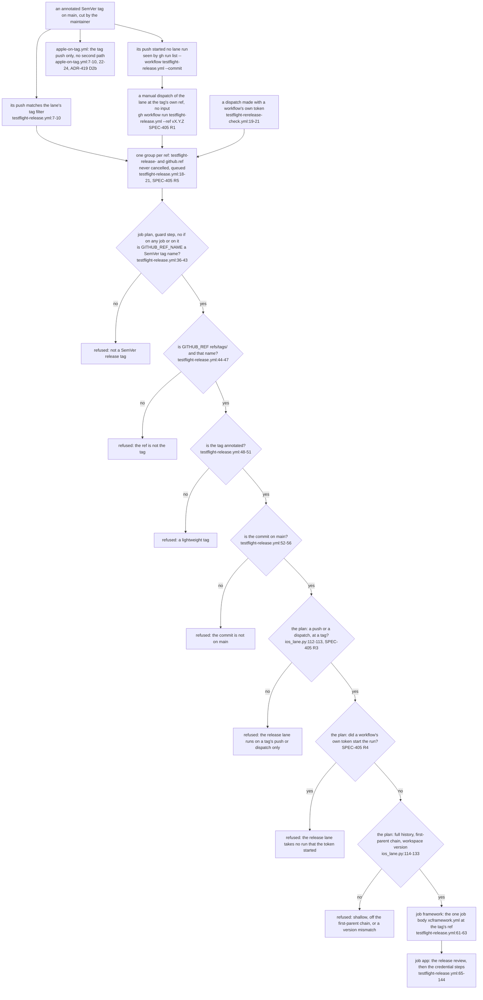

# Schematic: a release from a tag push or a dispatch at the tag's ref

Kind: data flow. It serves SPEC-373 and ADR-384. Every `path:line` citation was read at dev
`6f9ef860`, before SPEC-373's change; the nodes marked SPEC-373 are what the change adds.

## The two paths through the shared checks

Both paths enter one group and one guard step. The guard reads only the run's environment
(`GITHUB_REF_NAME`, `GITHUB_REF`, `GITHUB_SHA`) and the repository, so it cannot tell which event
started the run, and no `if:` lets either path step around it.

## Where each test pins each refusal

| refusal or property | where it is held | test (SPEC-373 unless named) | rows |
|---|---|---|---|
| the release has a second path, and only the two | `on:` | A1 | S37301 |
| the dispatch takes no input | `on.workflow_dispatch` | A1 | S37302, S19022 (re-anchored) |
| no path skips the guard or a job | the two jobs and the guard step, no `if:` | A1 | S37304, S37305, S37306 |
| a ref that is not the tag (a branch named like it, a missing ref, `dev`) | guard, the ref check | A2 | S37303 |
| a lightweight tag, on either path | guard, `release.yml:52-55` | A3; SPEC-062 A18 on the push | none new |
| a tag whose commit is not on `main`, on either path | guard, `release.yml:56-60` | A3; SPEC-062 A18 on the push | S06215, S37308 |
| a check that holds on one path only | guard | A3 | S37308 |
| a pushed and a dispatched run of one tag share one group | `concurrency.group` | A4; SPEC-190's tests for the tag's other events | S37307 |
| a recovery that pushes the tag again | `RELEASING.md` section 3 | A5 | S37309 |
| a dispatch at a tag whose commit lacks the trigger | GitHub refuses the dispatch | none: the live proof of SPEC-373 section 4 | none |

## What is drawn and what is not

- The jobs after the guard are drawn as one node; SPEC-373 changes none of them, and both paths
  run all of them in the order `release.yml` gives.
- The queue's behaviour with two runs of one tag in the group is SPEC-190's and ADR-292's, and its
  model is #467's; the diagram shows only that both paths enter the same group.

## The web engine's module, from its build to `/engine/` (SPEC-350 A29, #685)

Kind: data flow. Every `path:line` citation in this section was read at dev `794fd9ee`, before
#685's change. A node marked "new" is a step the change adds to the release job; it cites the
`ci.yml` lines it is copied from, byte for byte, because its own lines exist only after the change.

The gate sits before the app's install and build, so a refused module stops the job early, and
no step after it carries an `if`, so nothing after a refusal runs. The stage sits after the app's
build and before the tarball, the order CI's `web-engine` job runs them in, so both files are in
the build when the tarball step copies it to `web/`.

| property | where it is held | test (SPEC-350 A29) | rows |
|---|---|---|---|
| the tarball carries the module and its bindings at `web/engine/`, each in the manifest | the stage step, between the app's build and the tarball | `test_the_release_carries_the_module_at_web_engine` | S35044, S35045, S35046 |
| the release's web engine steps are CI's, in CI's order | the five steps W1 to W5 and the stage | `test_the_release_builds_and_gates_the_module_as_ci_does` | S35051 to S35055 |
| a module over the budget stops the job before the draft | the size gate: no `continue-on-error`, no `||`, no `if` after it | `test_an_over_budget_module_stops_the_release_before_the_draft` | S35047 to S35050 |
| the job's bound holds the module's cold build | `timeout-minutes`, 150 | none new: ADR-361 D22 | S19011, S19016 (re-anchored) |

What this section draws and what it does not:

- It draws the module's path only. The release's other steps keep the nodes the diagram above
  gives them, and both paths through the guard run every new step, in the order `release.yml`
  gives.
- How the host serves the tarball's `web/` folder is the deploy's, not the release's; the last
  node states the one condition the Worker's URL needs.

## A release tag's app lanes, from its push or a dispatch at its ref (SPEC-405, #733)

Kind: data flow. It serves SPEC-405 and ADR-419. Every `path:line` citation in this section was
read at dev `32f62172`, before SPEC-405's change; a node that cites SPEC-405 is what the change
adds. The release workflow's own two paths are this file's first section.

Both of the lane's paths enter one group, one guard step and one plan step. The guard reads only
the run's environment (`GITHUB_REF_NAME`, `GITHUB_REF`, `GITHUB_SHA`) and the repository, so it
cannot tell which event started the run; the plan reads the event only to admit a push or a
dispatch at a tag and to refuse everything else, and reads the actor only to refuse a run a
workflow's own token started. No `if:` lets either path step around a check.
`apple-on-tag.yml` keeps its one trigger: the same job body runs at the tag's ref as the lane's
`framework` job on both of the lane's paths.

| refusal or property | where it is held | test (SPEC-405 unless named) | rows |
|---|---|---|---|
| the lane has a second path, and only the two | `on:` | A1 | S40500 |
| the dispatch takes no input | `on.workflow_dispatch` | A1 | S40501 |
| no path skips the guard step or a job | the three jobs and the guard step, no `if:` | A1 | S40502, S40503, S40504, S40505 |
| a dispatch at the tag's own ref gets the push's outputs and refusals | the plan's event arm | A2 | S40507 |
| a dispatch at a branch named like the tag | the guard's ref check; the plan's event arm | SPEC-352 A18 (the guard is release.yml's, byte for byte); A2 | S40515, S40508 |
| an event that is neither a push nor a dispatch | the plan's event arm | A2 | S40509 |
| a run a workflow's own token started | the plan's actor arm | A5 | S40510, S40511 |
| a pushed and a dispatched run of one tag share one group | `concurrency.group` | A3 | S40506 |
| the credential is read in the `app` job only | the `app` job | A6 | none new |
| the runbook's detection, its recovery, and why `apple-on-tag.yml` takes no dispatch | `RELEASING.md` section 8 | A4 | S40512, S40513, S40514 |
| `apple-on-tag.yml` calls the job body on every release tag's push | `apple-on-tag.yml` | A7 (SPEC-344) | none new |
| a dispatch at a tag whose commit lacks the trigger | the hosting service refuses the dispatch | none: the live proof of SPEC-405 section 4 | none |

What this section draws and what it does not:

- The `app` job is one node; its review, its credential steps and its upload are SPEC-352's and
  ADR-363's, and SPEC-405 changes none of them.
- The plan's release checks after the actor arm (`ios_lane.py:114-133`) are one node; they are
  SPEC-352's, unchanged, and run on both paths.
- The queue's behaviour with two runs of one tag in the group is SPEC-190's and ADR-292's, and its
  model is #467's; the diagram shows only that both paths enter the same group.
