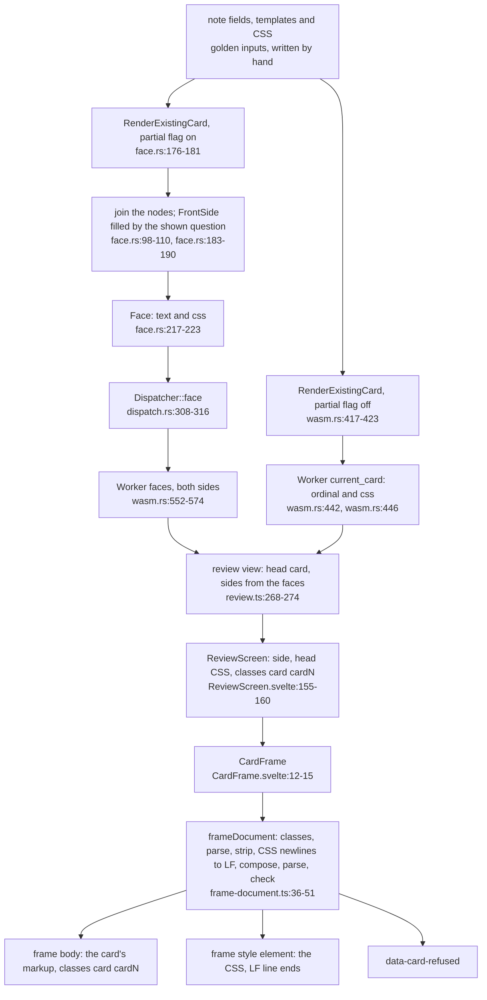
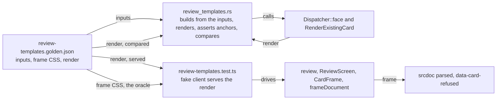

# Review templates: from a note's fields to the card frame

**Kind:** data flow. **Decided by:** ADR-383. **Specified by:** SPEC-372. Every `path:line` below
was read at DeckStreak `dev` `ebdd1371`.

The flow runs from a note's fields, its note type's templates and its CSS, through the engine's two
renders, through the Worker and the review, to the frame's body and style element. The golden file
sits beside the flow: the Rust test checks the engine's half against it, and the web test feeds it
to the review's half.

## The flow

## Where each test pins it

| pin | what it holds | on which edge | criterion |
|---|---|---|---|
| The Rust test's anchors, written by hand | each cloze card hides its own deletion and shows the other; each answer reveals it and adds the extra field; each reversed answer is its question, the rule and the other field; every CSS equals the inputs byte for byte; ordinals 0 and 1; no id in any text | Inputs to Face, Inputs to Head | A5 |
| The Rust test's comparison | the four cards' texts and CSS equal the golden's render | Face, Head | A5 |
| The web test, cloze cards | each side's body equals the golden text as the frame's parser reads it; classes `card card1` and `card card2` | View to Body | A1 |
| The web test, reversed cards | each answer's body equals the golden answer and opens with its question's body | View to Body | A2 |
| The web test, style element | the style element's text equals the frame CSS written by hand, for every card | Head to Style | A3 |
| The web test, refusals | no face is refused; a control card with CSS that ends the style element is | Doc to Refused | A4 |

## Newlines

| where | CR LF and lone CR | why |
|---|---|---|
| the note type's CSS (golden inputs) | kept | the fixture carries them on purpose |
| the engine's render, face and head | kept | the engine passes the CSS through (`face.rs:219`, `wasm.rs:446`) |
| the frame's style element | LF only | `frame-document.ts:40-41`, before the check at `:48` |
| the card's markup | the parser's own reading, on both sides | no step is needed or added |

## The planted reds (red commit only)

| plant | file | turns red |
|---|---|---|
| the face returns no CSS | `crates/engine-core/src/face.rs:219` | A5 |
| the review keeps the head card's own sides | `web/app/src/lib/study/review.ts:274` | A1, A2 |
| the composition trims the CSS's trailing newline | `web/app/src/lib/card/frame-document.ts:41` | A3 |
| the check admits only `card card1` | `web/app/src/lib/card/frame-document.ts:29` | A4 |

The greening commits restore each line, so every planted file's net diff is empty.
