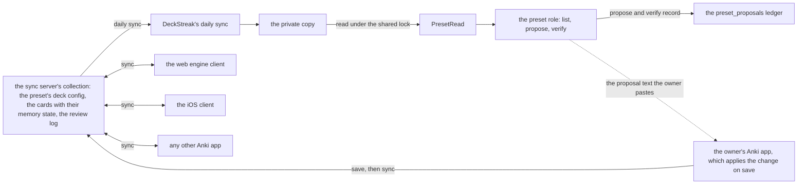
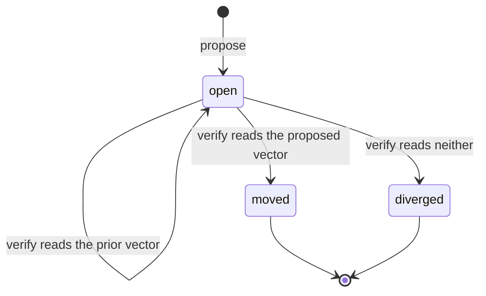
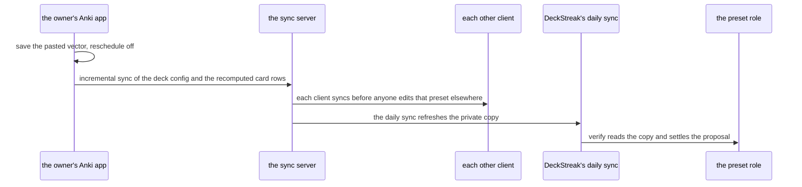

# Scheduler presets and their parameters

Every `path:line` below was read at DeckStreak `dev` `3ca06142`. The diagrams are mermaid: a data
flow (a), a reach table (b), a state machine (c), a sequence (d), and the undo (e).

A preset is a deck config in the collection. Each deck names its preset's id
(`crates/engine-core/src/face.rs:126-138`), and a preset holds its parameter vector and its desired
retention side by side. The only other schematic that touches the scheduler,
`docs/schematics/app-clients-engine-and-sync.md:83`, holds the FSRS-7 replay alone; this one owns
the presets.

## (a) Data flow

- `PresetRead` reads every preset from the private copy (`crates/ingest/src/engine.rs:532`, `open`),
  with each preset's vector, the field it came from, its desired retention, its decks and its count
  of non-new cards. Ingest already reads each card's stored desired retention
  (`crates/ingest/src/memory_state.rs:20-21`).
- The proposed vector is the scheduler's defaults, 21 values, as the engine reports them.
- The preset role is a host role beside the five the daemon names today
  (`crates/daemon/src/main.rs:56`).
- No arrow leaves DeckStreak toward the server. The preset paths name no engine write method: the
  ingest write port (`crates/ingest/src/engine.rs:254-299`) belongs to the skip day, and the engine
  core's ordinary table holds no deck-config write (`crates/engine-core/src/table.rs:122-249`).
  The only arrow back to the owner is the proposal text, which the owner pastes by hand.

## (b) Before and after the move

The reach, row for row:

| what | across the move |
|---|---|
| the store | the preset's deck config in the collection on the owner's sync server |
| who changes it | the owner's Anki app, on save |
| how it travels | the next sync from the owner's app is incremental. It carries the deck config and the card rows whose memory state the save recomputed. No full sync is asked |
| when other clients see it | at each one's next sync. DeckStreak's private copy sees it at its daily sync, and the web and iOS clients and any other Anki app see it at theirs. Deck configs merge last writer wins, so an edit of the same preset elsewhere before that sync replaces the move whole |
| review history | unchanged: no review-log row is added, changed or removed |
| due dates, intervals, queues | unchanged ("Reschedule cards on change" stays off) |
| desired retention and every other option | unchanged |
| the parameter vector | replaced by the 21 released defaults |
| memory state | recomputed by the engine for every non-new card in the preset's decks, from that card's own reviews under the new vector. Each card's next interval follows from it at its next review |
| the undo | the owner pastes the prior vector from the record, or clears the box when the record says it was empty. Memory state is recomputed again under the prior vector. It equals the state before the move whenever that state was itself a recompute from the full history under the same vector |

What leaves history and memory state untouched:

- every DeckStreak path (list, propose and verify), which only reads;
- review history, on every path;
- due dates and intervals, with "Reschedule cards on change" off.

What changes:

- the preset's parameter vector;
- the memory state of the preset's non-new cards, which the owner's app recomputes on save.

## (c) One proposal's states

- `moved` and `diverged` are terminal: a settled proposal is never settled again.
- At most one proposal per preset is `open`, held by a partial unique index on the ledger. A second
  `propose` prints the open one again and records nothing.
- A preset already on the defaults records nothing: `propose` reports it as on the defaults, and no
  state is entered.

## (d) Sync order

1. The owner's app saves the pasted vector, with "Reschedule cards on change" off.
2. It syncs. The sync is incremental: the deck config and the card rows whose memory state the save
   recomputed.
3. Each other client syncs before anyone edits that preset elsewhere. Deck configs merge last writer
   wins, so an earlier edit elsewhere replaces the move whole, and `verify` then reads `diverged`.
4. DeckStreak's daily sync refreshes the private copy.
5. `verify` reads the copy. Until step 4 it reads the prior vector, says the proposal is still open,
   and records nothing.

## (e) Undo

The record keeps the prior vector and the field it came from. To undo, the owner pastes the prior
vector into the preset's parameters box, or clears the box when the record says it was empty, saves
with "Reschedule cards on change" off, and syncs. The engine recomputes the memory state of the
preset's non-new cards under the prior vector, in the same way it did for the move (the last row of
the table in (b)).

## Change note

added by SPEC-387
