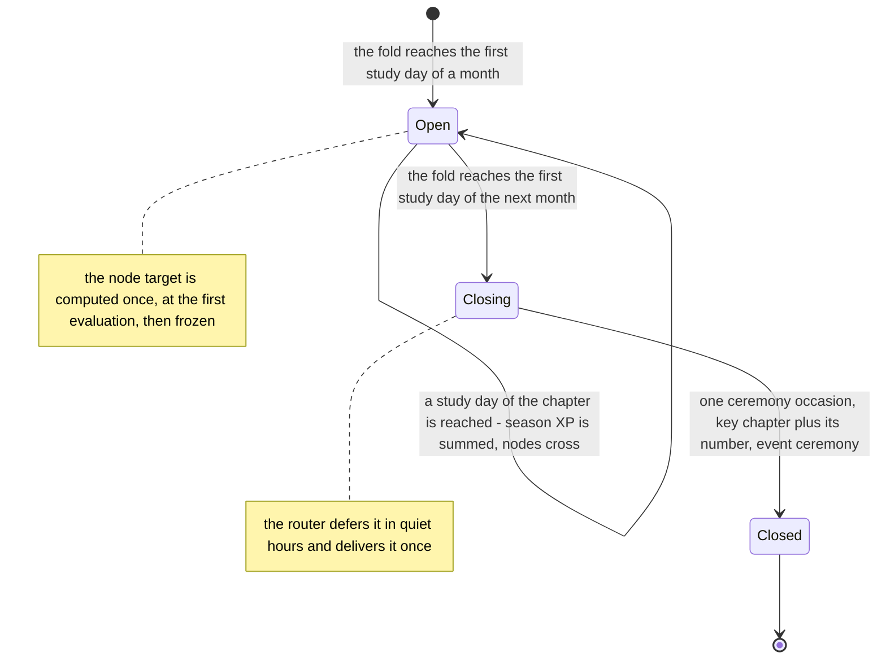
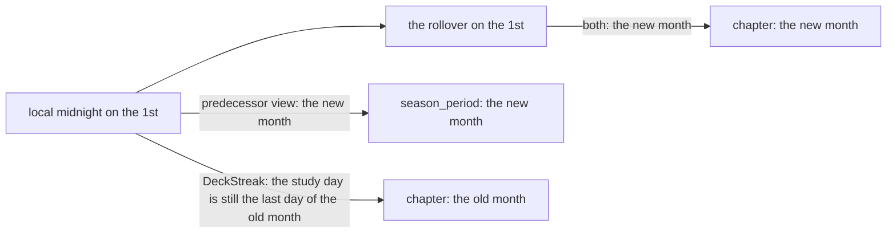
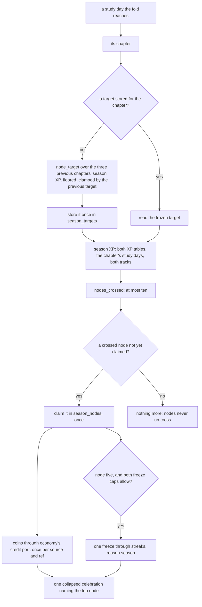

# Schematic: seasons at the study day, the node track and the one ceremony

Kind: state machine and data flow. Read at DeckStreak `dev` c3d769b and at the predecessor's
`27ee2bc` (`gamification/seasons.py`, `pipeline_layers/showcase.py:ShowcaseLayer._evaluate_season_nodes`
and `_month_ceremony`). Added by SPEC-074. It extends `docs/schematics/seasons-state-machine.md`,
which stays as it is: that machine names "the first sync of a calendar month"; here the month is the
study day's (ADR-074), and the fold that reaches each study day once is ADR-071's.

## A chapter, by the study day

A chapter is the calendar month of the study day; its number is `year × 12 + month − 1`. The fold
(ADR-071) reaches every study day once, in order: a closed day at its settle, then the current day.

## The boundary on a month's first day

The predecessor's `season_period` turns at local midnight; the study day turns at the rollover.
DeckStreak reads the study day on every screen (CHARTER 7), so the two differ only in this window.

The golden's cases inside that window carry the class `midnight-to-rollover`; the test asserts the
study day's month there and the predecessor's month everywhere else.

## The node track, at each day the fold reaches

The track and the ceremony are one step in phase 7 (awards) of SPEC-071's fold, after the day's
derived bonuses and its coin mint: the track reads the day's whole XP and pays coins only.

A node claimed on an earlier recompute whose coins were never written is paid at the next
evaluation, and a node whose coins exist is never paid again: the predecessor's claim-then-grant
self-heal (`database.py:GamifyStore.claim_season_node`, `coin_ref_exists`).
