# Schematic: seasons, chapters and prestige

Kind: state machine. Read at the predecessor's `27ee2bc` (`seasons.py`, the chapter ceremony) and at
DeckStreak `main` 769ee62 (`progression` context).

```mermaid
stateDiagram-v2
  [*] --> Open: the first sync of a calendar month opens its chapter
  Open --> Open: XP granted in the month adds to season XP; season nodes cross at their thresholds
  Open --> Closing: the first sync of the next month
  Closing --> Closed: the ceremony sends once per chapter (T5, deduped by chapter key, deferred in quiet hours)
  Closed --> [*]
```

Prestige follows lifetime XP and never resets: below 10,000 Novice, below 50,000 Adept, below
150,000 Expert, below 500,000 Master, else Grandmaster. The chapter title is one of 12 rotating
titles, indexed by `(year × 12 + month) mod 12` of the closed month. The ceremony's optional
keepsake art is a W7 decision (its image provider is an owner question).
