# Schematic: the lifecycle of a long-running role (api, bot)

Kind: state machine. Read at DeckStreak `main` e05dfa5 (ADR-010, the rust-service pack's
`templates/service-main.rs.template` and `templates/service.template.service`), and at the
predecessor's `27ee2bc` for the behaviour it ports (`watchdog.py:SdNotifier`,
`watchdog.py:run_sd_watchdog`). Decided by ADR-010 and ADR-025; built by SPEC-025 and reused by
SPEC-026.

```mermaid
stateDiagram-v2
  [*] --> Starting: systemd starts deckstreakd role (Type=notify)
  Starting --> Refused: a setting or credential is missing or malformed (exit non-zero, named)
  Starting --> Serving: logging installed, listener bound or poll loop started
  Serving --> Ready: READY=1 sent; readiness still 503 until the database is open
  Ready --> Ready: WATCHDOG=1 every WatchdogSec / 3 (the predecessor's divisor)
  Ready --> Draining: SIGTERM (or SIGINT): STOPPING=1, stop accepting
  Draining --> Stopped: in-flight work finishes (bounded by the 10 s request timeout)
  Stopped --> [*]: exit 0
  Ready --> Killed: runtime wedged, no WATCHDOG=1 within WatchdogSec
  Killed --> [*]: systemd restarts the unit; OnFailure pages through the alert unit
```

| message | when | read by |
|---|---|---|
| `READY=1` | the role serves (API listener bound, or bot poll loop started) | systemd, `rs.notify-ready` |
| `WATCHDOG=1` | every `WATCHDOG_USEC / 3`, from the role's own runtime | systemd, `rs.watchdog-ping` |
| `STOPPING=1` | the shutdown signal resolved | systemd |

The watchdog is deliberately not coupled to the sync's health (the predecessor's rule): a stale sync
is the dead-man watch's page, not a restart.
