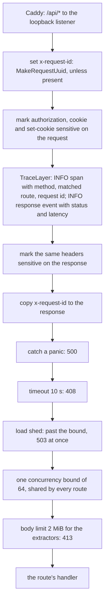
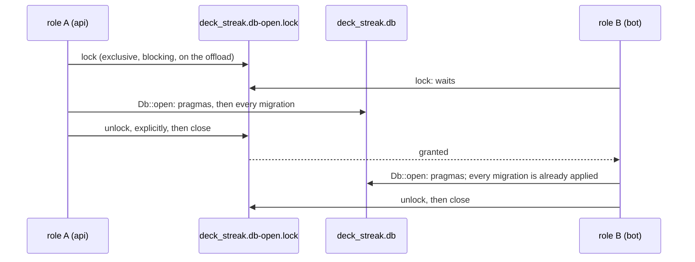

# Schematic: the lifecycle of a long-running role (api, bot)

Kind: state machine, with the request path and the start-up data flow it serves. Read at DeckStreak
`main` e05dfa5 (ADR-010, the rust-service pack's `templates/service-main.rs.template` and
`templates/service.template.service`), and at the predecessor's `27ee2bc` for the behaviour it
ports (`watchdog.py:SdNotifier`, `watchdog.py:run_sd_watchdog`, `watchdog.py:create_heartbeat`).
Decided by ADR-010 and ADR-025; built by SPEC-025, as drawn here, and reused by SPEC-026.

## The role's states

```mermaid
stateDiagram-v2
  [*] --> Starting: systemd starts deckstreakd role (Type=notify)
  Starting --> Refused: a setting is missing or malformed, or the listen address is not loopback (exit 1, named)
  Starting --> Serving: logging installed, settings read, SIGTERM and SIGINT handlers installed, listener bound
  Serving --> Ready: READY=1 sent; readiness answers 503 until the database is open
  Ready --> Ready: WATCHDOG=1 every WatchdogSec / 3 (the predecessor's divisor), never armed below 5 s
  Ready --> Open: the database opened and migrated under the open lock; readiness answers 200
  Open --> Open: WATCHDOG=1
  Ready --> Draining: SIGTERM (or SIGINT): STOPPING=1, stop accepting
  Open --> Draining: SIGTERM (or SIGINT): STOPPING=1, stop accepting
  Ready --> Draining: the database failed to open: STOPPING=1, and the role exits 1 after the drain
  Draining --> Stopped: in-flight work finishes (bounded by the 10 s request timeout)
  Stopped --> [*]: exit 0
  Ready --> Killed: runtime wedged, no WATCHDOG=1 within WatchdogSec
  Open --> Killed: runtime wedged, no WATCHDOG=1 within WatchdogSec
  Killed --> [*]: systemd restarts the unit; OnFailure pages through the alert unit
```

| message | when | read by |
|---|---|---|
| `READY=1` | the role serves (API listener bound, or bot poll loop started) | systemd, `rs.notify-ready` |
| `WATCHDOG=1` | at once after `READY=1`, then every `WATCHDOG_USEC / 3`, from the role's own runtime | systemd, `rs.watchdog-ping` |
| `STOPPING=1` | the shutdown signal resolved | systemd |

The signal handlers are installed before `READY=1`, so a SIGTERM that follows it at once is a
drain, never the default action that kills the process. The watchdog is deliberately not coupled to
the sync's health (the predecessor's rule): a stale sync is the dead-man watch's page, not a
restart. A `WATCHDOG_USEC` below 5 seconds arms no heartbeat and logs one WARN, as the predecessor
refused to arm one it could not keep ahead of the kill deadline; a `WATCHDOG_PID` naming another
process arms none (sd_watchdog_enabled(3)).

## A request's path through the layers

Every route of the API, the health routes and the fallback's 404 included, is served under one
stack, applied with `Router::layer` so the trace sees the matched route. Outermost first:

The request id is copied to the response inside the trace and outside the panic catcher, the
timeout and the shed, so a 500, a 408 and a 503 carry it too, and the response event the trace
writes sees the same response the caller gets. The response's headers are marked sensitive inside
the trace, which is where tower-http documents they must be for a trace that logs them to see the
mark. The span never records the raw URI: a query string may carry `initData`.

## Two roles open one fresh database

sqlx's SQLite migrator takes no lock, so two roles starting at once can both see an empty
`_sqlx_migrations` and both apply the first migration; one of them then fails to start. Every role
therefore opens the database through the daemon's one opener, which holds an exclusive `flock` on a
lock file beside the database while `Db::open` migrates.

The lock is a separate file, never the database: closing any descriptor of the database file drops
every POSIX lock the process holds on it, SQLite's included. It is released explicitly rather than
by closing, so a descriptor a child process inherited cannot keep it held.
