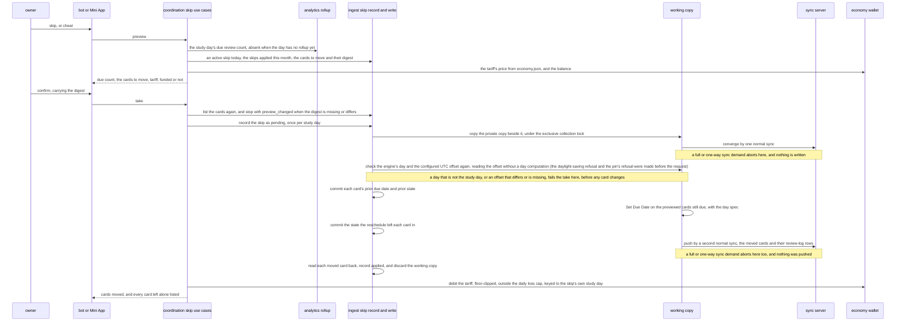
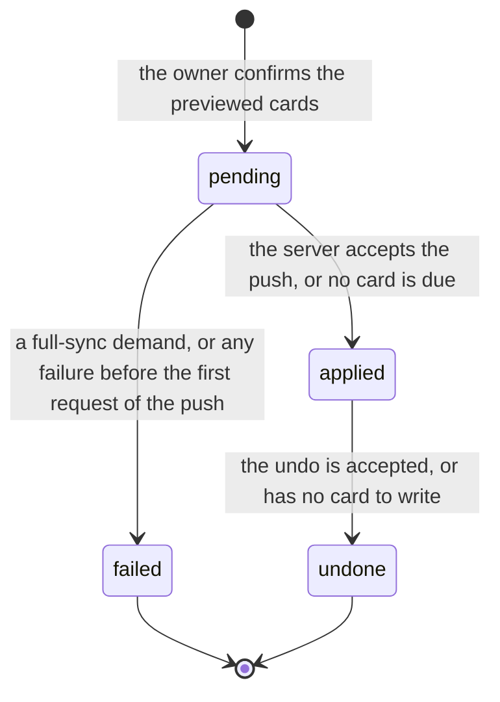
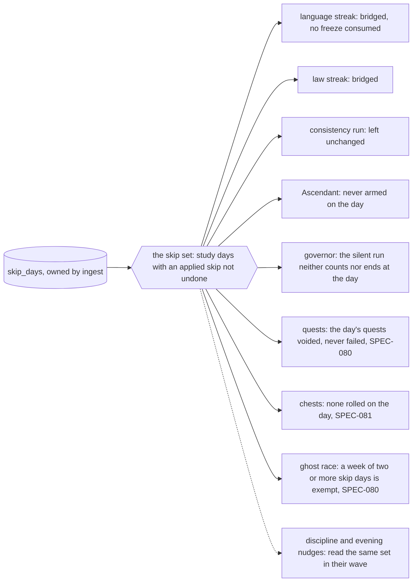
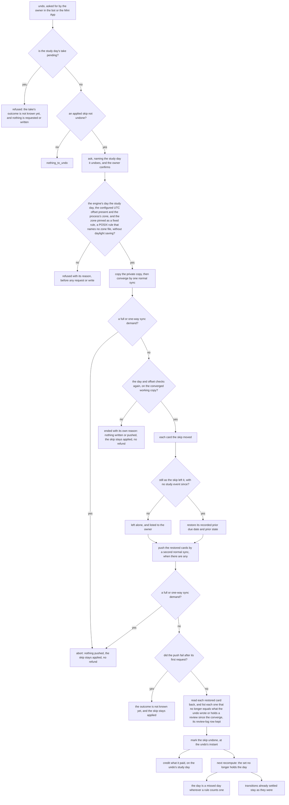
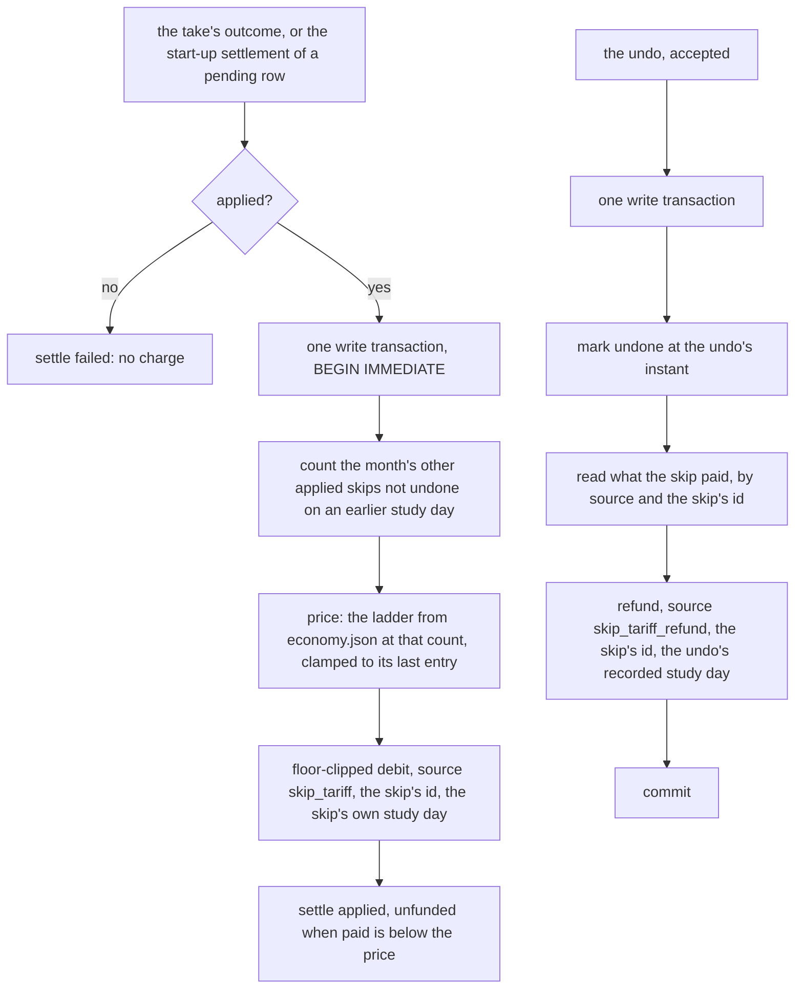
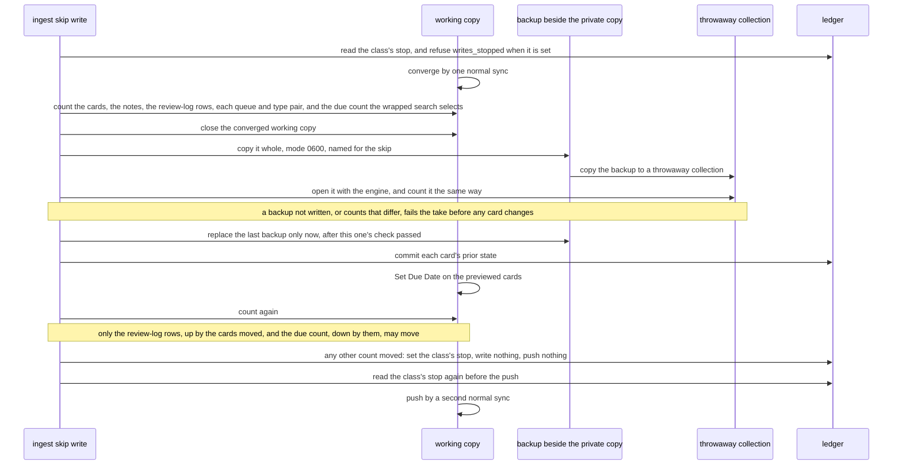
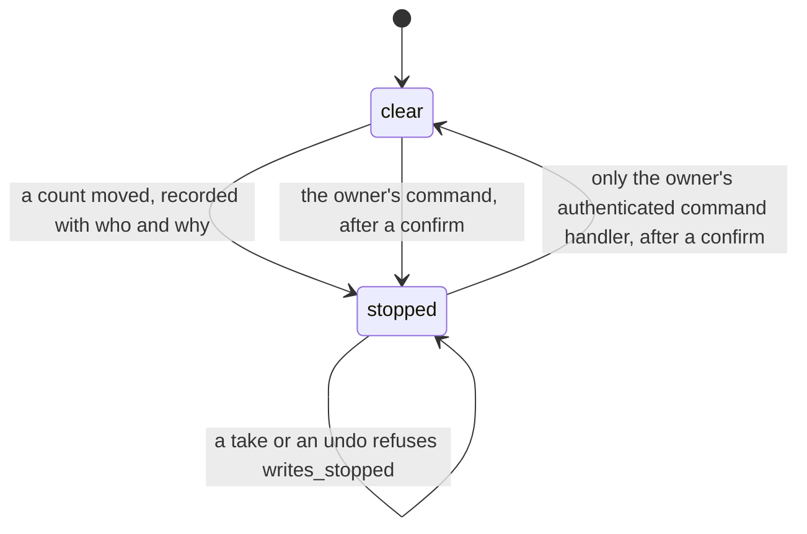
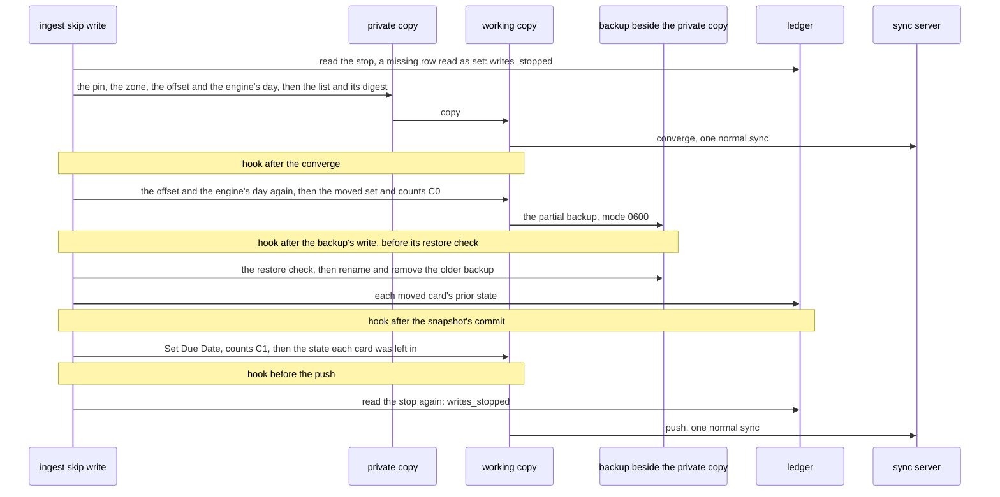
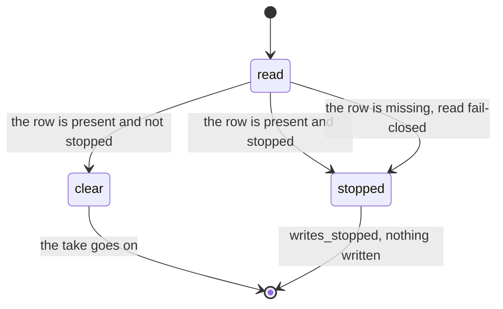
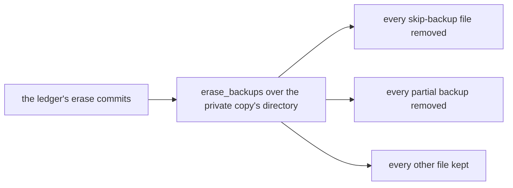

# Schematic: the skip day, recorded by DeckStreak, written to the collection on the owner's confirm, and read by every context it touches

Kind: data flow, sequence and state machine. Read at DeckStreak `dev` 53184dd and at the
predecessor's `27ee2bc` (`pipeline_layers/skip.py:SkipDaysLayer`, `sync.py:AnkiSyncer.skip_day`
and `AnkiSyncer.undo_skip`, `pipeline_layers/economy.py:EconomyLayer._charge_skip_tariff` and
`_refund_skip_tariff`, `skip.py`, and every reader of `database.py:GamifyStore.skip_days_set`).
Added by SPEC-083, under ADR-083's option (a), the owner's decision at #266 (ADR-089).

It extends `docs/schematics/data-flow.md`, whose dashed arrow from coordination to the sync server
is the skip day's write. That arrow carries only the skip day's reschedule of the study day's due
review cards and its exact inverse, beside the settings a push carries whole (below), each pushed
by a normal (incremental) sync of a working copy
that is discarded afterwards. The private collection copy stays SPEC-022's: no step below writes
it, so it never holds a local change for another sync to send.

## Taking a skip

The push also carries the collection's settings and creation stamp whole, because the working copy
is newer, each as the server held it at the converge, the engine's own last-unburied day aside
(SPEC-083 R23, R24). A preview, a take or an undo refuses before any request or write while the
engine's own day is not the study day, or while the collection's configured UTC offset is missing
or is not the process's zone, or while the process's zone observes daylight saving or is not pinned as a fixed rule (a POSIX rule that names no zone file) by `TZ` in the service's environment, and the take and the undo check the first two again on the converged working
copy before any card changes, so a converge that brings another client's setting that fails either
ends the take before its push and the undo with nothing written (R3). A take that aborts, or fails
before its push's first request, records the skip
as `failed` with its reason, discards the working copy and charges nothing. A take whose push fails
after its first request answers that its outcome is not known yet, never that nothing was written,
and its row stays `pending` (R25). A take whose write outlives the answer's wait answers `pending`,
and the write's own outcome settles the row; a row still `pending` is settled after the private
copy's next sync (R26).

## The skip's states

Only `applied` rows not undone are in the skip set. A `failed` row leaves its study day free, and
an `undone` one does too.

## What reads the skip, at the next recompute

Each reader holds its own rule and proves it in its own SPEC; the skip set is the one port they all
read, through coordination, so no context queries `skip_days` a second way.

## Undoing a skip

The skip may be taken again on the same study day after an undo: the migration's key allows one
skip `pending` or `applied` and not undone per study day, not one row. The review-log rows the
reschedule wrote stay after an undo, because an incremental sync carries none away, and the read
never counts them as study events (SPEC-023 R2).

## Amended by SPEC-083 section 10 (2026-10-03)

Read at DeckStreak `dev` 8fba25c. SPEC-083 lands in three parts (ADR-321): E4a the record, the
preview without its card list, the tariff and its refund, and the skip set's port with its seven
readers; E4b the take's write with its backup, restore drill, counts and the class's stop; E4c the
undo, the use cases, the bot, the API, the Mini App and the daemon's wiring. The diagrams below are
drawn before E4b's code. Where they differ from the ones above, section 10 governs.

### The settlement: the charge and the refund, once per skip (T3, T4; E4a)

A retry on any later study day finds the same ledger key `(study_day, source, reference)`, so the
debit and the refund each move coins once. The skip set's port, `skip/days.rs`, is the one reader
of `skip_days` in coordination: the streaks step twice, the XP step, the day bonuses, the streak
view and the level view call it, and the open lapse takes the set its caller read from it.

### The class's backup, restore drill and counts (R34, R35; E4b)

The backup is host-only: never in a bucket, never in Litestream's replica and never in ADR-064's
daily copy. DeckStreak never restores it; the owner restores it by the owner's own import, because
a restore reaches the server only by a full upload. The data-rights erase removes it, and the
export leaves it out.

### The class's stop (R36; E4b, E4c)

While the stop is set nothing writes, an undo included, and the preview says so.

### Amended by E4b (2026-10-03): the fourth hook, the stop's fail-closed read and the backup's erase

Drawn before E4b's code, at E4a's committed head `2669bc8a`, and appended: nothing above is edited.
The take runs its steps on a row the caller began, under the exclusive collection lock; every
refusal settles that row `failed` with one code and writes neither the collection nor a request,
and every exit discards the working copy. Its test seam has four hooks, each a no-op in production.

The backup's erase is ingest's `erase_backups` over the private copy's directory: it removes every
skip backup and partial backup there and no other file. E4c calls it from both of the erase's
callers, the bot's delete and the daemon's erase role, after the ledger's erase commits; the
ledger's own erase keeps the stop's row, which is exempt.

