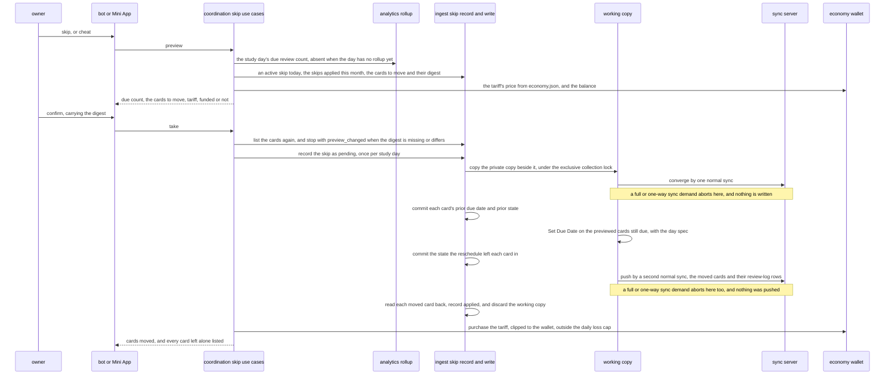
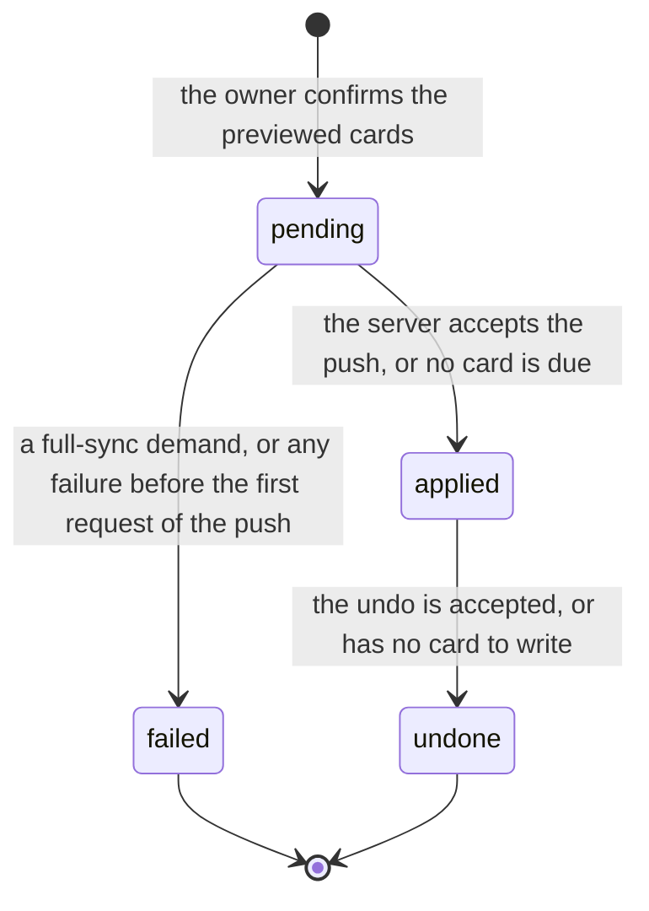
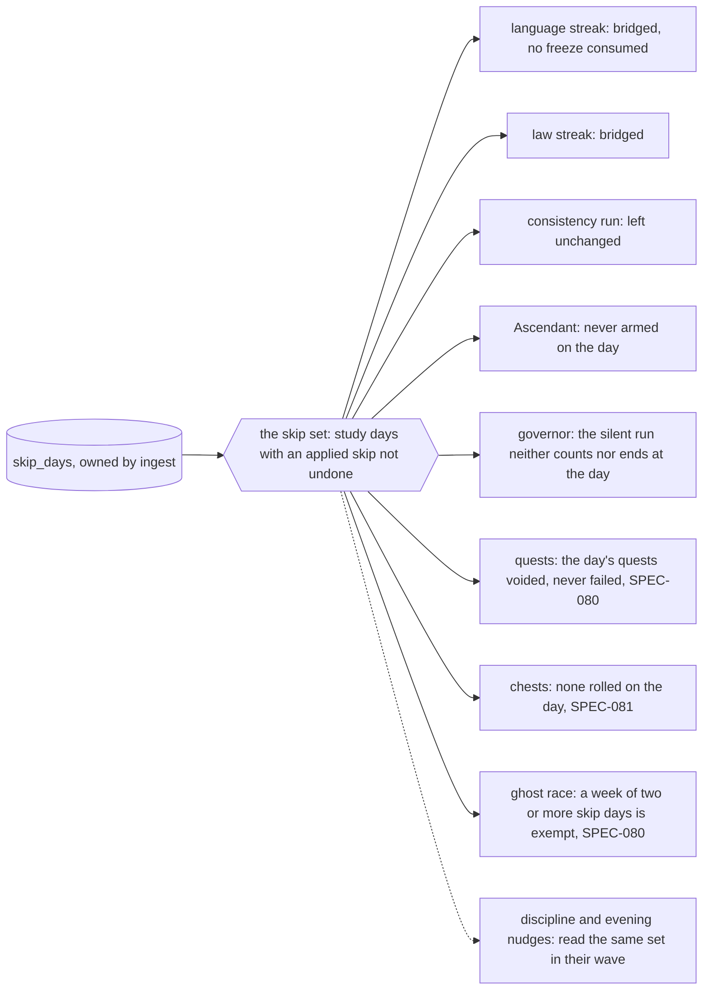
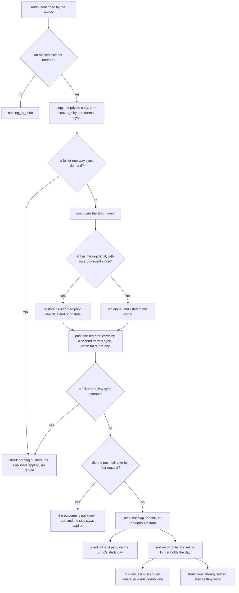

# Schematic: the skip day, recorded by DeckStreak, written to the collection on the owner's confirm, and read by every context it touches

Kind: data flow, sequence and state machine. Read at DeckStreak `dev` 53184dd and at the
predecessor's `27ee2bc` (`pipeline_layers/skip.py:SkipDaysLayer`, `sync.py:AnkiSyncer.skip_day`
and `AnkiSyncer.undo_skip`, `pipeline_layers/economy.py:EconomyLayer._charge_skip_tariff` and
`_refund_skip_tariff`, `skip.py`, and every reader of `database.py:GamifyStore.skip_days_set`).
Added by SPEC-083, under ADR-083's option (a), the owner's decision at #266 (ADR-089).

It extends `docs/schematics/data-flow.md`, whose dashed arrow from coordination to the sync server
is the skip day's write. That arrow carries only the skip day's reschedule of the study day's due
review cards and its exact inverse, each pushed by a normal (incremental) sync of a working copy
that is discarded afterwards. The private collection copy stays SPEC-022's: no step below writes
it, so it never holds a local change for another sync to send.

## Taking a skip

The push also carries the collection's settings and creation stamp whole, because the working copy
is newer, each as the server held it at the converge, the engine's own last-unburied day aside
(SPEC-083 R23, R24). A preview, a take or an undo refuses before any request or write while the
engine's own day is not the study day, or while the collection's configured UTC offset is not the
process's zone (R3). A take that aborts, or fails before its push's first request, records the skip
as `failed` with its reason, discards the working copy and charges nothing. A take whose push fails
after its first request answers that its outcome is not known yet, never that nothing was written,
and its row stays `pending` (R25). A take whose write outlives the answer's wait answers `pending`,
and the write's own outcome settles the row; a row still `pending` is settled after the private
copy's next sync (R26).

## The skip's states

Only `applied` rows not undone are in the skip set. A `failed` row leaves its study day free, and
an `undone` one does too.

## What reads the skip, at the next recompute

Each reader holds its own rule and proves it in its own SPEC; the skip set is the one port they all
read, through coordination, so no context queries `skip_days` a second way.

## Undoing a skip

The skip may be taken again on the same study day after an undo: the migration's key allows one
skip `pending` or `applied` and not undone per study day, not one row. The review-log rows the
reschedule wrote stay after an undo, because an incremental sync carries none away, and the read
never counts them as study events (SPEC-023 R2).
