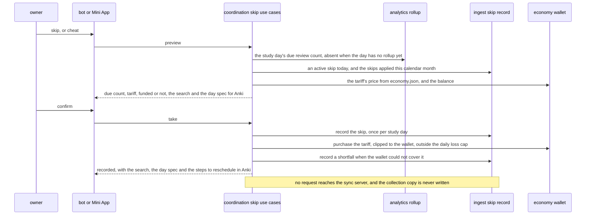
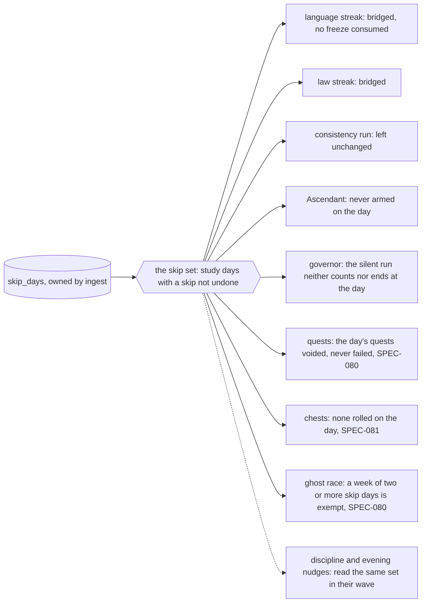
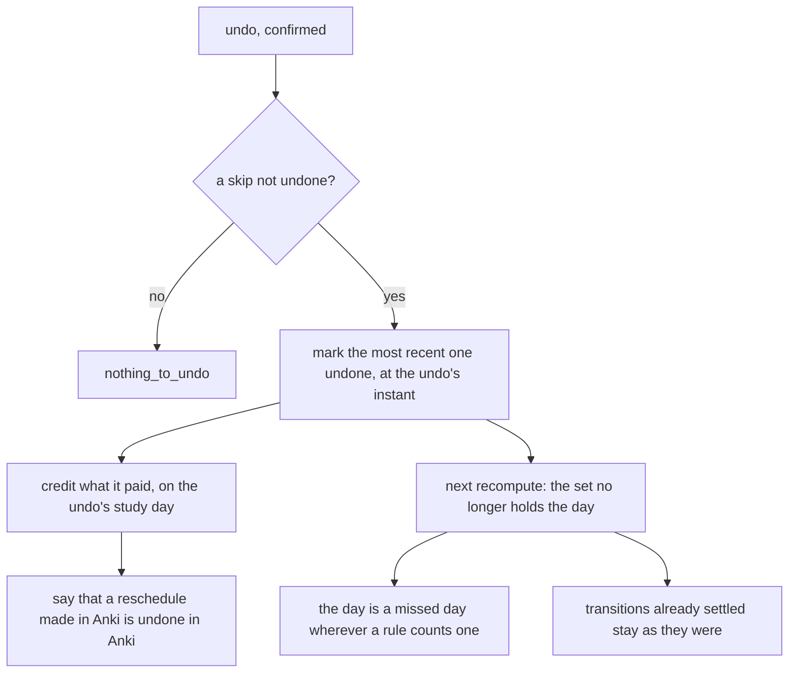

# Schematic: the skip day, recorded by DeckStreak and read by every context it touches

Kind: data flow and sequence. Read at DeckStreak `dev` c3d769b and at the predecessor's `27ee2bc`
(`pipeline_layers/skip.py:SkipDaysLayer`,
`pipeline_layers/economy.py:EconomyLayer._charge_skip_tariff` and `_refund_skip_tariff`,
`skip.py`, and every reader of `database.py:GamifyStore.skip_days_set`). Added by SPEC-083, under
ADR-083's option (b).

It extends `docs/schematics/data-flow.md`, whose dashed arrow from coordination to the sync server
marks the skip day as W3's, held to ADR-037's no-upload rule. Under option (b) that arrow carries
nothing: no step below reaches the sync server or writes the collection copy.

## Taking a skip

## What reads the skip, at the next recompute

Each reader holds its own rule and proves it in its own SPEC; the skip set is the one port they all
read, through coordination, so no context queries `skip_days` a second way.

## Undoing a skip

The skip may be taken again on the same study day after an undo: the migration's key allows one
skip not undone per study day, not one row.
