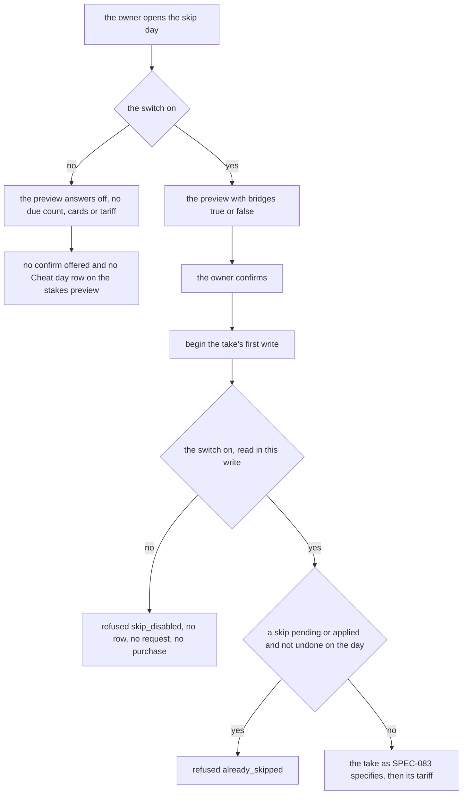
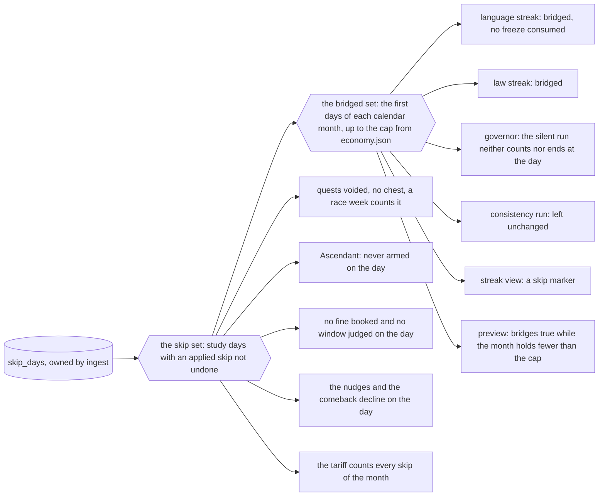

# Schematic: the skip day's switch and the monthly cap of bridges

Kind: data flow. Read at DeckStreak `dev` af0693f and at the predecessor's `27ee2bc`
(`config.py:Settings.skip_enabled`, `constants.SKIP_BRIDGE_MONTHLY_CAP`,
`pipeline_layers/skip.py:SkipDaysLayer.take_skip_day` and `skip.py:real_misses`, which check
neither). Added by the W5 architect turn, by the owner's decision at #269. SPEC-109 builds it.

It extends `docs/schematics/skip-day-record-and-effects.md` without changing it: the take there
gains a first refusal, and its readers' port answers a second set.

## A take and the switch

The switch is read in the same write that checks the day, so a switch turned off before that
write refuses the take, and one turned off after it finds the day's row already written.

- The undo, its refund, the summary and the skip set never read the switch.
- A change of the switch bumps the settings generation in its own write; writing the same value
  writes nothing.

## Two sets from one record

- A skip day in the skip set and not in the bridged set is a missed day to every rule fed by the
  bridged set, and still a declared day off to every rule fed by the skip set.
- The tariff's month and the cap's month are one function of the study day, so the price and the
  bridge never disagree at a month's edge.
- An undo removes its day from the skip set, so the month's next skip joins the bridged set.
