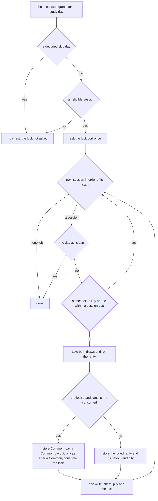
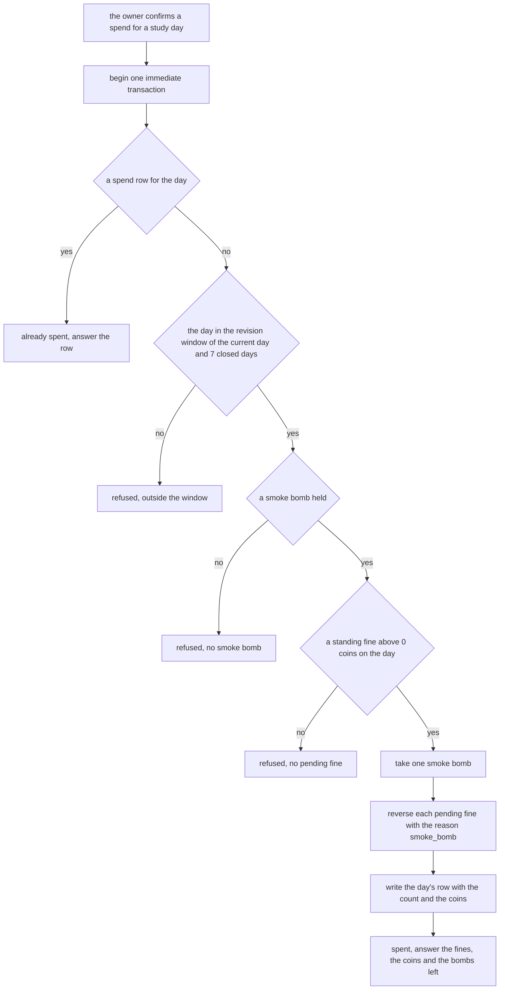

# Schematic: the smoke bomb's spend and the chest lock's effect

Kind: data flow. Read at DeckStreak `dev` af0693f and at the predecessor's `27ee2bc`
(`pipeline_layers/loot.py:LootLayer._grant_session_chests` and `_maybe_earn_smoke_bomb`). Added by
the W5 architect turn. SPEC-108 builds it.

It extends two schematics without changing them: `docs/schematics/quests-and-chests-lifecycle.md`
(a chest's roll inside the fold's phase 4, and the Perfect Week that earns a smoke bomb) and
`docs/schematics/fine-verdict-and-refund.md` (a fine's reversal, whose reason `smoke_bomb` this
spend uses).

## The chest lock in a study day's grant

A lock set by a rung-1 fine (SPEC-104) is asked once, and bites the first chest the day grants.

- A failed draw writes nothing and consumes nothing; a failed write leaves the lock standing.
- A day that stops at its cap, or skips every session, keeps its lock unconsumed.

## A spend

One transaction, checked in order; a refusal changes nothing.

- A fine levied on the day after its spend stands; a second spend answers `already spent`.
- A reversed fine is never levied again, so settling or revising the day again books nothing.
