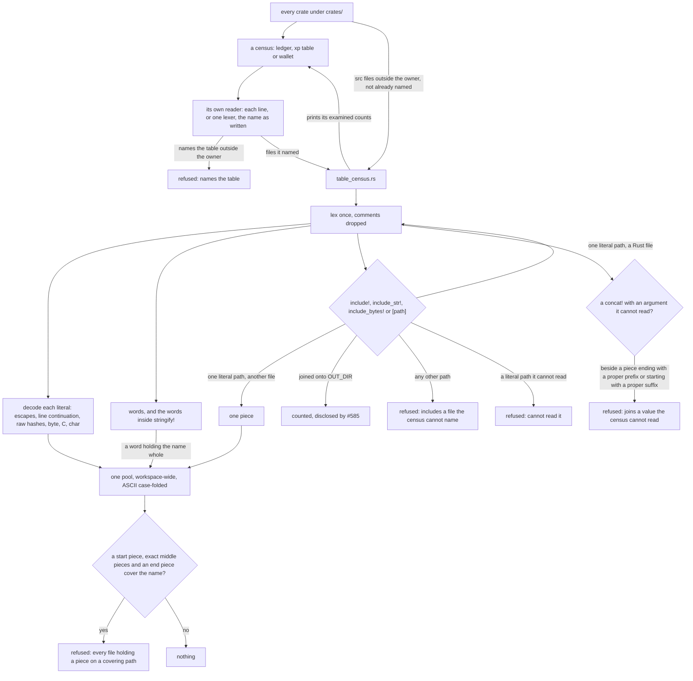
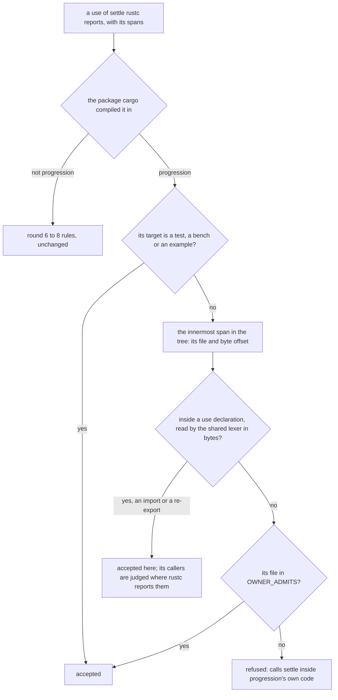

# Schematic: what the table censuses read, and how the settle census judges the owner's own use

Kind: data flow. Read at DeckStreak dev `9affffe6f`. Decided by ADR-325 and ADR-197 (round 9); built
by SPEC-324.

## The shared reader, called by each table census

The assembly is a reachability over the positions of the name: position `i` is reached when a piece
ends with the name's first `i` characters, or a reached position `k` is followed by a piece equal to
the characters from `k` to `i`; the name is covered when a reached position, or the start, is
followed by a piece that starts with the rest. A piece may serve more than once, and pieces join in
any order, so the rule holds `concat!`, `+`, `format!`, constants joined in one file, across files
and across crates, without a parser.

## The settle census's owner branch

A re-export a macro of progression writes in its own body is reported at the macro's definition,
inside its `use`, so it is followed. A re-export whose path the macro takes as an argument is
reported at the macro's call, outside any `use`, so it is refused. `OWNER_ADMITS` admits no file.
