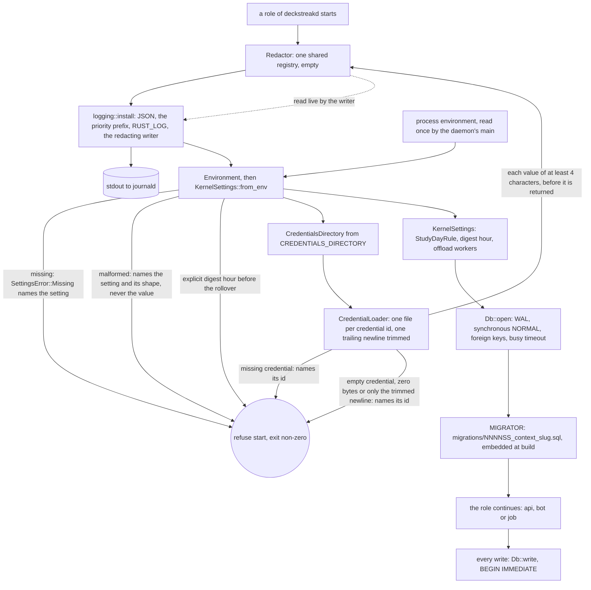

# Schematic: a process starts, loads its settings and secrets, and opens the database

Kind: data flow. Read at DeckStreak `main` e05dfa5 (ADR-008, ADR-010, the observability pack's
`logging.rs.template`), and at the predecessor's `27ee2bc` for the rules it ports
(`config.py:Settings.validate`, `config.py:_env_digest_hour`, `logging_redact.py:register`,
`database.py:GamifyStore.connect`). Decided by ADR-020, and built by SPEC-020's delivery in the
order below: the logging is installed before a setting is read, so even a refusal to start leaves
the process as a JSON line with its priority (SPEC-031 R1), and every secret the loader reads is
registered in the one registry the log writer reads live. SPEC-066 (ADR-067) adds the
loader's refusal of an empty credential, which fails start exactly as a missing one does.

| step | guard | proved by |
|---|---|---|
| logging installed first | JSON lines, each opening with its journal priority; a second install is an error | SPEC-020 A15 |
| settings parse | no value in any error; blank is unset | A5, A6 |
| digest hour | unset resolves to the larger of 9 and the rollover; explicit earlier is refused | A3, A4 (golden) |
| credential load | only the credentials directory; never an environment variable | A11, A12; `rs.no-secret-env` |
| empty credential | refused by its id once the one trailing newline is trimmed, before the redactor registers anything | SPEC-066 A1 to A3 |
| redaction | registered values and token shapes replaced by the marker, longest first, live | A13, A14 (golden) |
| database open | the four pragmas, then every migration | A17, A21 |
| writes | two writers serialise on the write lock; none is lost | A18 |
