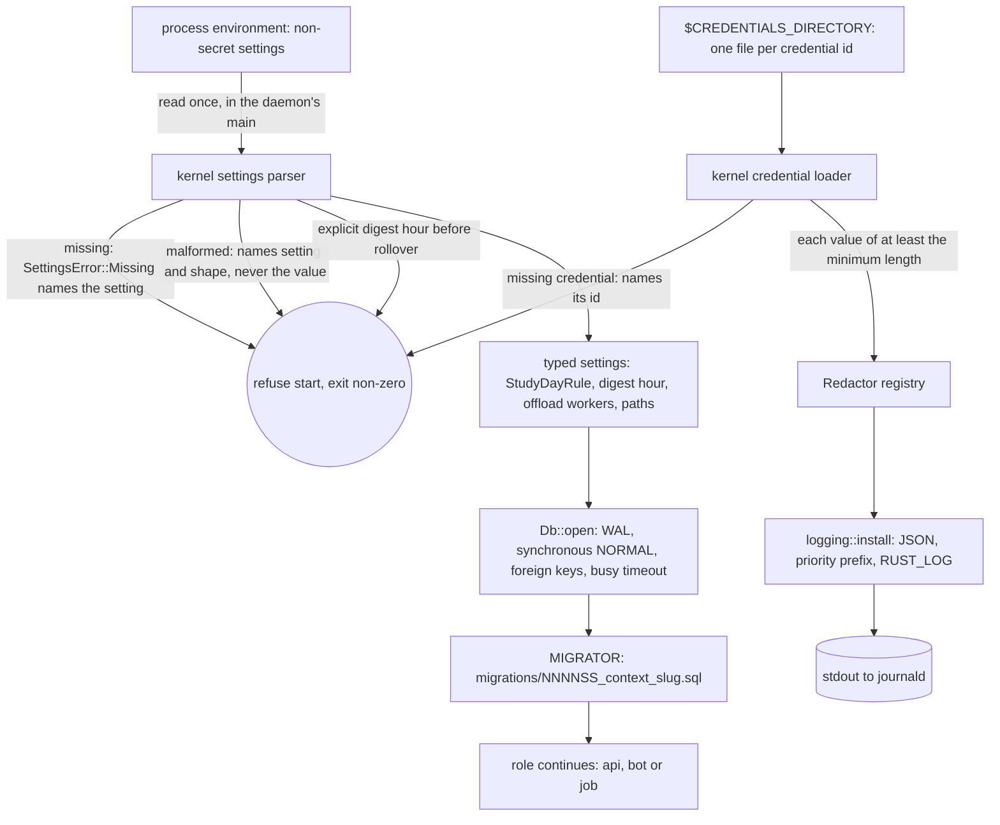

# Schematic: a process starts, loads its settings and secrets, and opens the database

Kind: data flow. Read at DeckStreak `main` e05dfa5 (ADR-008, ADR-010, the observability pack's
`logging.rs.template`), and at the predecessor's `27ee2bc` for the rules it ports
(`config.py:Settings.validate`, `config.py:_env_digest_hour`, `logging_redact.py:register`,
`database.py:GamifyStore.connect`). Decided by ADR-020.

| step | guard | proved by |
|---|---|---|
| settings parse | no value in any error | SPEC-020 A5, A6 |
| digest hour | unset resolves to the larger of 9 and the rollover; explicit earlier is refused | A3, A4 (golden) |
| credential load | only the credentials directory; never an environment variable | A11, A12; `rs.no-secret-env` |
| redaction | registered values and token shapes replaced by the marker, longest first | A13, A14 (golden) |
| database open | the four pragmas, then every migration | A17, A21 |
